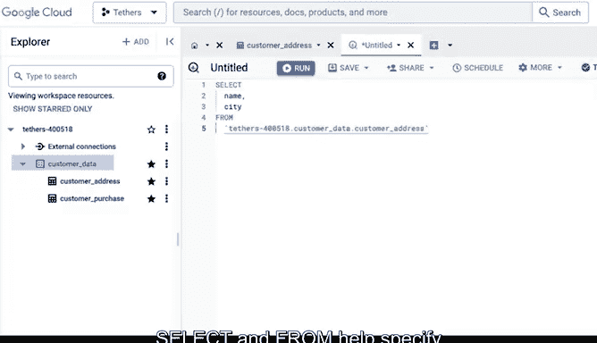
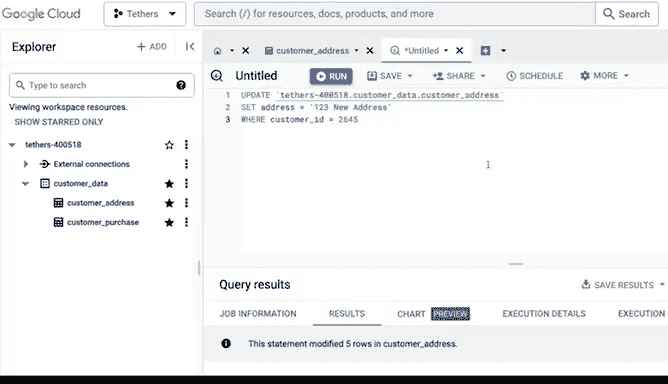

# 023：23_03_02_广泛使用的SQL查询.zh_en - GPT中英字幕课程资源 - BV19m4y1J7dG


## 课程概述 📋

在本节课中，我们将学习一些数据分析师最常使用的SQL查询。这些查询是处理和分析数据库中数据的基础工具，能帮助你从数据库中提取、插入、更新数据，甚至创建和删除表格。

## 查询简介

上一节我们介绍了SQL与电子表格的相似性。本节中，我们来看看SQL中一些最广泛使用的查询语句。查询是向数据库发出的请求，要求它为你执行特定操作。作为“结构化查询语言”，查询是SQL的核心部分。

以下是数据分析师经常使用的一些常见查询。

## 使用SELECT查询提取数据

首先，我将展示如何使用SELECT查询。我之前提到过它，但现在会加入一些新的尝试。

目前，表格查看器是空白的，因为我们还没有从数据库中提取任何数据。在这个例子中，我们工作的商店正在为特定城市的客户举办赠品活动。我们有一个包含客户信息的数据库，可以用来筛选出符合赠品活动资格的客户。

我们可以使用`SELECT`来指定我们想要与表中哪些数据进行交互。如果我们将`SELECT`与`FROM`结合使用，只要我们知道列和行的名称，就可以从这个数据库的任何表中提取数据。

我们可能想从其中一个表中提取关于客户姓名和城市的数据。为此，我们可以输入：

```sql
SELECT name, city
FROM customer_data.customer_address;
```

这条语句将从`customer_address`表中获取信息，该表位于`customer_data`数据集中。

因此，`SELECT`和`FROM`帮助我们指定要从数据库提取和使用的数据。



## 使用INSERT INTO插入新数据

我们也可以向数据库中插入新数据或更新现有数据。


例如，假设我们有一个新客户想要插入到这个表中。我们可以使用`INSERT INTO`查询来输入这些信息。

首先，我们需要指定尝试插入数据的目标表：`customer_address`表。


我们还需要通过在括号内键入列名来指定要将数据添加到哪些列。这样，SQL可以告诉数据库我们具体在哪里输入新信息。

然后，我们将告诉它我们要放入什么值。运行查询后，新数据就被添加到我们的表中了。

## 使用UPDATE更新现有数据

现在假设我们只需要更改一个客户的地址。我们可以告诉数据库为我们更新它。



为此，我们需要告诉它我们正在尝试更新`customer_address`表。然后我们需要让它知道我们要更改什么值。但我们还需要具体告诉它我们在哪里进行更改，以免它更改表中的每个地址。

执行后，这个特定客户的地址就被更新了。

## 使用CREATE TABLE创建新表

如果我们想为这个数据库创建一个新表，可以使用`CREATE TABLE IF NOT EXISTS`语句。


请记住，仅仅运行SQL查询并不会为我们提取的数据实际创建一个表。它只是将数据存储在我们的本地内存中。要保存它，我们需要将其下载为电子表格，或者将结果保存到一个新表中。

作为数据分析师，有几种情况可能需要这样做。这实际上取决于你提取的数据类型和频率。

如果你只使用客户总数，可能不需要CSV文件或数据库中的新表。但如果你使用每日客户总数来跟踪商店的周末促销等活动，则可能将该数据下载为CSV文件，以便在电子表格中进行可视化。

然而，如果要求你定期提取这种趋势数据，你可以创建一个表，该表将根据你编写的查询自动刷新。这样，每当需要为报告获取结果时，就可以直接下载。


## 使用DROP TABLE删除表

另一个需要注意的好习惯是，如果你在数据库中创建了许多表，应该使用`DROP TABLE IF EXISTS`语句来清理自己创建的表。


这是一种良好的内务管理。你可能不会经常删除现有的表。毕竟，那是公司的数据，你不想从他们的数据库中删除重要信息。但你可以确保清理自己创建的表，以免数据库中存在包含冗余信息的旧表或未使用的表，造成混乱。

## 课程总结 🎯

本节课中，我们一起学习了一些最广泛使用的SQL查询的实际应用。当然，还有更多的查询关键字和独特的组合需要学习，它们将帮助你在数据库中工作，但这是一个很好的起点。

接下来，我们将进一步学习SQL中的查询，以及如何使用它们来清理我们的数据。下次见。😊