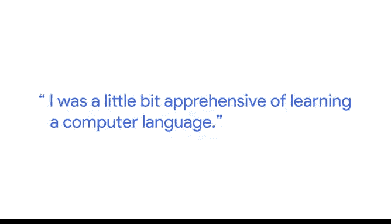

# 024：谷歌数据分析师课程第四课《从脏数据到干净数据的处理》 🧹

## 概述
在本节课中，我们将跟随谷歌的学习组合经理埃文，了解他如何从会计领域转向数据分析，并探索SQL作为一种强大且易于入门的数据查询语言的魅力。我们将理解SQL的核心价值，并学习如何以好奇心和策略性的思维来使用它。

---

## 从会计到数据：我的旅程 👨‍💼➡️👨‍💻

我是埃文，是谷歌的一名学习组合经理。

我并非计算机科学或超级工程类型的人，但我非常喜欢与数字打交道。因此，我自然地进入了会计领域。在大约两年的会计工作后，我发现我并不想手动处理所有事情。

于是我选修了第一门信息系统课程，在那里我学习了SQL语言。这门课彻底改变了我的思维方式。它让我看到了电子表格的操作知识（改变一个单元格，整个表格就会因那些神奇的计算字段而更新）与SQL（可以在几秒钟内查询数十亿行数据）之间的强大联系。

我完全被数据的魅力所折服，并将我的生活和职业生涯致力于传播这份热情，让人们为能用数据所做的事情感到兴奋。

---

## 为什么SQL是绝佳的首选语言？ 🤔

SQL能做很多事情。首先我要说明，我并非计算机科学专业出身，也不精通Java或Python。最初我对学习一门计算机语言有些 apprehensive（担忧）。

它有点像一种伪编程语言。但实际上，你可以在五分钟甚至更短的时间内写出你的第一条SQL语句，正如你即将在这里发现的那样。

SQL是一门易于学习、掌握起来更有趣的语言。我学习SQL已有15年，教授SQL也有10年。

正如你将在一些实践实验室中看到的，从数据库或数据中返回数据非常简单。你只需要使用类似 `SELECT column1, column2 FROM database_name` 的语句，就能立即取回数据。

真正有趣的部分在于，你可以尝试调整查询，例如添加更多列、以不同方式过滤数据集，并与同事分享。SQL本就是一种交互式查询语言，而“查询”就意味着提出问题。

如果让我给你一个挑战，那就是：学习SQL的语法就像学习国际象棋规则一样，非常容易上手。

但困难的部分实际上不在于语法书写，这与任何编程语言类似。真正的难点在于，你想向你的数据提出什么问题。

---

## 给初学者的建议：保持好奇，先思后行 💡

因此，我鼓励你对所接触的任何数据集都保持超级好奇。

在触碰键盘之前，花大量时间思考你能从数据集中获得什么数据或见解。

然后，开始享受乐趣。编写同一条正确的SQL语句有很多不同的方法。

所以，尝试一种方法，与你的朋友分享，然后开始获取数据以产生见解。

祝你好运。

---

## 总结
本节课中，我们一起学习了埃文从会计转向数据分析的个人经历，理解了SQL作为一种强大、易学的查询语言的核心优势。我们认识到，掌握SQL的关键不仅在于语法，更在于培养对数据的好奇心，并学会在分析前进行深思熟虑。记住，先从提出问题开始，再让SQL帮助你找到答案。