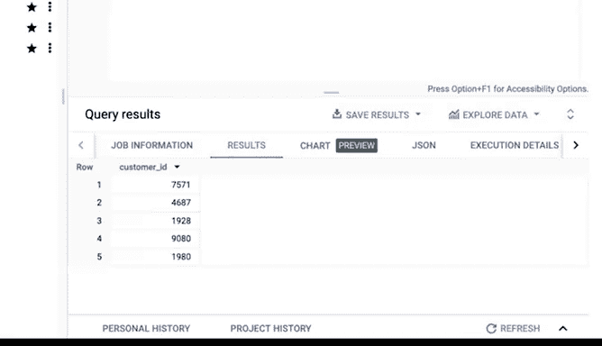

# 025：谷歌数据分析师第四课《从脏数据到干净数据的处理》- 使用SQL清洗字符串变量 🧹


在本节课中，我们将学习如何运用SQL来清洗数据，特别是处理字符串变量。我们将重点介绍如何去除重复数据，以及使用四种关键函数来确保字符串数据的完整性和一致性。

上一节我们介绍了SQL的基本查询和在数据库中的操作，本节中我们来看看如何将这些知识应用于数据清洗。

## 去除重复数据

在分析数据之前，去除重复项是确保数据准确性的重要步骤。在SQL中，我们可以使用`DISTINCT`关键字来实现这一点。

例如，假设我们公司为俄亥俄州的客户提供一项特别促销。我们想获取居住在俄亥俄州的客户ID，但某些客户信息被重复输入了多次。

以下是不使用`DISTINCT`的查询，它会返回所有记录，包括重复项：
```sql
SELECT Customer_ID
FROM customer_data.customer_address;
```

如果客户ID `9080`在表中出现了三次，我们的结果中也会出现三次。为了获取唯一的客户ID列表，我们需要在`SELECT`语句中添加`DISTINCT`：
```sql
SELECT DISTINCT Customer_ID
FROM customer_data.customer_address;
```
现在，客户ID `9080`在结果中只会出现一次。

## 清洗字符串变量

字符串变量是单元格中的一组字符，通常由字母、数字或两者组成。有时，这些字符串在数据库的不同位置以不同方式输入，导致它们不匹配。在这些情况下，您需要在分析之前清洗它们。

以下是您可以在SQL中用于处理字符串变量的一些函数。您可能在我们讨论电子表格时已经认识了其中一些，现在我们将以新的方式看到它们的作用。

### 1. LENGTH 函数

如果我们已经知道字符串变量应有的长度，可以使用`LENGTH`函数来双重检查字符串变量是否一致。在某些数据库中，此查询写作`LEN`，但功能相同。

假设我们正在处理之前示例中的`customer_address`表。我们可以使用`LENGTH`函数来确保所有国家代码具有相同的长度。

以下是检查国家代码长度的SQL查询：
```sql
SELECT LENGTH(country) AS letters_in_country
FROM customer_data.customer_address;
```
运行此查询会得到一个列表，显示每位客户对应国家字段的字母数量。结果显示，几乎所有国家代码都是两个字母，但我们注意到有一个是三个字母。这表明数据不一致。

为了找出哪些国家被错误地列出，我们可以将`LENGTH(country)`函数放入`WHERE`子句，以筛选出国家代码长度超过两个字母的客户：
```sql
SELECT country
FROM customer_data.customer_address
WHERE LENGTH(country) > 2;
```
运行此查询后，我们得到了两个国家，其字母数量超过了预期的两个。错误列出的国家显示为`USA`而不是`US`。

### 2. SUBSTR 函数

为了在结果中修正这个错误，我们可以在SQL查询中使用`SUBSTR`函数。这样，即使原始数据是`USA`，我们也能正确筛选出美国的客户。

以下是使用`SUBSTR`函数获取所有美国客户ID的查询：
```sql
SELECT customer_id
FROM customer_data.customer_address
WHERE SUBSTR(country, 1, 2) = ‘US’;
```
在这个查询中：
*   `SUBSTR(country, 1, 2)` 表示从`country`列的第一个字符开始，提取两个字符。
*   因此，无论是`US`还是`USA`，都会被提取为`US`，从而被`WHERE`子句的条件匹配。

运行此查询后，我们得到了所有国家为美国的客户ID列表，包括那些原本是`USA`的客户。结果中可能仍然存在重复的客户ID，我们可以通过添加`DISTINCT`关键字来去除它们：
```sql
SELECT DISTINCT customer_id
FROM customer_data.customer_address
WHERE SUBSTR(country, 1, 2) = ‘US’;
```

### 3. TRIM 函数

`TRIM`函数在发现条目包含多余空格并需要消除这些空格以保持一致性时非常有用。

例如，让我们检查`customer_address`表中的`state`列。就像对国家列所做的那样，我们希望确保州列具有一致的字母数量。我们再次使用`LENGTH`函数来检查是否有任何州的字母数超过两个（这是我们期望在数据表中找到的）。

以下是检查州名长度的查询：
```sql
SELECT state
FROM customer_data.customer_address
WHERE LENGTH(state) > 2;
```
运行此查询后，我们得到了一个结果：有一个州的字母数超过两个。但看起来它只有两个字母（`OH`代表俄亥俄州）。既然SQL通过`WHERE LENGTH(state) > 2`条件筛选出了它，这意味着SQL计数的额外字符必须是一个空格——很可能是在`H`后面有一个空格。

这时我们就需要使用`TRIM`函数。`TRIM`函数会移除任何空格。

假设我们想要所有居住在俄亥俄州（`OH`）的客户ID列表。我们需要编写一个能修正这个错误的SQL查询：
```sql
SELECT DISTINCT customer_id
FROM customer_data.customer_address
WHERE TRIM(state) = ‘OH’;
```
在这个查询中：
*   `TRIM(state)`会移除`state`列值中的所有空格。
*   因此，无论是`OH`还是`OH `（后面带空格），经过`TRIM`处理后都会变成`OH`，从而被条件匹配。

运行此查询后，我们就得到了所有居住在俄亥俄州的客户ID，包括那个在`H`后面有额外空格的客户。

## 总结

本节课中我们一起学习了如何使用SQL来清洗字符串变量。我们掌握了三个核心函数：
1.  **`LENGTH`**：用于检查字符串的长度是否一致。
2.  **`SUBSTR`**：用于提取字符串的特定部分，以标准化数据格式。
3.  **`TRIM`**：用于移除字符串首尾的空格，确保数据的一致性。



确保字符串变量完整且一致，将为您后期节省大量时间，避免错误或计算失误。这正是我们首先进行数据清洗的原因。希望`LENGTH`、`SUBSTR`和`TRIM`这些函数能为您提供所需的工具，开始处理您自己数据集中的字符串变量。

接下来，我们将探讨其他处理字符串的方法以及更高级的清洗函数。然后，您就可以准备开始独立使用SQL进行工作了。