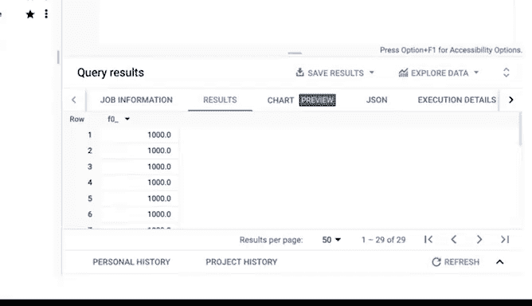

# 026：谷歌数据分析师第四课《从脏数据到干净数据的处理》- 高级数据清洗函数第一部分 🧹


## 概述

在本节课中，我们将学习如何使用SQL中的高级函数来处理和清洗数据。我们将重点介绍`CAST`函数，它可以帮助我们将数据从一种类型转换为另一种类型，从而解决数据格式不正确导致的分析问题。

---

## 回顾与引入

上一节我们介绍了一些基础的SQL查询和函数，以及处理字符串变量的方法。本节中，我们来看看一个更强大的工具——`CAST`函数，它能帮助我们正确地格式化数据。

当你导入的数据原本不存在于你的SQL表中时，新数据的数据类型可能没有被正确识别。这时，`CAST`函数就派上用场了。

## `CAST`函数简介

`CAST`函数的基本功能是将数据从一种数据类型转换为另一种数据类型。以下是其基本语法：

```sql
CAST(column_name AS new_data_type)
```

让我们通过一个例子来理解它的应用。

## 实战案例：家具店销售数据

假设我们正在为劳伦的家具店工作。店主收集了过去一年的交易数据，但她发现由于数据格式不正确，无法有效地组织这些数据。我们的任务是帮助她转换数据，使其重新变得有用。

例如，我们希望按`purchase_price`降序排列所有购买记录，即最贵的购买记录显示在最前面。

初始的SQL查询可能如下：

```sql
SELECT purchase_price
FROM customer_data.customer_purchase
ORDER BY purchase_price DESC;
```

运行此查询后，我们发现`89.85`排在了`799.99`前面。这显然不正确，因为`799.99`大于`89.85`。

## 问题诊断

问题的根源在于数据库将`purchase_price`列识别为字符串（`STRING`）类型，而不是浮点数（`FLOAT`）类型。当对字符串进行排序时，数据库会逐个字符进行比较。

*   比较`89.85`和`799.99`时，首先比较第一个字符`8`和`7`。
*   由于字符`8`的编码值大于`7`，因此`89.85`被排在了前面。

## 使用`CAST`函数解决问题

我们需要使用`CAST`函数将`purchase_price`从字符串转换为浮点数，以便数据库能将其识别为数字并进行正确的数值排序。

修改后的查询如下：

```sql
SELECT CAST(purchase_price AS FLOAT64)
FROM customer_data.customer_purchase
ORDER BY CAST(purchase_price AS FLOAT64) DESC;
```

**代码解释：**
*   `CAST(purchase_price AS FLOAT64)`： 将`purchase_price`字段的值转换为`FLOAT64`类型（在BigQuery等64位系统中表示浮点数）。
*   在`ORDER BY`子句中同样使用转换后的字段进行排序。

运行此查询后，数据将按照价格数值从高到低正确排序。现在，劳伦家具店的数据就可以用于分析了。



## `CAST`函数的其他用途

`CAST`函数不仅可以将字符串转换为数字，还可以转换为其他数据类型，例如日期（`DATE`）和时间（`TIMESTAMP`）。

作为数据分析师，你经常需要整合来自不同来源的数据。确保这些数据在你的数据库中被正确识别和可用，是你工作的重要部分，这能避免后续分析中出现问题。

## 总结

本节课我们一起学习了`CAST`函数的使用。我们了解到，当数据因类型错误而无法正确排序或计算时，可以使用`CAST(column_name AS new_data_type)`来转换数据类型。这解决了将字符串误判为数字进行排序的典型问题，是数据清洗中一个非常实用的工具。

`CAST`函数是你数据清洗工具箱中的一件利器。在接下来的课程中，我们将继续介绍其他高级函数，以丰富你的技能。