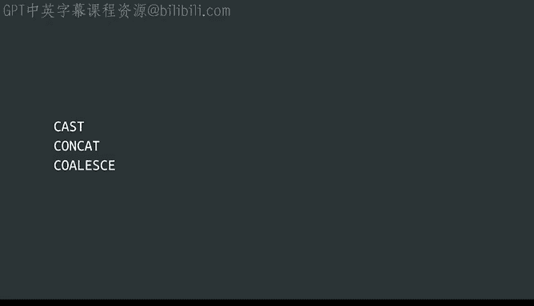
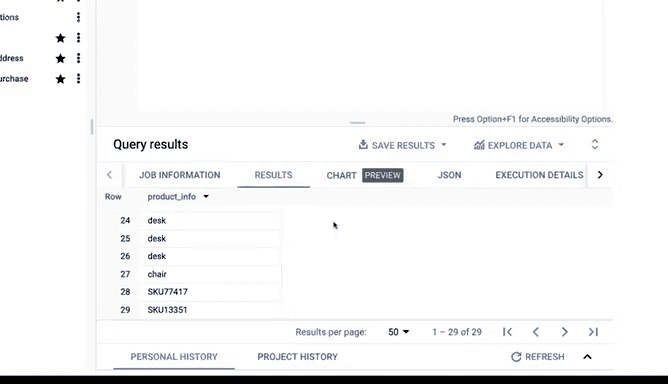

# 027：谷歌数据分析师课程第四课《从脏数据到干净数据的处理》- 高级数据清洗函数（第二部分）🔧




在本节课中，我们将继续学习SQL中的高级数据清洗函数。上一节我们介绍了`CAST`函数的基础用法，本节中我们将深入了解`CAST`函数的更多应用场景，并学习两个新的强大函数：`CONCAT`和`COALESCE`。这些工具将帮助你更高效地处理和准备数据，为后续分析打下坚实基础。

## 使用CAST函数转换日期类型 📅

我们之前讨论了`CAST`函数，它可以将文本字符串转换为浮点数。实际上，`CAST`函数还能用于转换其他数据类型。让我们通过一个实例来看看如何在数据工作中使用它。

我们继续使用劳伦斯家具店的交易数据。现在，我们需要查看`purchase_date`字段。家具店老板要求我们分析在12月促销期间发生的购买记录。我们需要编写一个SQL查询，提取2020年12月1日至2020年12月31日期间所有购买记录的日期和价格。

以下是构建查询的基本步骤：

1.  从`customer_data`数据集中的`customer_purchase`表选择数据。
2.  在`SELECT`语句中指定要提取的字段：`date`和`purchase_price`。
3.  在`WHERE`子句中添加过滤条件，仅选择12月份的记录。

运行查询后，我们得到了四条12月的购买记录。但日期字段的显示包含了时间信息，这是因为数据库将其识别为`DATETIME`类型。虽然查询结果正确，但我们可以使用`CAST`函数使其仅显示日期部分，让结果更清晰。

为此，我们在`SELECT`语句中修改`date`字段：
```sql
CAST(date AS DATE)
```
现在，查询结果将只显示促销期间的日期，数据看起来更整洁。`CAST`是一个在数据清洗和排序中非常有用的函数。

## 使用CONCAT函数创建唯一键 🔑

接下来，让我们看看`CONCAT`函数。`CONCAT`允许你将多个字符串连接在一起，创建新的文本字符串，这常被用作唯一标识符或键。

回到我们的`customer_purchase`表，家具店销售同款产品的不同颜色。老板想知道顾客是否偏好某些颜色，以便相应地管理库存。问题是，无论产品颜色如何，`product_code`都是相同的。我们需要另一种方法来按颜色区分产品，从而判断顾客的偏好。

这时就可以使用`CONCAT`来生成一个结合了产品和颜色的唯一键，帮助我们更轻松地进行区分和计数。

以下是构建查询的方法：

1.  从`customer_data.customer_purchase`表中选择数据。
2.  在`SELECT`语句中使用`CONCAT`函数，将`product_code`和`product_color`字段连接起来。
3.  假设我们只想查看沙发，则在`WHERE`子句中添加过滤条件：`product = ‘Couch’`。

通过`CONCAT`，家具店可以统计每种颜色沙发的购买次数，从而找出最受欢迎的颜色并增加库存。

## 使用COALESCE函数处理空值 ⚙️

我要介绍的最后一个函数是`COALESCE`。`COALESCE`可用于返回列表中的第一个非空值。空值（`NULL`）就是缺失值。如果你的表中某个字段是可选的，那么对于那些没有合适值的行，该字段就会显示为`NULL`。

查看`customer_purchase`表，我们会发现有几行数据的产品信息是缺失的，因此那里显示为`NULL`。但在产品名称为`NULL`的行中，我们仍有`product_code`数据可供使用。我们更希望SQL显示像“床”或“沙发”这样的产品名称，因为这更便于阅读。如果产品名称不存在，我们可以指示SQL改为提供产品代码。这正是`COALESCE`函数的用武之地。

假设我们需要一份所有已售产品的列表。我们希望使用`product_name`列来了解售出了何种产品。

以下是构建查询的步骤：

1.  从`customer_data.customer_purchase`表中选择数据。
2.  在`SELECT`语句中，我们使用`COALESCE`函数：首先检查`product_name`列，如果该列为空，则返回`product_code`列的值。
3.  我们可以将这个新字段命名为`product_info`。
4.  由于不需要过滤数据，我们可以省略`WHERE`子句。



这样，我们就得到了每次购买的产品信息列表，方便店主查阅。

此外，`COALESCE`在进行计算时也能节省时间，它可以跳过任何空值，确保数学运算的正确性。

## 总结 📝

本节课中我们一起学习了SQL中三个高级数据清洗函数：
*   **`CAST`函数**：用于将数据从一种类型转换为另一种类型，例如将`DATETIME`转换为`DATE`，使数据显示更清晰。
*   **`CONCAT`函数**：用于连接多个字符串，创建新的唯一标识符，帮助区分和聚合数据。
*   **`COALESCE`函数**：用于处理空值，返回提供的参数列表中的第一个非空值，确保数据的完整性和可读性。

这些只是你可以用来清洗数据、为分析下一步做准备的部分高级函数。随着你在SQL中不断深入，还会发现更多有用的工具。本模块到此结束，你做得很好！我们涵盖了大量内容，学习了电子表格和SQL中不同的数据清洗函数，了解了使用SQL处理大型数据集的好处，并向你的工具箱中添加了一些SQL公式和函数。最重要的是，我们亲身体验了SQL如何帮助你为分析准备好数据。


接下来，你将花时间学习如何验证和报告你的清洗结果，以确保数据绝对干净，并且让你的相关方了解这一点。在此之前，你还需要完成另一个每周挑战。一些概念起初可能看起来具有挑战性，但随着你在职业生涯中的进步，它们会成为你的第二天性，这只需要时间和练习。说到练习，欢迎你随时回看这些视频，甚至可以自己尝试一些这些命令。祝你好运，当你准备好时，我们下次再见！