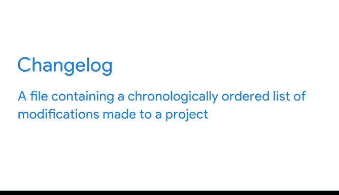

# 028：谷歌数据分析师第四课《从脏数据到干净数据的处理》 🧹✨

## 课程概述

在本节课中，我们将要学习数据清洗流程中的关键一步：验证数据完整性并报告清洗结果。我们将探讨验证的重要性、具体步骤以及如何通过有效的报告与团队沟通。

---

## 验证数据完整性 🔍

上一节我们介绍了数据清洗的工具和策略，本节中我们来看看如何确保清洗后的数据准确可靠。

验证是一个确认数据清洗工作执行良好、且最终数据准确可靠的过程。它涉及重新检查清洗后的数据集，必要时进行一些手动清理，并花时间思考项目的原始目的。这样，你可以确信所收集的数据是可信的，并且适合你的分析目的。

确保数据得到适当验证至关重要，因为它允许你双重检查数据清洗工作是否彻底和准确。例如，你可能引用了错误的电话号码，或不小心输入了拼写错误。验证让你在开始分析之前发现这些错误。没有验证，从分析中获得的任何见解都无法用于决策，你甚至可能面临错误呈现群体或损害你试图改进的产品结果的风险。

我记得曾参与一个项目，我以为我的数据已经非常干净，因为我使用了所有正确的工具和流程。但当我按照步骤验证数据完整性时，我发现了一个忘记删除的分号。我知道这听起来像是一个非常小的错误，但如果我没有在验证过程中发现并删除这个分号，它会导致我的结果发生重大变化。这当然可能导致不同的业务决策。这就是验证为何如此关键的一个例子。

---

## 报告清洗工作 📋

验证过程不仅仅是检查数据，另一个重要部分是报告你的工作成果。

开放沟通是任何数据分析项目的生命线。报告是一种极其有效的方式，可以向你的团队展示你在数据清洗方面是100%透明的。报告也是向利益相关者展示你负责任、与团队建立信任，并确保大家对重要项目细节有共同理解的绝佳机会。

以下是几种有效的报告策略：

*   **创建数据清洗报告**：系统性地记录清洗过程、遇到的问题及解决方案。
*   **记录清洗过程**：详细说明每一步清洗操作及其原因。
*   **使用变更日志**：变更日志是一个文件，其中按时间顺序记录了项目中所做的修改。它通常按版本组织，包括日期以及添加、改进和删除的功能列表。

变更日志对于跟踪数据集在项目过程中的演变非常有用，它们也是向他人沟通和报告数据的另一种好方法。

在此过程中，你还将看到一些例子，了解验证和报告如何帮助你避免重复错误，并为你和你的团队节省时间。

---

## 课程总结

本节课中，我们一起学习了数据清洗流程中验证与报告的核心环节。我们明确了**验证**是确保数据准确可靠的必经步骤，而**报告**（包括使用**变更日志**）则是建立团队信任、保证项目透明度的关键。掌握这些技能，能让你更有信心地使用清洗后的数据进行决策分析。