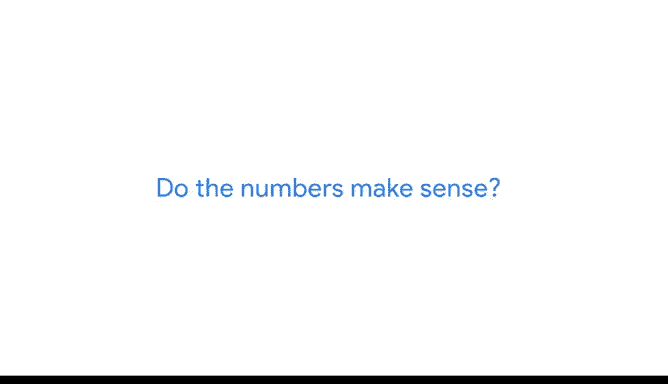

# 029：谷歌数据分析师第四课《从脏数据到干净数据的处理》 🧹

## 课程概述

在本节课中，我们将要学习数据清洗流程中的一个关键环节：**验证**。我们将探讨如何确认你的数据清洗工作符合业务期望，确保最终得到的数据是准确、可靠的，从而为数据驱动的决策提供坚实的基础。

---

## 验证的重要性

上一节我们介绍了数据清洗的基本步骤，本节中我们来看看如何验证清洗结果。验证是任何分析项目中至关重要的一环。没有验证，你无法确定你的分析洞察是否值得信赖，能否用于数据驱动的决策。

你可以将验证视为一个“批准印章”。简单来说，**验证是一个确认数据清洗工作执行良好、最终数据准确可靠的过程**。它还包括手动检查数据，将你的预期与实际数据内容进行比较。

---

## 验证的第一步：对比原始数据

验证过程的第一步是回到你原始的、未经清洗的数据集，并将其与你当前清洗后的数据进行对比。

以下是进行对比时需要关注的一些常见问题：

*   **空值问题**：如果原始数据中存在大量空值，你需要检查清洗后的数据，确保没有空值残留。你可以手动搜索数据，或使用条件格式、筛选器等工具来辅助检查。
*   **拼写错误**：例如，某个产品名称被反复错误地输入。在这种情况下，你需要在清洗后的数据中运行“查找”功能，确保拼写错误的单词不再出现。

---

## 验证的关键：审视项目全局

验证的另一个关键部分是**从宏观角度审视你的整个项目**。这是一个机会，可以确认你确实在专注于需要解决的业务问题和整体项目目标，并确保你的数据实际上有能力解决该问题并实现这些目标。

花时间重新审视和聚焦于全局非常重要，因为项目有时会在我们不知不觉中演变或改变方向。

例如，一家电子商务公司决定对1000名客户进行调查，以获取用于改进产品的信息。但随着回复开始涌入，分析师注意到大量评论是关于客户对整个电商网站平台的不满。于是分析师开始关注这一点。虽然客户购买体验对任何电商业务都很重要，但这并非项目的原始目标。在这种情况下，分析师需要暂停一下，重新聚焦，回到解决原始问题上。

从宏观角度审视你的项目，需要做以下三件事：

1.  **考虑你试图用数据解决的业务问题**。如果你偏离了问题本身，你就无法知道哪些数据应该包含在你的分析中。在任何项目的所有阶段，采取“问题优先”的分析方法都至关重要。你需要确信你的数据确实能让你解决业务问题。
2.  **考虑项目的目标**。仅仅知道公司想要分析关于产品的客户反馈是不够的。你真正需要知道的是，获取这些反馈的目标是为了改进该产品。此外，你还需要知道你收集和清洗的数据是否真的能帮助公司实现这一目标。
3.  **考虑你的数据是否有能力解决问题并满足项目目标**。这意味着要思考数据的来源，并测试你的数据收集和清洗流程。

有时，数据分析师可能对自己的数据过于熟悉，这反而更容易遗漏某些东西或做出假设。在这个阶段，请同事从一个全新的角度审查你的数据，并获取他人的反馈是非常有价值的。

这也是一个时机，去注意数据中是否有任何让你觉得可疑或可能存在问题的东西。再次退一步，从宏观角度审视，并问自己：这些数字合理吗？

---

## 实践案例：电商公司调查

让我们回到电商公司的例子。想象一位分析师正在审查来自客户满意度调查的清洗后数据。调查最初发送给了1000名客户。

但如果分析师发现数据中的回复数量**超过1000份**呢？这可能意味着客户找到了多次参与调查的方法。也可能意味着数据清洗过程中出现了问题，导致字段被重复复制了。

无论哪种情况，这都是一个信号，表明需要回到数据清洗流程中去纠正这个问题。

---

## 总结与展望

**验证你的数据，能确保你从分析中获得的洞察是可信的**。这是数据清洗中必不可少的一部分，能帮助公司避免重大错误。这也是数据分析师可以大显身手的另一个领域。

本节课中我们一起学习了数据验证的重要性、具体步骤（对比原始数据和审视全局）以及一个实践案例。验证是连接数据清洗与可靠分析的关键桥梁。

接下来，我们将继续学习数据清洗流程的后续步骤。