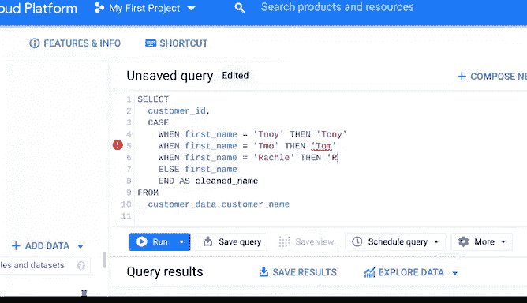

# 030：从脏数据到干净数据的处理 🧹


## 课程概述

在本节课中，我们将学习数据清洗后的关键步骤——数据验证。我们将探讨如何确保数据清洗工作正确无误，以及如何使用工具自动修复常见错误，使数据达到100%可用的状态。

---

## 数据验证的目标与重要性

上一节我们介绍了数据清洗的基本步骤，本节中我们来看看如何验证清洗结果。数据验证的目标是确保数据清洗工作正确完成，结果可靠可信。这类似于汽车公司在车辆上路前进行大量测试以确保安全。经过验证的数据，你才能确信它已准备就绪。

## 数据验证的第一步：对比原始数据

验证的第一步是返回原始的脏数据集，并将其与当前清洗后的数据集进行比较。这是一个发现常见问题的机会。之后，你可以手动清理这些问题，例如删除多余的空格或不需要的引号。

## 自动修复错误的工具

除了手动清理，还有一些强大的工具可以自动修复常见错误，例如 **`TRIM`** 函数和 **`REMOVE DUPLICATES`** 工具。

*   **`TRIM`** 函数：这是一个用于移除数据中**开头、结尾和重复空格**的函数。
*   **`REMOVE DUPLICATES`** 工具：这是一个能自动搜索并**消除电子表格中重复条目**的工具。

## 处理重复性错误：数据透视表

有时，你会遇到反复出现的错误，无法通过快速手动编辑或自动工具解决。在这些情况下，创建数据透视表会很有帮助。

数据透视表是一种用于数据处理的数据汇总工具。它可以对数据库中存储的数据进行**排序、重组、分组、计数、求和或求平均值**。

我们现在使用一家派对用品商店的电子表格来练习。

假设这家公司想了解其四家供应商中哪家成本效益最高。因此，分析师提取了以下业务销售数据：销售的产品、购买数量、供应商、产品成本和最终收入。

数据已经过清洗，但在验证过程中，我们注意到其中一个供应商的名称输入有误。

我们可以直接将错误的单词“PLOS”更正为“PLUS”。但这可能无法彻底解决问题，因为我们不知道这是个一次性错误，还是在整个电子表格中重复出现。

## 查找与替换工具

有两种方法可以回答上述问题。第一种是使用**查找和替换**工具。

**查找和替换**是一种在电子表格中查找指定搜索词并允许你将其替换为其他内容的工具。

以下是操作步骤：
1.  选择“编辑”。
2.  选择“查找和替换”。
3.  在“查找”框中输入“PLOS”（供应商名称中“PLUS”的错误拼写）。
4.  在“替换为”框中输入“PLUS”。
5.  点击“全部替换”，然后点击“完成”。

这样，拼写错误就被纠正了。当然，这是我们的目标。但现在，让我们撤销这个操作，以便练习另一种确定错误是否在整个数据集中重复出现的方法——使用数据透视表。

## 使用数据透视表验证数据

我们首先选择要使用的数据（C列），然后按照以下步骤操作：
1.  选择“数据”菜单。
2.  选择“数据透视表”。
3.  选择“新工作表”，然后点击“创建”。

我们知道这家公司有四家供应商。因此，如果我们统计供应商的数量，结果不等于4，就说明存在问题。

以下是创建数据透视表的步骤：
1.  将“供应商”字段添加到“行”区域。
2.  将“供应商”字段再次添加到“值”区域。
3.  在值汇总方式中选择“COUNTA”。

**`COUNTA`** 函数用于计算指定范围内的**值总数**。在这里，我们计算的是供应商名称在C列中出现的次数。

请注意，还有一个名为 **`COUNT`** 的函数，它只计算指定范围内的**数值**。如果在这里使用它，结果将是0，这不是我们想要的。但在其他特定应用中，`COUNT` 函数能提供我们需要的信息。

随着你继续学习更多公式和函数，你会发现更多有趣的选项。如果你想继续学习，可以在网上搜索“电子表格公式和函数”，那里有很多很棒的信息。

现在，我们的数据透视表已经统计了拼写错误的数量，它清楚地显示该错误只出现了一次。除此之外，我们的四家供应商在数据中都得到了准确的记录。现在我们可以放心地纠正拼写，并且已验证其余供应商数据是干净的。

## 在SQL查询中处理拼写错误

在查询数据库时，这也是一种有用的做法。如果你使用SQL，可以使用 **`CASE` 语句**来处理拼写错误。

**`CASE` 语句**会遍历一个或多个条件，并在满足条件时返回一个值。

让我们通过`customer_name`表来讨论这在现实中如何运作。注意，我们的客户“Tony Magnolia”被记录为“Tony”和“Tnoi”。Tony的名字被拼错了。

假设我们需要一份客户ID和客户名字的列表，以便为每位客户撰写个性化的感谢信。我们不希望Tony的信被错误地寄给“Tnoy”。

这时就可以使用`CASE`语句。我们以基本的SQL结构开始查询：`SELECT`、`FROM`、`WHERE`。

我们知道数据来自`customer_data`数据集中的`customer_name`表，因此可以在`FROM`后面添加`customer_data.customer_name`。

接下来，在`SELECT`子句中告诉SQL要提取哪些数据。我们需要`customer_id`和`first_name`。

我们可以在`SELECT`后直接添加`customer_id`。但对于客户的名字，我们知道Tony被拼错了。因此，我们将使用`CASE`来纠正它。

以下是SQL查询示例：
```sql
SELECT
    customer_id,
    CASE
        WHEN first_name = 'Tnoi' THEN 'Tony'
        ELSE first_name
    END AS cleaned_name
FROM customer_data.customer_name;
```

如前所述，一个`CASE`语句可以涵盖多种情况。如果我们想搜索更多拼写错误的名字，语句会与原始语句类似，但包含一些额外的名称，如下所示：
```sql
SELECT
    customer_id,
    CASE
        WHEN first_name = 'Tnoi' THEN 'Tony'
        WHEN first_name = 'Jhon' THEN 'John'
        WHEN first_name = 'Kte' THEN 'Kate'
        ELSE first_name
    END AS cleaned_name
FROM customer_data.customer_name;
```



## 课程总结

本节课中，我们一起学习了数据验证的核心流程。我们了解了如何通过对比原始数据来发现问题，并掌握了使用`TRIM`、`REMOVE DUPLICATES`、`查找和替换`以及`数据透视表`等工具来自动或半自动地修复错误。最后，我们还探讨了如何在SQL中使用`CASE`语句来处理数据库中的拼写错误。掌握这些方法，能确保你交付的数据是干净、可靠且值得信赖的。