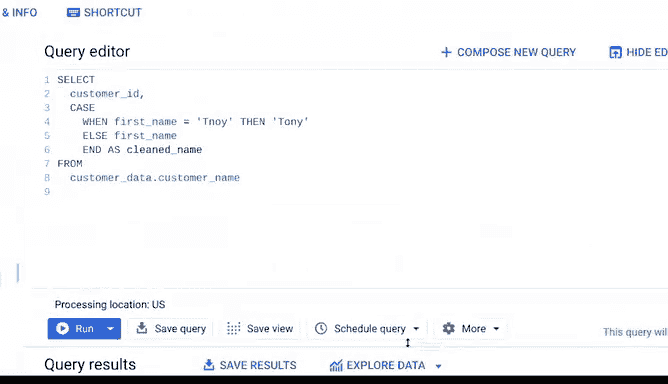

# 031：记录清洗变更 📝

在本节课中，我们将要学习数据清洗过程中一个至关重要的环节：记录变更。了解如何以及为何要详细记录你对数据所做的每一次修改，这对于确保项目的可追溯性、团队协作和数据质量评估都至关重要。

---

## 为何记录清洗变更至关重要 🔍

上一节我们介绍了如何将数据清洗干净。本节中，我们来看看清洗后留下的“痕迹”——变更记录。

当你清洗数据时，所有不正确或过时的信息都被移除，只留下最高质量的内容。然而，你对数据所做的所有更改本身也具有重要价值。记录变更，即跟踪数据清洗过程中的所有更改、添加、删除和错误，就像犯罪现场调查中的取证报告。它能让你的工作过程透明化，便于他人审查或未来参考。

详细记录数据集的演变过程能带来三个非常重要的好处：

以下是记录变更的三个核心优势：

1.  **恢复清洗错误**：它让我们能够恢复数据清洗中的错误。与其费力回忆几个月前可能做过什么，不如拥有一份可供参考的“备忘单”，以便日后遇到相同错误时使用。创建一个新的干净数据表，而不是覆盖现有表，是一个好方法。这样，你仍然保留原始数据，以备需要重新清洗。
2.  **通知其他用户**：记录为你提供了一种方式，可以告知其他用户你所做的更改。如果你休假或晋升，接替你的分析师将有一份参考清单可以查阅。
3.  **评估数据质量**：记录帮助你确定用于分析的数据的质量。前两个好处假设错误无法修复。但如果可以修复，记录则为数据工程师提供了更多参考信息。它也是一个重要的警示，提醒我们该数据集充满错误，未来应避免使用。如果修复错误非常耗时，那么寻找可替代的其他数据集可能是更好的选择。

---

## 如何使用变更日志 📋

数据分析师通常使用**变更日志**来管理这些信息。变更日志是一个文件，按时间顺序记录了项目中的所有修改。

你可以在电子表格和SQL中使用和查看变更日志，以达到类似的效果。

### 在电子表格中记录变更

我们可以使用表格软件的“版本历史”功能，它能实时跟踪从单个单元格到整个工作表的所有更改及其修改者。

以下是查看版本历史的步骤：

1.  点击“文件”选项卡。
2.  选择“版本历史”。
3.  在右侧面板中，选择一个较早的版本。我们可以找到编辑文件的人员以及他们所做的更改（更改内容会显示在其姓名旁边的颜色标记处）。
4.  要返回当前版本，请点击左上角的“返回”按钮。

如果你想查看特定单元格的更改，可以右键单击该单元格并选择“显示编辑历史”。

此外，如果你希望其他人能够浏览表格的版本历史，你需要为他们分配相应的权限。

### 在SQL中记录变更

使用SQL创建和查看变更日志的方式取决于你使用的软件程序。有些公司甚至有自己独立的软件来跟踪变更日志和重要的SQL查询。

这涉及到较高级的操作，但本质上，当你将查询作为新的改进版查询提交到代码仓库时，你只需确切地说明你做了什么以及为什么这样做。这让公司可以在你的操作导致系统崩溃时（这种情况以前在我身上发生过），回退到之前的版本。

另一个选择是在使用SQL清洗数据时，随时添加注释。这将帮助你在事后构建变更日志。

现在，我们来看看BigQuery的“查询历史”功能，它会跟踪你运行过的所有查询。

你可以点击其中任何一个查询，以回退到查询的先前版本，或调出旧版本来查找你所做的更改。

具体操作如下：我位于“查询历史”选项卡中。右下角列出了按日期和时间排序的所有已运行查询。你可以点击每个查询右侧的图标，将其调出到查询编辑器中。

---

## 总结与预告 🎯

本节课中，我们一起学习了记录数据清洗变更的重要性与方法。像这样的变更记录是让你保持工作进度的好方法。它也能让你的团队在需要时获得实时更新。

但是，还有另一种保持沟通顺畅的方式，那就是**报告**。请继续关注，在接下来的课程中，你将学习一些分享文档的简单方法，并可能在此过程中给你的利益相关者留下深刻印象。

我们下个视频再见。