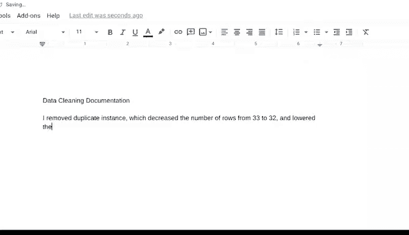

# 032：谷歌数据分析师第四课《从脏数据到干净数据的处理》 📊

## 第32节：文档化的重要性 📝

在本节课中，我们将学习数据清洗过程中文档化的重要性。我们将了解如何记录每一步操作，以及如何向团队和利益相关者清晰地展示你的工作。

---

### 概述

数据清洗、验证和报告的过程很像一部犯罪剧。现在，我们就像在法庭上作证的鉴证科学家一样，需要向同行展示我们的“证据”。数据分析师在完成数据清洗工作后，需要负责展示他们的发现。

上一节我们介绍了数据清洗和验证的具体步骤，本节中我们来看看如何将这些步骤清晰地记录下来并呈现给他人。

### 文档化的核心概念

文档化是跟踪数据清洗过程中所涉及的**变更、添加、删除和错误**的过程。一个很好的例子是变更日志，它按时间顺序记录了每一次修改。

**公式/概念**：
`文档化 = 跟踪(变更 + 添加 + 删除 + 错误)`

对于未来的数据分析师来说，文档化将为你节省大量时间。它本质上是一个备忘单，当你处理类似的数据集或需要解决类似错误时可以参考。

### 如何创建文档

虽然你的团队可以直接查看变更日志，但利益相关者不能，他们必须依赖你的报告来了解你做了什么。

让我们通过一个之前用过的例子，来看看如何记录我们的数据清洗过程。

在那个例子中，我们发现协会的数据库中有两个相同的500美元会员记录实例。我们决定通过手动删除重复信息来修复这个问题。

以下是记录我们所做工作的几种常见方法：

*   **创建步骤清单**：列出所采取的步骤及其产生的影响。
    *   例如，清单上的第一项可能是：你删除了重复的实例。
    *   这导致行数从33减少到32。
    *   并使会员费总额降低了500美元。

*   **在代码中添加注释**：如果我们使用SQL，可以在语句中包含注释来描述更改的原因，而不会影响语句的执行。这是一种更高级的方法，我们将在后面讨论。

### 文档化的益处

无论我们如何捕获和共享变更日志，通过对数据清洗过程保持**100%的透明度**，我们为成功奠定了基础。

这使每个人都能保持同步，并向项目利益相关者表明，我们对有效的流程负责。

换句话说，这有助于建立我们作为“证人”的可信度，在针对“脏数据”的“庭审”中，我们可以被信任来准确呈现所有证据。

### 总结

本节课中我们一起学习了数据清洗中**文档化**的关键作用。我们了解到，详细记录每一步操作不仅能提升个人工作效率，还能确保团队协作的透明度和可信度。通过清晰的文档，脏数据的案件就能“铁证如山”，顺利结案。