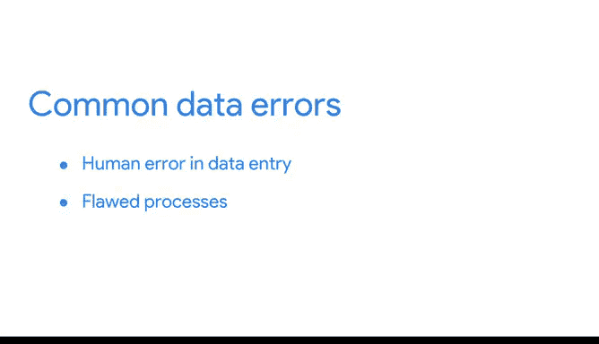

# 033：谷歌数据分析师第四课《从脏数据到干净数据的处理》 🧹

在本节课中，我们将学习数据清洗流程中的反馈与清洗环节。我们将探讨如何利用清洗过程中获得的反馈来改进数据收集流程，并最终推动业务发展。

---

欢迎回来。现在可以肯定地说，验证、记录和报告是数据清洗过程中非常有价值的步骤。你拥有向利益相关者证明数据准确可靠的证据，并且获取这些证据的努力得到了良好的执行和记录。

下一步是获取关于这些证据的反馈，并有效地利用它。这正是本视频将要涵盖的内容。

## 从清洗到洞察 🔍

干净的数据对于手头的任务至关重要，但数据清洗过程本身也能揭示对业务有帮助的见解。我们在报告清洗工作时获得的反馈，可以改变数据收集流程，并最终影响业务发展。

例如，处理数据时最大的挑战之一就是处理错误。一些最常见的错误涉及人为失误，如打字错误或拼写错误；流程缺陷，如调查表设计不佳；以及系统问题，如旧系统集成数据不正确。

无论原因是什么，数据清洗都能揭示错误产生过程的性质和严重程度。

## 利用反馈改进流程 🔄

通过持续的记录和报告，我们可以发现数据收集和录入程序中的错误模式，并利用获得的反馈来确保常见错误不再重复。

以下是可能需要采取的改进措施：

*   **重新编程数据收集方式**：可能需要修改数据收集的程序逻辑。
*   **修改调查表问题**：调整调查表中的具体问题设计。
*   **重新评估与更新流程**：在更极端的情况下，反馈甚至可能促使我们重新审视预期，并可能更新质量控制程序。

例如，有时与数据工程师或数据所有者安排一次会议是很有用的，以确保数据被正确导入，而不需要持续清洗。

## 反馈的价值与总结 📈

一旦错误被识别并解决，利益相关者就拥有了可以信赖的决策数据。通过减少数据收集中的错误和低效，公司可能会发现其利润大幅增长。

恭喜你，现在你已经掌握了成功验证和报告清洗结果所需的基础知识。请继续关注，以在你新获得的技能上不断构建。

---

本节课中，我们一起学习了数据清洗反馈环节的重要性。我们了解到，清洗不仅是修正错误，更是发现数据源头问题的过程。通过系统性地记录、报告并获取反馈，我们可以优化数据收集流程，减少未来错误，从而为公司提供更可靠的数据基础，并可能带来显著的效率提升和成本节约。