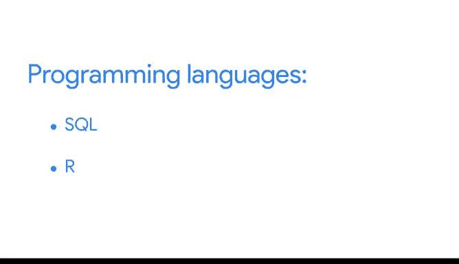

# 034：从脏数据到干净数据的处理 📊

## 第34课：让你的简历脱颖而出 ✨

在本节课中，我们将学习如何优化你的简历，使其在申请数据分析师职位时更具竞争力。我们将探讨如何清晰地展示你的沟通能力、技能和经验，以吸引招聘经理和招聘人员的注意。

很高兴再次见到你。打造一份出色的简历是求职成功的重要途径。

你已经有机会开始构建你的简历，现在我们将迈出下一步，向你展示如何针对数据分析职位优化简历。让我们开始吧。

对于数据分析师而言，简历最重要的作用之一是展示你清晰的沟通能力。招聘分析师的公司希望知道，他们雇用的人不仅能够进行分析，还能以清晰直接的方式向任何受众解释分析结果。作为数据分析师，你的第一受众很可能是招聘经理和招聘人员。因此，在简历中保持直接和连贯性对他们来说也非常重要。

让我们从“个人总结”部分开始。虽然你不会在这一部分详细描述任何工作经历，但这是指出你是否正在转型到新的职业角色的好地方。例如，你可以添加类似这样的内容：“从汽车行业转型，寻求在数据分析领域的全职职位。”

你可以在个人总结以及整个简历中使用一种策略，即PAR陈述法。PAR代表问题、行动、结果。这是帮助你清晰简洁地写作的好方法。

以下是PAR陈述法的应用示例：

*   **问题：** 网站知名度低。
*   **行动：** 通过策略性博客写作。
*   **结果：** 为网站带来了超过2000次新点击。

将PAR陈述法添加到你的工作描述或技能部分，有助于简历的组织性和一致性。这在我换工作时确实对我有帮助。

说到技能部分，请确保包含你通过本课程和自学获得的任何技能和资格。你不需要非常技术化，但谈论你在电子表格、SQL、Tableau和R方面的经验将提升你的简历，并增加你获得工作的机会。

如果你要列出资格或技能，可以设置一个“编程语言”类别，然后列出SQL和R，这两者都是谷歌数据分析证书的一部分。你甚至可以添加你在每种语言中熟悉的主要函数、包或公式。同样，包含你在电子表格中获得的技能，比如数据透视表，也是合理的。

数据透视表、SQL、R以及我们在这里讨论的许多其他术语可能会引起招聘经理和招聘人员的注意。但你肯定希望你的简历能准确反映你的技能和能力。因此，请在完成证书课程后再添加这些技能。

一旦你开始将我们在这里讨论的想法应用到你的简历中，你将很好地使自己与其他候选人区分开来。在你完成最终课程后，你将有机会完成一个案例研究并将其链接到你的简历上。这将是一个绝佳的机会，向招聘人员和招聘经理展示你在获得证书过程中学到的技能。

不知不觉中，你将拥有一份相当出色的简历，每当寻找数据分析师工作时，你都可以快速更新它。这没有任何问题。

接下来，我们将更多地讨论如何在简历中添加经验。现在先到这里，再见。

---

**本节课总结：**

在本节课中，我们一起学习了如何优化数据分析师简历的关键要点。我们强调了清晰沟通的重要性，介绍了使用PAR陈述法来结构化地描述成就，并讨论了如何在技能部分有效展示相关技术能力。记住，一份出色的简历是准确、清晰且有针对性的，它能帮助你在求职过程中脱颖而出。