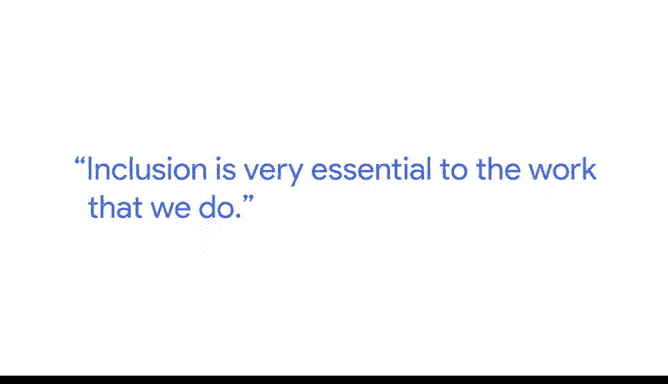
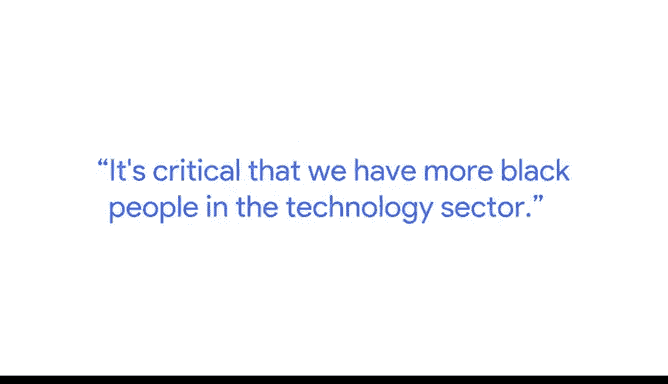

# 035：数据行业中的包容性 🌍

在本节课中，我们将聆听谷歌人事分析师约瑟夫的分享，了解数据行业中多样性与包容性的重要性，特别是黑人及非裔美国人专业人士的角色。我们将探讨如何通过多元化的视角，让数据分析更具代表性和影响力。

---

大家好，我是约瑟夫，我是谷歌的一名人事分析师。

作为一名人事分析师，我的工作是与管理层和人力资源业务伙伴合作，利用数据做出明智的人力资源决策。包容性是我们工作的核心要素。

---

正如你所知，有时你可以用数据讲述一个故事，但其中可能包含你自己的偏见。

因此，在我们这个非常敏感的领域，需要一群拥有不同背景的多元化人才，为数据提供多元的视角。

作为一名黑人专业人士，我可以更好地讲述关于有色人种的故事，这对我而言更具个人意义。作为一名分析师，我的职责是获取数据并从中讲述故事。从个人立场出发，我非常热衷于提升科技行业代表性的工作。

---

例如，在工作之余，我运营着一个名为“Sanrofer Tech”的非营利组织。我们的核心目标是帮助培养下一代黑人工程师，使他们能够进入这个领域，并代表我们的经验。我们以数据为基础，以技术为主要驱动力向前发展。让更多黑人进入科技领域至关重要。

---

众所周知，在未来10到20年，人工智能和机器学习将在美国乃至全世界变得像英语一样普及。

因此，我们在这个领域拥有的黑人专业人士越多，我们就能在正在开发的产品中更好地体现代表性，我们的经验也就能更多地影响这些公司构建的每一个产品。拥有更多黑人工程师、更多黑人数据科学家来进行分析，以及更多黑人数据分析师来帮助讲述更包容我们经验的故事，这绝对是至关重要的。

因此，本质上我们必须拥有来自不同背景、不同肤色的人才来创建、分析数据，并与之建立联系，讲述故事，使其对我们的受众而言更具个人意义。

---

本节课中，我们一起学习了约瑟夫关于数据行业包容性的见解。我们了解到，多元化的团队对于提供无偏见的数据视角、讲述更具代表性和个人意义的故事至关重要。培养和吸纳来自不同背景的专业人士，特别是黑人及非裔美国人，对于构建真正反映社会多样性的产品和技术至关重要。