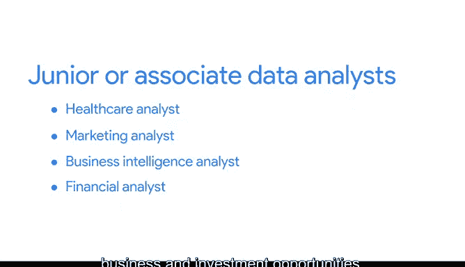

# 036：谷歌数据分析师课程第四课《从脏数据到干净数据的处理》 🧹

## 概述

在本节课中，我们将探讨数据分析师职业的多样性，并学习如何根据自己的兴趣和背景来寻找和定位合适的职位。课程将介绍几种常见的数据分析师职位类型，并帮助你理解如何将所学技能应用到不同的行业中去。

---

如果你还没有搜索过数据分析师职位，现在可以尝试一下。

你可能会注意到数据分析师职位存在许多不同的变体。有些职位头衔只写着“数据分析师”，而另一些则包含更多细节，例如“市场研究分析师”和“数字数据分析师”。

这种多样性是一件好事。它意味着作为一名数据分析师，你将拥有相当广泛的职业机会。因此，虽然你可能不适合每一个发布的职位，但每一个发布的职位也可能并不适合你。

在继续前进的过程中，牢记你自己的兴趣非常重要。我们已涵盖或将要涵盖的某些主题，你可能会发现自己特别感兴趣。

---

## 根据兴趣定制求职方向

以下是你可以采取的策略：

*   **关注职责描述**：当你在求职时，你可能希望定制你的搜索，以找到专注于或包含你感兴趣领域的工作。例如，如果一个职位描述将数据清洗列为一项工作职责，并且你认为自己会非常享受这个过程，你可以将该职位作为你的首选。
*   **结合过往背景**：同时，考虑你的其他兴趣。如果你有零售、医疗或金融方面的背景，并且有过良好的经验，你可以申请与你背景相匹配的工作。作为一个额外的好处，你的经验在你的简历上会显得非常出色。
*   **探索个人兴趣领域**：但在你没有任何专业经验的个人兴趣领域寻找工作也是可以的。如果你一直热爱汽车，可以看看汽车行业有哪些职位。如果你对公用事业公司的运作方式着迷，可以在能源和公用事业行业寻找工作。

找到一份工作很棒。找到一份你热爱的工作则更棒。请始终记住，数据分析正在许多不同的行业中不断发展。因此，职位头衔和招聘需求也可能发生变化。但无论你在搜索时遇到什么，机会总是存在的。

---

## 预览数据分析师职位类型

现在，让我们预览一下市面上众多数据分析师职位中的一些类型。你在这里获得的证书将最适用于初级或助理数据分析师职位。但这并不意味着你必须将求职范围仅限于初级或助理分析师的招聘信息。

职位头衔形式多样。新的分析师在广泛的行业中工作。

以下是几种常见类型：

*   **医疗保健分析师**：他们收集和解释来自电子健康记录和患者调查等来源的数据。他们的工作帮助组织提高护理质量。医疗保健分析师也可能寻找降低护理成本和改善患者体验的方法。
*   **市场营销数据分析师**：他们完成定量和定性的市场分析。他们识别重要的统计数据，并解释和展示他们的发现，以帮助利益相关者理解其营销策略背后的数据。
*   **商业智能分析师**：他们帮助公司利用收集到的数据来提高效率并最大化利润。这些分析师通常处理大量数据，以识别趋势并产生商业洞察。
*   **金融分析师**：他们也处理大量数据（实际上，所有分析师都如此），但金融分析师利用数据来识别并可能推荐商业和投资机会。如果你是这一领域的初级分析师，你可能会从大量的数据收集、财务建模以及电子表格维护工作开始。

这仅仅是数据分析师职位类型的一小部分示例。我们介绍的每种类型也可以扩展到其他行业，例如，商业智能分析师可以在医疗保健、政府、电子商务等领域工作。

---

## 总结

想到这些可能性是令人兴奋的。当然，你还有更多的工作要做，但展望未来并无不妥。当你到达你所展望的那个阶段时，你将能够主动出击，为自己找到最适合的工作。目前，我们将继续探索你的简历构建。下次见。