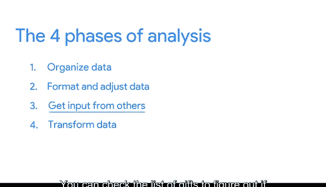
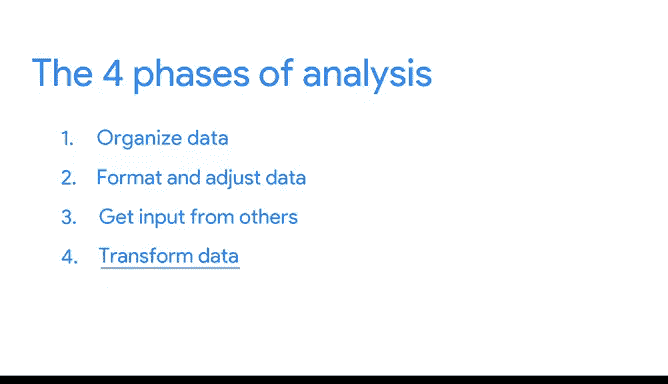

# 002：谷歌数据分析师第五课《通过数据分析回答问题》分析流程 🧩

## 概述

在本节课中，我们将要学习数据分析的核心环节——分析流程。我们将了解分析的定义、目标，并详细拆解分析过程的四个关键阶段。

---

## 什么是分析？

上一节我们学习了如何准备和清理数据。本节中我们来看看数据分析的核心环节。

分析是一个理解所收集数据的过程。它意味着采取正确的步骤，以不同的方式处理和思考你的数据。分析的目标是识别数据中的趋势和关系，以便你能准确地回答你所提出的问题。

## 分析的四个阶段

为了达成分析目标，你应该遵循分析的四个阶段。

以下是这四个阶段：
1.  **组织数据**
2.  **格式化和调整数据**
3.  **获取他人意见**
4.  **通过观察数据点之间的关系并进行计算来转换数据**

---

## 现实场景应用

现在，让我们将这四阶段分析流程应用到一个现实场景中。

想象你想为朋友Zara的婚礼购买礼物。问题是你不确定该买什么。幸运的是，你从她的婚礼网站上获得了大量数据。但你没有阅读她网站上的所有数据或滚动浏览她和伴侣的相册，而是直接查看了在线登记表——一份他们喜欢的礼物愿望清单。

这个登记表就像一个你可以分析以做出决定的数据集。

### 第一阶段：组织数据

此时，你正在查看登记表中组织好的数据。

### 第二阶段：格式化和调整数据

你希望确保数据列表（在这里是礼物列表）的格式易于参考。格式化数据可以简化流程并节省时间。

滚动浏览数百件礼物可能很耗时。因此，你可以通过**过滤**和**排序**数据来调整数据，使其易于消化。

你有一个预算需要遵守。因此，你将礼物价格从低到高排序。然后，你过滤价格，只包含预算60美元以内的礼物。

### 第三阶段：获取他人意见

此时，你正在处理一个新格式化的数据列表。需要记住，在分析信息和做决策时，他人的意见也非常有帮助。

你可以查看礼物列表，看看是否已经有人购买了任何物品。你发现列表中的一些物品已被购买，这为你的决策提供了信息。

在分析数据时，获取他人意见很重要，因为它提供了你可能不理解或无法获得的视角。

除了获取他人意见，尽早寻求他人观点也很重要。这样，如果他们预见到任何障碍或挑战，你就能提前知道。

你寻求意见的人不必是专家也能提供帮助。有时，你只需要一个熟悉你正在考虑的主题或数据的人。

在我们的例子中，这将是Zara的婚礼宾客，他们正在从同一个在线登记表购买礼物。他们可能不是婚礼礼物专家，但他们协作标记已购物品的努力可以帮助你弄清楚不该买什么，从而防止Zara收到重复的礼物。因此，最终获取意见对你的分析很有价值。

### 第四阶段：转换数据

这引出了分析的最后一个步骤：转换数据。转换数据意味着识别数据之间的关系和模式，并根据你拥有的数据进行计算。

回到我们的例子，你能够找到一件你知道Zara会喜欢且符合你预算的礼物。你也能够选择一件尚未被他人购买的礼物。

通过找到这些数据点之间的关系，你选择、购买并发送了一份能够解决你想要解决的问题的礼物。

---

## 总结

本节课中我们一起学习了数据分析流程的精髓。

分析流程的美妙之处在于，你可能已经在日常生活中分析各种情况了。无论你是在个人生活还是职业生涯中分析数据，这四个任务都能帮助你做出更好的决策。你做得越多，对这个过程就会越得心应手。

希望这能让你更好地理解分析的基础知识。随着课程的深入，我们将探讨如何在电子表格和使用SQL时定位数据进行分析。