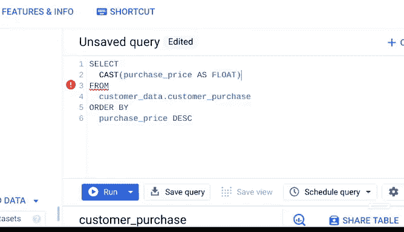

# 004：组织整理永不过时 📂


在本节课中，我们将学习数据分析过程中“分析阶段”的一个核心环节：数据组织。我们将探讨如何有效地组织和结构化数据，以确保分析结果的准确性和效率。

---

上一节我们介绍了数据分析流程的阶段划分。本节中，我们来看看**组织**这一贯穿始终的关键活动。

数据分析师在流程的每个阶段都需要做出关于数据组织的决策。在整个分析过程中保持数据的有序性至关重要。数据的分类和结构方式将直接影响你的分析发现。

无论你是在电子表格还是数据库中工作，一旦你清楚了数据的组织方式，你就能准确地捕获或收集所需的信息。

你分析中使用的大部分数据都将以**表格**形式组织。表格帮助你将相似类型的数据归类到不同的主题领域中，以便你在分析时能够集中关注。

例如，这个基础数据库包含了关于汽车经销商、产品详情和维修部件的表格。每个表格又包含多个数据字段，例如分支机构、所有者和维修部件成本。

你可以利用这些表格和字段来帮助你决定如何推进分析。数据库的结构可以帮助你确定需要提取哪些数据来实现目标，例如某个特定品牌汽车的总销量，或某个分支机构特定型号汽车的维修部件。

表格允许你对**数据类型**做出决策。它们帮助你确定需要哪些变量，以及这些变量应具备的数据类型。

如果你在分析过程中需要转换数据库中的某个数据类型，你可以使用SQL中的`CAST`命令，或者在工作中学习或自行研究的任何其他方法来实现。

就像这个例子，我们将采购价格列从字符串转换为浮点数，使其成为可用于计算的数值形式。



```sql
-- 示例：使用CAST转换数据类型
SELECT CAST(purchase_price AS FLOAT) FROM sales_data;
```

如果你在电子表格中进行分析，你需要确保列和行的组织是高效的。你甚至可以隐藏分析不需要的或显示重复信息的列。

一旦数据被组织和格式化好，你就可以准备对其进行**排序和筛选**，以找到所需的数据。我们很快会详细讲解排序和筛选。但现在，你只需要知道筛选和排序都受我们所处理的数据类型影响。

核心要点是，让数据处于正确的格式非常重要。因此，无论你的分析进行到哪个阶段，都要随时准备进行调整。

---

本节课中，我们一起学习了数据组织的重要性、表格和字段的作用，以及如何准备数据以进行后续的排序和筛选操作。接下来，我们将深入探讨筛选功能的具体应用。