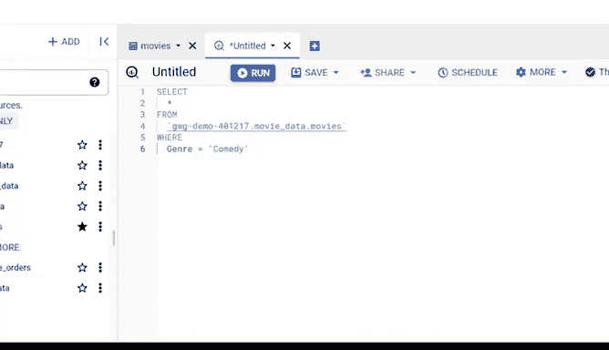

# 005：谷歌数据分析师第五课《通过数据分析回答问题》- 05_01_10_使用SQL过滤数据 📊

在本节课中，我们将学习如何使用SQL的`WHERE`子句来过滤数据。通过过滤，我们可以从庞大的数据集中快速提取出符合特定条件的子集，从而提高数据分析的效率和准确性。

---

## 数据组织的重要性 📂

上一节我们讨论了数据生命周期中组织数据的重要性。就像管理任何收藏品一样，当数据围绕特定结构组织时，管理和维护会变得更加容易。

需要注意的是，数据组织不仅是为了让数据看起来有序，更是为了能够快速、轻松地搜索和定位所需的数据。

作为数据分析师，你会经常需要重新排列和筛选数据库。排序和过滤是两种最常见的数据整理方式。

---

## 排序与过滤：核心概念 🔍

我们之前简要讨论过排序和过滤。了解它们各自的功能非常重要。

**排序**是指将数据按照有意义的顺序排列，以便更容易理解、分析和可视化。排序根据你选择的特定指标对数据进行排名。你可以在电子表格和使用SQL的数据库中对数据进行排序。

以下是排序的常见应用场景：
*   按价格从低到高排序网站商品。
*   按字母顺序排序，如图书馆的书籍。
*   按时间从新到旧排序，如手机短信。
*   按距离从近到远排序，如在线搜索餐厅。

**过滤**是另一种组织信息的方式。它只显示符合特定条件的数据，同时隐藏其余部分。通常，当你想要缩小需要筛选的数据范围时会使用过滤器。

例如，在线搜索绿色运动鞋时，为了节省时间，你可以只过滤出绿色的鞋子。过滤器将较大的数据集精简为与你需求相关的较小子集。

排序和过滤是你在网上可能经常执行的两个操作。无论是将电影放映时间从最早到最晚排序，还是将搜索结果过滤为仅显示图片，你可能已经熟悉了它们对于理解数据有多么大的帮助。

---

## 应用过滤：SQL中的WHERE子句 🛠️

现在，让我们将上述知识应用到筛选大型、杂乱无章的数据堆中。在这种情况下，过滤器是你的好帮手。

你可能还记得之前的视频，可以在Excel和Sheets等电子表格程序中使用过滤器，仅显示符合你设置的范围或条件的行数据。

你也可以在SQL中使用`WHERE`子句来过滤数据。`WHERE`子句的工作原理与电子表格中的过滤类似，因为它会根据你命名的条件返回行数据。

接下来，让我们学习如何在数据库中使用`WHERE`子句。我们将使用BigQuery访问数据库并运行查询。

以下是数据库示例，你可能在之前的视频中见过它。基本上，它是一个很长的电影列表。每一行都包含以下列的数据：电影标题、上映日期、类型、导演、演员阵容、预算和总收入。它还包括电影维基百科页面的链接。

当然，我们不需要遍历所有内容来找到想要的数据。这就是过滤器的妙处。在本例中，我们将使用`WHERE`子句过滤数据库，将列表范围缩小到喜剧类型的电影。

以下是实现步骤：
1.  使用`SELECT`命令，后跟一个星号`*`。在SQL中，星号选择所有数据。
2.  在新的一行，键入`FROM`和数据库名称 `movie_data.movies`。
3.  为了按喜剧类型过滤电影，我们将键入`WHERE`，然后列出条件，即`genre`。
4.  `genre`是数据集中的一个列，我们只想选择`genre`列中的单元格完全匹配“comedy”的行。
5.  接下来，键入等号`=`，并写出我们要过滤的具体类型，即“comedy”。
6.  由于`genre`列中的数据是字符串格式，在书写时必须使用单引号或双引号。
7.  请注意，这里区分大小写，因此必须确保字母大小写与列名完全匹配。

现在，我们可以点击“运行”来查看结果。

---

## 过滤结果与进阶应用 ✅

我们得到的是一个较短的喜剧电影列表。这很酷，对吧？

你还应该知道，你可以对数据库应用多个过滤器。你甚至可以同时进行排序和过滤，以获得更精确的结果。作为一名数据分析师，掌握如何排序和过滤数据将使你成为超级明星。

本节课到此结束。接下来，我们将深入探讨电子表格中的排序功能。下次见！

---

## 总结 📝

在本节课中，我们一起学习了：
1.  **数据组织**对于高效管理和检索的重要性。
2.  **排序**与**过滤**的核心概念及其在日常生活中的应用。
3.  如何在SQL中使用 **`WHERE`子句** 来过滤数据，通过指定条件（如 `genre = ‘comedy’`）从大数据集中提取相关子集。
4.  过滤可以结合排序使用，并且可以应用多个条件，从而帮助数据分析师快速、精准地定位所需信息。