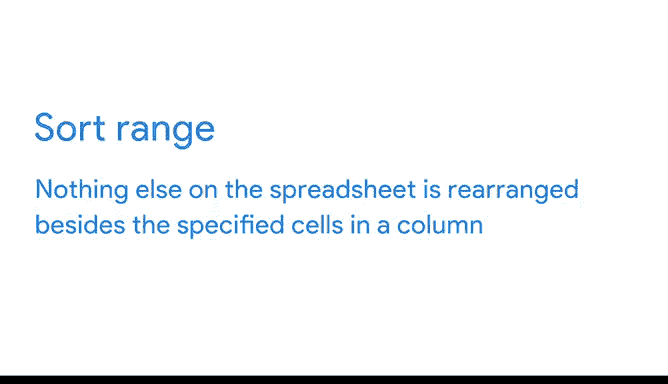

# 006：在电子表格中排序数据

在本节课中，我们将学习如何在电子表格中对数据进行排序。排序是数据分析中一项基础且强大的技能，它能帮助你整理数据、发现模式，并更清晰地理解信息。

上一节我们介绍了数据分析的基本流程，本节中我们来看看如何通过排序来组织和探索数据。

排序功能非常强大。它不仅能为你的电子表格带来秩序和可读性，还能让你重新审视数据。当你根据特定指标对数据进行排序时，可以揭示出数据集中原本不易察觉的新模式和关联。这对于电子表格尤其重要，因为作为数据分析师，你会频繁使用它。掌握排序技巧能让你成为更强大、更自信的分析师。从很多方面来说，排序依赖于你的创造力，去重新构想眼前的信息。

在电子表格中，你可以使用数字或字母按升序或降序对数据进行排序。如果单元格带有颜色标签，你也可以按颜色排序。

在电子表格中排序数据时，你可以选择“排序工作表”或“排序范围”。

以下是两种方式的区别：
*   **排序工作表**：应用此选项时，整个工作表的数据会根据某一列的条件进行排序，但每一行中的相关信息会保持在一起。
*   **排序范围**：此选项不会保持跨行的信息在一起。当你对一个范围排序时，你选择的是希望排序限制在其中的特定单元格集合。工作表中其他部分不会重新排列，只有指定的单元格会变动。

排序电子表格数据有两种主要方法。一种涉及使用菜单，另一种涉及编写排序函数。目前，我们将重点介绍使用菜单进行排序。我们稍后会学习编写函数。

现在，根据你使用的程序，具体过程可能略有不同，但我们讨论的指令和概念基本相同。

回到使用数据菜单进行排序，为了让你了解具体操作，我们将使用一个电影数据表格作为示例。

这个示例将按上映日期对电影进行排序。我们转到B列，即“上映日期”列。点击B列的列标以高亮该列的所有单元格。然后，我们前往菜单栏的“数据”选项卡。

现在，你有两个选择：排序工作表或排序数据范围。

你会注意到我们只选择了“上映日期”列，但这些日期与所在行的电影信息是相关联的。在这种情况下，你希望在排序时，上映日期和电影标题保持在同一行，因为它们是相关的。

为此，你需要选择“排序工作表”。这将保持所有数据按行聚合，无论你如何排序。根据你希望上映日期的排列顺序，你可以选择从A到Z排序（这也会按数字顺序排列日期），或者从Z到A排序（以相反方式排序数据）。由于我们希望上映日期按顺序排列，我们将点击“按B列从A到Z排序工作表”。

操作完成。你刚刚使用菜单对一整张工作表的数据进行了排序。现在，电影根据上映日期按时间顺序排列好了。

假设你想对特定列的数据进行排序，但不需要该列单元格与特定的行信息绑定。相反，你希望隔离该列的数据并单独排序，而不影响工作表其余部分的排列。

为了演示，我们在这个例子中使用电影标题列。首先，选择我们要排序的列——A列。点击A列列标会高亮该列所有包含电影标题的单元格。然后，我们转到菜单并点击“数据”。因为这次我们是将该列与工作表的其余部分隔离开来排序，所以我们将点击“按A列排序范围”。在这个例子中，我们将电影标题按字母顺序从A到Z排序。

完成。你会注意到，“排序范围”不会保持行数据在一起，所以数据看起来有些混乱。在实际工作中，你可能会更频繁地使用“排序工作表”。但理解两者都很重要，这样你就不会意外地将它们混淆。

你刚刚学会了使用菜单在电子表格中排序数据，并了解了如何对整个工作表或特定单元格范围进行排序。这是你作为数据分析师无论走到哪里都能随身携带的技能。

接下来，我们将学习在电子表格中排序的第二种方法——通过编写函数。我们还将通过自定义排序将排序技能提升到新的水平。下节课见。

---

**本节课总结**：在本节课中，我们一起学习了在电子表格中对数据进行排序的核心概念和操作。我们区分了“排序工作表”和“排序范围”两种模式，并通过实例演示了如何使用菜单功能按列进行升序或降序排序。掌握这些基础排序技巧是有效组织和初步探索数据的关键步骤。