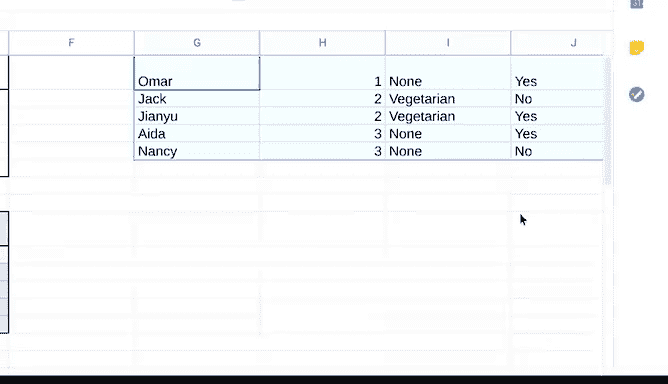
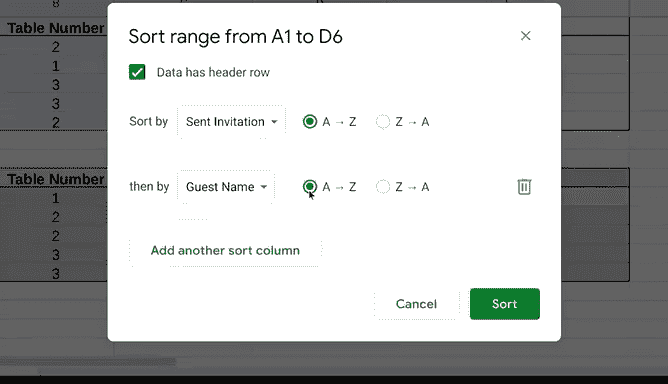

# 007：在电子表格中使用排序功能 📊

在本节课中，我们将深入学习电子表格中的排序功能。我们将探讨两种主要的排序方法：通过菜单排序和使用SORT函数。此外，我们还将学习如何创建自定义排序条件，以便更灵活地组织数据。

上一节我们介绍了排序的基础概念，本节中我们来看看更高级的排序方法。

## 两种排序方法

电子表格中有两种主要的数据排序方法。

第一种方法是使用电子表格程序菜单栏中的“数据”选项卡。

第二种方法是通过编写**SORT函数**来排序。电子表格函数是执行特定过程的预设命令。在本例中，SORT函数的功能就是对你的数据进行排序。

## 使用SORT函数排序

让我们通过一个派对宾客计划的电子表格来演示SORT函数的实际应用。

第一组数据是我们的原始数据集，包含宾客及其相关信息。

假设你想按桌号对宾客进行排序，以了解每个人的座位安排。

以下是操作步骤：
1.  在一个空白单元格中输入函数。与任何函数一样，以等号`=`开始，然后输入`SORT`。
2.  输入开括号`(`。
3.  引用数据起始单元格。在本例中，是`A2`。
4.  输入冒号`:`，然后输入要包含在函数中的最后一个单元格，即`D6`。`A2:D6`就是这个函数的**数据范围**。
5.  输入逗号`,`，将数据范围与排序依据的列分隔开。这里我们依据B列（桌号）排序。
6.  注意，函数的这一部分不识别列字母，因此我们使用对应的数字。由于B列在我们的数据范围中是第二列，所以输入数字`2`。
7.  输入另一个逗号`,`。
8.  接下来，决定该列数据是按升序还是降序排列。`TRUE`代表升序，`FALSE`代表降序。
9.  因为我们希望桌号从1开始列出，所以输入`TRUE`表示升序。
10. 输入闭括号`)`完成函数。

完整的函数公式如下：
`=SORT(A2:D6, 2, TRUE)`

现在，让我们看看函数的效果。我们的派对宾客已经按照他们所在的桌号排序好了。

一旦你明确了想要排序的数据和方式，将函数应用到数据中就变得非常简单。

现在，你的工具箱里已经有了两种不同的数据排序工具。

## 创建自定义排序

掌握了编写SORT函数后，你还会想要定制排序顺序。

**自定义排序顺序**是指在电子表格中使用多个条件对数据进行排序。这意味着排序将基于你选择的条件顺序进行。

让我们回到派对宾客的电子表格。假设你想先按“是否已发送邀请”排序，然后在此基础上，再按宾客姓名字母顺序排列。

你可以通过“数据”选项卡下的“排序范围”选项轻松实现。

以下是操作步骤：
1.  首先，高亮选中数据集中的所有单元格，从`A1`到`D6`。
2.  然后，在菜单栏的“数据”选项卡下，点击“排序范围”。
3.  在本例中，勾选“数据包含标题行”，这能确保列标题不会混入排序数据中。
4.  确保排序依据是“已发送邀请”列。
5.  我们希望“否”的回应在前，“是”的回应在后，因此点击“A到Z”以按此顺序排序回应。
6.  因为我们要添加额外的排序条件，现在点击“添加另一个排序列”。
7.  宾客姓名应按字母顺序排列。因此，选择“宾客姓名”列，并选择从“A到Z”排序。
8.  然后，点击“排序”。

完成！你已经成功地应用了自定义排序顺序。

## 总结

本节课中我们一起学习了电子表格中的高级排序技巧。

你掌握了通过菜单对整张工作表或特定范围进行排序，也学会了使用**SORT函数**来动态排序数据。更重要的是，你通过创建自定义排序条件，进一步提升了数据组织能力。

很快，你将学习另一个强大的工具：如何使用SQL对数据进行排序。尽管数据库有时信息量很大，但掌握这些技能将使你能够以对你有意义的方式重新排列数据。一旦你找到了真正适合的排序方式，你就会理解这对于一名数据分析师而言是多么宝贵的技能。