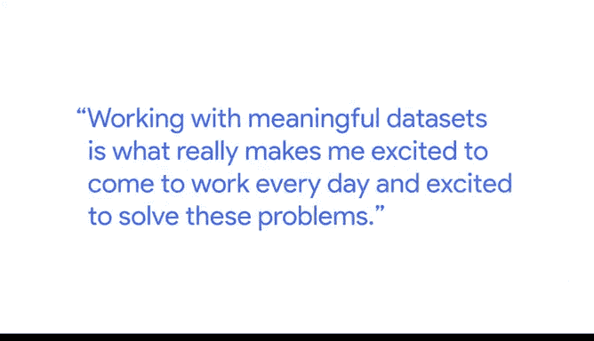
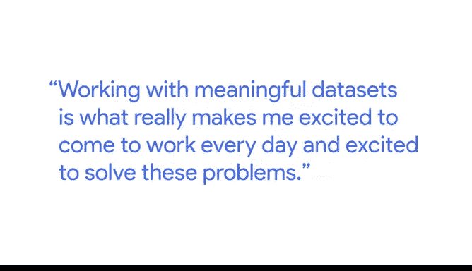

# 008：艾玛的职业旅程 🚀

在本节课中，我们将跟随谷歌健康团队的产品分析师艾玛，了解她如何通过数据分析解决实际问题，并探索如何将个人兴趣与职业发展相结合，找到有意义的数据分析工作。

---

我是艾玛，我是谷歌健康团队的一名产品分析师。我帮助分析数据的工具是为临床医生设计的。这个工具能让临床医生像在谷歌搜索上查找数据一样，轻松找到患者的健康数据。我具体的工作重点是**标准化医疗保健数据**。

上一节我们介绍了数据分析的基本流程，本节中我们来看看艾玛如何将这一流程应用于医疗健康领域。

我分析数据以发现异常或数据质量问题，并与产品经理讨论我们应该推出哪些功能以及原因。

在我的职业生涯中，我处理过各种问题，从解决机车故障并在故障发生前进行预测，到手袋上市前的销售预测，再到如今处理医疗保健数据，试图让临床医生能轻松获取患者的资料。

---

我对从事数据分析工作非常感兴趣，但我当时在努力思考我想处理哪种类型的数据，或者我想专注于数据分析的哪个领域，因为选择实在太多了。我最终被医疗保健数据所吸引。

以下是艾玛选择专注于医疗数据领域的几个关键原因：

*   我真正爱上了我们今天在医疗保健领域面临的所有问题。
*   我看到了医疗行业中可用的大量数据如何能被更好地利用，以帮助患者、帮助临床医生、改善公众健康。

---

处理有意义的数据集，是真正让我每天兴奋地来工作、并热衷于解决这些问题的动力。

在我的职业生涯中，我发现，追随那些让我感兴趣的数据集和问题类型，总能带来更好的结果。因为我更有动力每天去工作，尽我所能去解决这些有趣的问题，仅仅因为它们就是我所感兴趣的。

---

令人惊叹的是，数据无处不在。每个公司、每个领域都存在数据问题。你真的可以追随自己热爱的事物。😊

---

本节课中我们一起学习了艾玛如何将数据分析技能应用于医疗健康这一充满意义的领域。她的经历告诉我们，将个人兴趣与数据分析工作相结合，不仅能带来职业上的成功，更能获得巨大的工作满足感。数据分析是一个广阔的领域，关键在于找到那个能点燃你热情的数据集和问题。