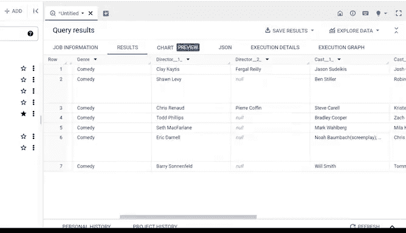

# 009：谷歌数据分析师第五课《通过数据分析回答问题》- 09_01_02_使用SQL排序数据 📊


在本节课中，我们将学习如何在SQL中使用`ORDER BY`子句对查询结果进行排序。排序是数据分析中一项基础且重要的技能，它能帮助我们以不同的视角审视数据，从而发现潜在的规律和洞察。

上一节我们介绍了在电子表格中进行排序的方法，本节中我们来看看如何在SQL中实现类似的功能。

## SQL排序的优势

数据分析师经常需要调整数据的呈现方式。排序是一种重新排列数据的有效方法，因为它能帮助你从不同角度理解现有数据。

你可能已经注意到，许多在电子表格中能完成的操作，在SQL中同样可以实现，排序就是其中之一。我们之前讨论过SQL在处理大型数据集时的应用。当一个电子表格包含过多数据时，你可能会收到错误提示，甚至导致程序崩溃，这是我们希望避免的情况。

SQL可以缩短那些在电子表格中需要极长时间或根本无法完成的处理过程。就个人而言，我使用SQL来提取和合并不同的数据表，这比使用电子表格快得多，通常非常方便。

## 使用`ORDER BY`子句

以下是SQL中一项非常有用的功能：你可以使用`ORDER BY`子句对查询返回的结果进行排序。

让我们回到电影数据表的例子，以便更好地理解其工作原理。你可以选择使用任何SQL工具跟随操作。

作为快速回顾，我们有一个电影数据库，其中列出了上映日期、导演等数据。我们可以使用`ORDER BY`函数以多种不同方式对此表进行排序。

在这个例子中，我们按上映日期排序。

首先，我们有`SELECT`函数和一个星号。请记住，星号意味着选择所有列。接着是`FROM`以及我们当前所在的数据库和表的名称。

现在，让我们看看下一行。它是空的，但我们将在这里编写`ORDER BY`函数。`ORDER BY`命令通常是查询中的最后一个子句。

回到实际的排序操作。我们将键入`ORDER BY`，后面加一个空格。通过这个子句，你可以选择按特定列中的字段对数据进行排序。因为我们想按上映日期排序，所以键入`release_date`。

默认情况下，`ORDER BY`子句按升序对数据进行排序。如果你现在运行这个查询，电影将按照从最旧到最新上映日期的顺序排列。

让我们运行查询看看结果。

```sql
SELECT *
FROM movie_database.movies
ORDER BY release_date;
```

你也可以将上映日期按相反的顺序排序，即从最新到最旧。为此，只需在`ORDER BY`命令中指定降序，写作`DESC`。

让我们运行这个查询。

```sql
SELECT *
FROM movie_database.movies
ORDER BY release_date DESC;
```

你会注意到，最新上映的电影现在位于数据库的顶部。

## 结合筛选与排序

在电子表格中，你可以结合排序和筛选功能以不同方式显示信息。在SQL中，你同样可以实现类似的操作。

你可能还记得，排序是将数据按特定顺序排列，而筛选则是缩小数据范围，使你只看到符合筛选条件的数据。

例如，假设我们想按电影类型进行筛选，以便只处理喜剧片，但我们仍然希望上映日期按从最新到最旧的降序排列。我们可以使用`WHERE`子句来实现这一点。

现在让我们尝试一下。首先，要确保`ORDER BY`子句始终是最后一行。这可以确保你运行查询的所有结果都按该子句排序。

然后，我们将在`FROM`之后、`ORDER BY`之前为`WHERE`子句添加新行。

到目前为止，我们得到的内容如下。接下来，我们想键入要筛选的列名。在这个例子中，我们要筛选出喜剧类型的电影。因此，在`WHERE`子句之后，我们将键入列名`genre`。

现在，我们在`genre`后面添加一个等号，因为我们只想包含与我们筛选条件匹配的类型。在这个例子中，我们筛选的是喜剧，所以我们在两个单引号之间键入`comedy`。

现在，如果你查看整个查询，你会注意到我们正在选择所有列（星号表示所有列）。`FROM`子句指定了我们正在使用的电影数据库的名称。`WHERE`子句筛选数据，只包含类型指定为喜剧的条目。最后一行是`ORDER BY`子句，它将我们选择筛选的数据按上映日期降序排序。

这意味着当我们运行查询时，我们将只得到按从最新到最旧上映日期排列的喜剧电影列表。让我们运行它，看看是否如此。

```sql
SELECT *
FROM movie_database.movies
WHERE genre = 'comedy'
ORDER BY release_date DESC;
```

很好，看看所有这些喜剧电影以及日期的排序方式。

## 使用`AND`进行多条件筛选

现在，让我们更进一步。我们将使用`AND`筛选器，在`WHERE`子句中同时过滤两个条件，并保持排序不变。

假设你想筛选出喜剧电影**并且**票房收入超过3亿美元的电影。在这种情况下，在`AND`函数之后，你通过键入`revenue`来添加收入条件。



然后，你将指定只希望返回收入超过3亿美元的电影。为此，键入大于号`>`，然后键入不带逗号的完整数字`300000000`。

现在，让我们运行查询。

```sql
SELECT *
FROM movie_database.movies
WHERE genre = 'comedy'
  AND revenue > 300000000
ORDER BY release_date DESC;
```

这里，数据只显示收入超过3亿美元的喜剧电影，并且按上映日期降序排序。看起来非常棒。你刚刚像专业人士一样对数据库进行了筛选和排序。通过练习，有一天你就能成为专业人士。

## 总结

本节课中我们一起学习了SQL中的排序功能。我们了解到，`ORDER BY`子句是控制查询结果顺序的关键工具，默认按升序排列，使用`DESC`关键字可改为降序。更重要的是，我们学会了如何将`WHERE`子句与`ORDER BY`结合使用，先对数据进行筛选，再对筛选后的结果进行排序，甚至可以同时使用`AND`等逻辑运算符应用多个筛选条件。这使你能够从大型数据集中精确地提取并有序地呈现所需信息，是数据分析工作中的一项核心技能。


在接下来的课程中，我们将探讨组织性思维如何进一步提升你的分析技能。我们还将介绍如何转换、格式化和调整数据，以合理的方式组合信息。尽早学习这些技能，从长远来看，将使你作为数据分析师的工作更加高效和有效。