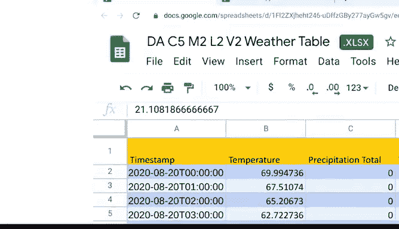

# 011：数据类型转换 📊


## 概述

在本节课中，我们将学习如何在电子表格中转换数据类型和单位。确保数据格式正确是数据分析的关键步骤，能帮助我们避免错误并得出准确结论。

---

## 为什么数据类型转换很重要？🤔

上一节我们介绍了在SQL中进行类型转换，本节中我们来看看如何在电子表格中完成类似操作。

有时，处理电子表格时需要转换数据。这可能意味着将数字转换为日期、字符串、百分比甚至货币。在分析前，务必仔细检查所有数据是否采用了正确的格式。即使在清理和处理数据之后，数据格式仍可能不符合分析需求。

回顾之前的电影数据表，其中包含多种数据类型，例如日期、预算等数字，以及演员姓名等文本字符串。这些是不同的值，但电子表格并不总能自动识别它们。

以下是示例：假设您想按最新上映日期对电子表格中的电影进行排序。如果电子表格将其视为字符串而非日期，则可能会按字母顺序排序。在更改数据类型之前，您将无法按所需方式排序。

此外，您的数据集可能包含不一致的测量单位，需要您进行转换，例如同时包含美元和英镑的表格。因此，再次检查这些数据类型非常重要，以避免在实际分析中遇到问题。

考虑电影表中错误转换的日期。如果您的老板需要一份最新的20部电影列表，但您的电子表格是按字母顺序而非最新日期组织的，您将无法提供她所需的列表。格式错误的数据可能导致分析中出现耗时的错误，并最终影响利益相关者的决策。但提前花时间转换和格式化数据可以帮助您避免这种情况。

---

## 如何在电子表格中转换数据类型？🔧

既然您知道了在电子表格中工作时需要转换数据类型的原因，接下来让我们看看具体如何操作。

首先，让我展示一个用于指定电子表格数据类型的实用菜单。这是我们之前使用的电影数据表。但现在，货币列在工具栏上并未设置为货币格式。在表格顶部的工具栏中，您会找到一个菜单，可以帮助您将这些数字转换为特定的数据类型。

它通过下拉菜单提供了许多选择，例如数字、货币、日期、百分比。如果您点击打开完整菜单，还有更多选项，包括自定义数字格式。我们知道我们希望这些列采用货币格式，所以让我们开始操作。

**操作步骤：**
1.  选择目标列。
2.  点击货币格式快捷按钮。

现在所有数据都已正确设置格式，但这还不是全部。您还可以进一步转换所使用的测量单位。

---

## 转换测量单位 🌡️

对于这个例子，让我们查看一个不同的表格。假设您正在与气象频道合作收集每日温度数据。您有一个表格，其中包含该地区每日温度、风速和降水量的观测数据。目前，温度单位是华氏度。但为了您的分析，您需要将其转换为摄氏度。这很简单。

您只需要使用转换函数来更改测量单位。我们将使用这个空列。这是表格中的第一个温度值。我们将在新列中输入转换函数，将其更改为摄氏度。

**转换公式示例：**
```excel
=CONVERT(A2, "F", "C")
```
在这个公式中：
*   `A2` 是我们要转换的单元格。
*   `"F"` 表示源单位（华氏度）。
*   `"C"` 表示目标单位（摄氏度）。

转换完成后，这个单元格就拥有了适合您分析的正确测量单位。您可以轻松地将此公式应用到该列的其余部分。现在，温度数据全部以摄氏度为单位，表格中的测量单位保持一致。

---

## 一个重要提示：将公式结果转换为静态值 📌

另一个提示是：当使用公式向表格添加数据后，建议随后将数据作为值粘贴回去。这样，数据就被固定下来。否则，单元格将保持为公式，当您开始处理数据时可能会造成混淆。

**操作步骤：**
1.  复制通过公式计算出的值。
2.  右键单击新列。
3.  选择“选择性粘贴”。
4.  选择“仅粘贴值”。

现在，该列中就是静态值了。



---

## 总结

在本节课中，我们一起学习了在电子表格中转换数据类型和测量单位的方法。在开始分析之前，确保数据格式正确至关重要。这样做，您的分析才能返回您真正寻找的答案。现在您已经掌握了一些在电子表格中进行数字类型转换和单位转换的方法，可以确信您的数据已按正确方式格式化。

接下来，我们将进一步讨论如何为分析和数据验证调整数据。下次见。