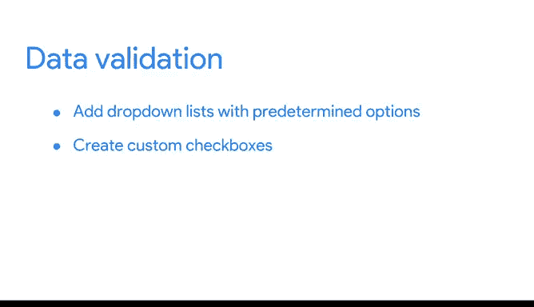

# 012：数据验证 📊

在本节课中，我们将学习电子表格中的一个重要功能——数据验证。数据验证能帮助我们控制工作表中可以输入的内容，从而提升数据质量、简化协作流程，并减少后续数据清理的工作量。

---

## 什么是数据验证？🔍

上一节我们介绍了数据格式化的基本概念，本节中我们来看看数据验证。数据验证是一个电子表格功能，它允许你控制工作表中可以输入和不可以输入的内容。这有助于确保数据的准确性和一致性。

通常，数据验证用于为单元格添加下拉列表，提供预定义的选项供用户选择。如果你的电子表格有很多协作者，这可以使他们更轻松地与你的表格互动。

你可以把它想象成测验中的多项选择题。由于你可以控制输入到工作表中的内容，这减少了后续需要进行的**数据清理**工作量。

---

## 如何使用数据验证创建下拉列表 📋

让我们通过一个例子来了解如何操作。假设我们正在处理一个包含许多里程碑和截止日期的项目。

我们的团队有一个跟踪每个人进度的电子表格。与其让每个人手动输入他们的任务状态，我们可以提供一个包含多个选项的下拉菜单，例如“尚未开始”、“进行中”和“已完成”。

以下是创建下拉列表的步骤：

1.  选择要添加下拉菜单的列。在本例中，是“状态”列。
2.  转到顶部的“数据”下拉菜单，点击“数据验证”。
3.  这会弹出一个带有数据验证选项的菜单。我们知道我们想为用户添加一个选项列表。
4.  在“条件”下选择“项目列表”选项。
5.  输入我们想要创建的选项，例如：`尚未开始, 进行中, 已完成`。
6.  点击“保存”。

现在，所有这些单元格都有了我们可以使用的下拉菜单，可以轻松标记每个任务的进度。

---

## 创建自定义复选框 ✅

除了下拉列表，数据验证还可以用来创建自定义复选框。

以下是创建自定义复选框的步骤：

1.  选择“审核”列下的单元格，以创建一个让我们知道任务是否已获批准的复选框。
2.  回到“数据验证”菜单。
3.  这次不选择“项目列表”，而是选择“复选框”。
4.  有一个选项是“使用自定义单元格值”。我们选择这个选项，并输入“已批准”和“未批准”。
5.  点击“保存”。

现在，这些任务可以由审核者（例如项目经理）通过勾选复选框来标记。

---

## 保护结构化数据和公式 🛡️

数据验证的另一个用途是保护结构化数据和公式。

在电子表格中协作的人越多，有人意外破坏公式的可能性就越大。好消息是，数据验证菜单有一个“拒绝无效输入”的选项，这有助于确保我们的自定义工具即使有人在错误地输入了错误数据时也能继续正常运行。

---

## 总结 📝

本节课中我们一起学习了数据验证在电子表格中的三种用途：

*   **添加下拉列表**：为用户提供预定义选项，确保数据一致性。
*   **创建自定义复选框**：简化是/否或通过/未通过等二元选择。
*   **保护结构化数据和公式**：通过拒绝无效输入，防止公式被意外破坏。

数据验证可以帮助你的团队跟踪进度，在大型团队协作时保护表格不被破坏，并根据你的需求自定义表格。

接下来，我们将学习更多关于条件格式化的知识，以及如何将条件格式化和数据验证结合使用。