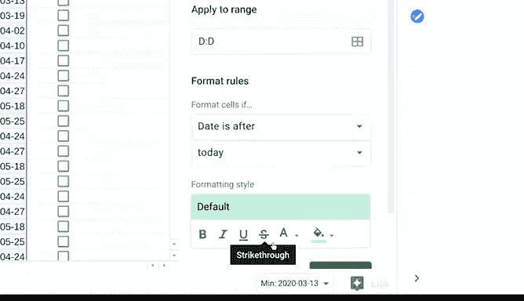

# 013：条件格式化与数据验证 🎨

在本节课中，我们将学习如何结合使用条件格式化和数据验证这两个强大的电子表格工具，以创建自定义的可视化提示，使数据表格更易于理解和分析。

## 概述

上一节我们介绍了条件格式化的基本概念，它是一种能根据单元格数值是否满足特定条件来改变其外观的工具。本节中，我们将在此基础上，探索如何将条件格式化与数据验证功能结合使用，从而构建更直观、更易于管理的电子表格。

## 结合条件格式化与数据验证

我们之前曾使用条件格式化来高亮显示仍需要填写数据的空单元格，以便快速定位表格中缺失的信息。现在，让我们进一步利用它，使我们的项目进度表一目了然。

以下是一个我们在讲解数据验证时使用过的表格，它用于追踪项目中不同任务的状态，供团队查阅。与上次相比，现在表格中包含了更多的任务。

这个表格虽然包含了有用信息，但目前需要花点时间才能理解。我们无法直观地看到有多少任务正在进行中，或者有多少即将到来的截止日期。

然而，如果我们为表格的这些元素添加颜色编码，就能非常轻松地快速查看关键数据。

## 为状态列添加颜色编码

让我们从状态列（C列）开始。在之前的例子中，我们使用数据验证工具创建了下拉菜单。现在，我们可以使用条件格式化来添加颜色。

1.  首先，转到“格式”菜单下的“条件格式化”选项。
2.  这会打开一个侧边栏，我们可以在其中选择范围、规则和格式样式。
3.  我们需要决定当满足设定的条件时，将格式应用到哪些行。我们可以点击范围选项中的按钮来选择要应用格式的所有行，而不是手动输入。
4.  选中这些单元格后，我们就可以选择要应用于这些单元格的规则。由于我们已经有了包含特定文本的下拉菜单，因此可以从规则中选择“如果文本完全等于”。
5.  对于第一条规则，我们将文本条件设置为“尚未开始”。
6.  然后，我们为那些包含“尚未开始”的单元格选择一种颜色，例如红色。
7.  现在，所有从下拉菜单中选择“尚未开始”的单元格都将显示为红色。
8.  点击“添加另一条规则”按钮，为其他状态选项添加条件格式化。
9.  接下来，添加条件“进行中”，我们可以将其设置为黄色。
10. 最后，为“已完成”添加一条规则，我们选择绿色。

现在，我们有了一个易于理解的可视化提示，可以告诉我们有多少任务正在进行中，有多少已经完成。

## 追踪即将到来的截止日期

我们还可以结合数据验证和条件格式化来追踪即将到来的截止日期。

表格中有一个名为“审核截止日期”的日期列。

1.  首先，使用数据验证功能确保用户只能输入有效的日期。我们回到顶部的“数据”下拉菜单，打开数据验证，并选择“日期”作为条件。
2.  然后，我们可以再次转到顶部的“格式”菜单，选择“条件格式化”并打开侧边栏。
3.  点击“选择范围”图标，选择“审核截止日期”列。
4.  现在，在格式规则下，我们可以选择“日期晚于”，这将提供另一个选项。我们选择“今天”。
5.  最后，为这些单元格选择颜色，例如橙色。

这样，如果这些行中列出的日期晚于今天，它们就会被填充为橙色。你也可以根据需要选择一个特定的锁定日期，但目前我们选择“今天”。

现在，所有即将到来的审核日期都有了清晰可见的颜色编码，任何使用此表格的人都可以快速参考这些截止日期。

你会发现，像Excel这样的一些电子表格程序内置了可以直接使用的颜色编码方案。

## 总结

本节课中，我们一起学习了如何使用数据验证和条件格式化来创建自定义工具和可视化提示，从而使你的信息更易于理解。这些工具有多种不同的使用方式，因此鼓励你在自己的电子表格中大胆尝试。

接下来，我们将继续学习电子表格和SQL的新工具。本节课到此结束。