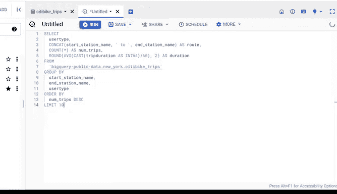

# 014：使用CONCAT合并文本字符串以获得洞察 📊


在本节课中，我们将学习如何使用SQL中的`CONCAT`函数，将来自多个来源的文本字符串合并起来，以创建新的数据视角并获取洞察。

上一节我们介绍了`CONCATENATE`函数在单个电子表格中的应用。本节中，我们将探索SQL中一个类似的函数——`CONCAT`，并学习如何用它来合并来自多个数据表的文本字符串。

## 认识CONCAT函数

`CONCAT`是一个SQL函数，用于连接两个或更多文本字符串。文本字符串是单元格内的一组字符，通常由字母组成。

与之前学到的`CONCATENATE`函数类似，`CONCAT`允许你将来自多个数据源的文本合并。

## 实践案例：纽约共享单车数据

为了演示`CONCAT`的用法，我们将使用纽约市公共自行车共享系统“Citi Bike”的开放数据。

开放数据是指可以自由访问、使用和共享的数据，它为数据分析师提供了丰富的练习资源。

我们的目标是找出不同用户类型最常使用的骑行路线。为此，我们需要从`stations`和`trips`表中创建可识别的路线名称字符串。

## 构建SQL查询

以下是构建查询以合并字符串并分析数据的步骤。我们将逐步解释每个部分的作用。

首先，我们需要确定所需的列，以便告诉SQL我们想要的字符串位于何处。

**查询的核心结构如下：**

```sql
SELECT
  user_type,
  CONCAT(start_station_name, ' to ', end_station_name) AS route,
  COUNT(*) AS num_trips,
  ROUND(AVG(CAST(tripduration AS INT64)), 2) AS duration
FROM
  `bigquery-public-data.new_york_citibike.citibike_trips`
GROUP BY
  start_station_name,
  end_station_name,
  user_type
ORDER BY
  num_trips DESC
LIMIT 10;
```

**让我们分解这个查询：**

1.  **选择用户类型**：`SELECT user_type` 告诉SQL我们想要`user_type`列。
2.  **使用CONCAT创建路线名**：`CONCAT(start_station_name, ' to ', end_station_name) AS route` 将起点站和终点站名称合并，形成一个新的`route`列，使路线名称易于阅读。
3.  **计算行程次数**：`COUNT(*) AS num_trips` 计算所选数据中的行数（每行代表一次行程）。
4.  **计算平均行程时长**：`ROUND(AVG(CAST(tripduration AS INT64)), 2) AS duration` 计算平均行程时长，并使用`CAST`确保数据为64位整数格式，最后用`ROUND`函数将结果四舍五入到两位小数。
5.  **指定数据来源**：`FROM` 子句指明了我们从中提取数据的表。
6.  **使用GROUP BY分组**：由于在`SELECT`中使用了`COUNT`和`AVG`聚合函数，我们必须使用`GROUP BY`对`start_station_name`、`end_station_name`和`user_type`进行分组，以汇总数据。
7.  **使用ORDER BY排序**：`ORDER BY num_trips DESC` 按行程次数降序排列，帮助我们找到最常见的路线。
8.  **使用LIMIT限制结果**：`LIMIT 10` 只返回前10条结果。

## 查询结果的价值

运行上述查询后，我们可以清晰地看到合并后的路线名称，并将其对应到真实的地点。

这有助于共享单车公司了解不同用户群体在城市各区域的出行模式，例如哪些路线的需求量最大，从而优化单车的投放和调度。

能够合并多个数据片段为你提供了组织和分析数据的新方法。除了`CONCAT`，你之后还会遇到另一个功能类似的查询——`JOIN`。



## 总结

本节课中，我们一起学习了如何使用SQL中的`CONCAT`函数来合并来自不同列的文本字符串，从而创建有意义的洞察。

我们通过一个具体的纽约共享单车数据分析案例，构建了一个完整的SQL查询，实现了路线合并、行程统计和平均时长计算。


掌握合并数据的技巧能极大地提升你从复杂数据集中提取有价值信息的能力。接下来，我们将继续深入探讨处理字符串的其他方法。