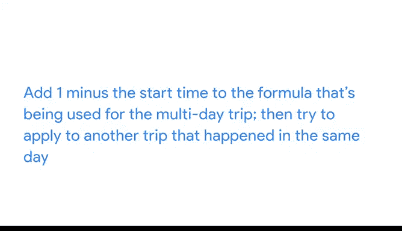

# 016：遇到困难时 🆘


在本节课中，我们将学习数据分析师在遇到困难时应如何应对。数据分析工作涉及大量问题解决，因此掌握寻求帮助的方法至关重要。无论是向他人请教还是在线搜索解决方案，都是推动项目前进的关键技能。

## 向他人寻求帮助 👥

数据分析师在解决问题时，时常会遇到瓶颈。知道在这种情况下该怎么做是关键。向他人请教你遇到的问题，可以帮助你找到新的解决方案，从而推动项目进展。

因此，向你的同事和导师求助总是一个好主意，特别是当他们也在参与同一个项目时。你的团队成员拥有宝贵的知识和见解，能帮助你找到摆脱困境所需的解决方案。

有时我们花费大量时间独自钻研，心想“我自己能搞定”。但如果我们与他人交流，寻找新的资源支持，并尽可能汇集更多人的想法，我们的工作效率会高得多。

例如，假设你正在处理之前视频中的自行车骑行时间数据。你可能试图找出给定月份内两次骑行之间的平均时间间隔。

计算午夜前骑行的时间差很容易。但如果经过的时间跨越到第二天，你可能会遇到问题。

如果有人在晚上11点骑行，但下一次骑行直到早上6点才开始，你的公式会返回一个负数，因为结束时间小于开始时间。

你知道，如果两次骑行开始和结束于不同日期，可以给公式加上“1减去开始时间”。但该公式不适用于同一天内发生的时间。

逐条滚动检查每次骑行以找出这些特殊情况是相当低效的。你需要找到一种方法来构建一个条件公式，但你不确定如何操作。



## 团队协作解决问题 🤝

于是，你决定与团队中其他分析师沟通，看看他们是否有任何想法。你可以给他们发一封简短的邮件，或者去他们的工位看看他们是否有时间与你讨论。

结果发现，他们在之前的项目中遇到过类似问题，并且能够向你展示一个可以加速计算的条件公式。

他们建议使用一个类似这样的 **`IF` 公式**：

```excel
=IF(结束时间 > 开始时间, 结束时间 - 开始时间, (1 - 开始时间) + 结束时间)
```

这个公式的基本逻辑是：如果结束时间大于开始时间，则使用标准的“结束时间减开始时间”公式；否则，使用“1减开始时间再加结束时间”的公式。


## 在线搜索解决方案 🌐

当然，也有可能你的团队成员没有答案。这也没关系。网上肯定有其他人遇到了同样的问题，提出了同样的疑问。

知道如何在线寻找解决方案，是数据分析中一个极其宝贵的问题解决工具。网上有各种各样的论坛，电子表格用户可以在那里提问。你永远不知道一次简单的搜索能带来什么。

例如，假设你搜索“计算电子表格中时间间隔的小时数”，并找到了一个有用的教程，其中介绍了一个使用 **`MOD` 函数**的更复杂公式。

`MOD` 函数可以将负值转换为正值，从而解决你的计算问题。


## 总结 📝

在本节课中，我们一起学习了数据分析师在遇到困难时应采取的策略。无论是向你认识的人请教，还是在互联网上搜索答案，主动寻求帮助都能为你带来有趣的解决方案，并为未来的分析工作提供新的问题解决思路。

接下来，我们将进一步学习如何在网上搜索解决方案。下次见。