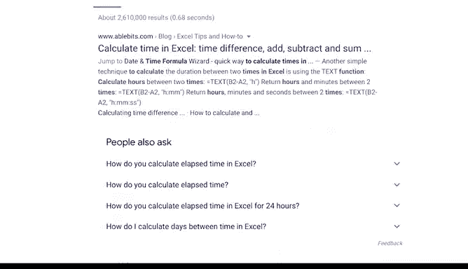

# 018：在线寻找解决方案 📚

在本节课中，我们将学习如何有效地利用网络资源解决数据分析过程中遇到的问题。掌握在线搜索技巧，能够帮助数据分析师快速找到解决方案，并将新知识应用到实际工作中。

## 概述：善用网络资源是数据分析师的核心能力

上一节我们介绍了数据分析中的思维模式。本节中，我们来看看如何将这种思维应用于在线搜索，以高效地解决实际问题。

优秀的分析师并非无所不知。相反，他们擅长利用互联网上的海量知识和经验。能够将网络上的新想法与既有知识结合，往往能催生出出色的解决方案。因此，不必担心需要借助外部资源，这是分析师工作中常见且高效的做法。

## 构建解决问题的思维模型 🧠

寻找在线答案的第一步，是从思维层面正确地定义问题。在本课程中，你已经学习了从分析性思维、数学思维到结构化思维等多种思考技能。

数据分析师运用这些思维技能，以逻辑方式处理问题，并将其分解为更小的部分。将这种思维融入你自己的问题解决流程，可以帮助你准确定位具体问题，从而更容易地找到相关资源。

例如，假设你在分析中反复遇到一个错误。通过逻辑推理，你可以将问题范围缩小到两种可能性：公式错误或数据本身错误。在仔细检查并确认公式无误后，你便能确定问题根源在于数据录入。这样，你就明确了下一步需要搜索“如何检查数据录入准确性”这类具体问题。

## 使用正确的术语进行搜索 🔍

在网络上寻找解决方案时，使用正确的术语至关重要。用其他分析师通用的语言来组织你的问题，能帮助你获得更多、更相关的搜索结果，并更好地理解他人的解答。

以下是搜索时需要注意的关键点：

*   **避免模糊描述**：例如，搜索“获取列中四个字符”过于笼统。
*   **使用专业关键词**：搜索“LEFT string query SQL”则使用了数据分析师社群中通用的术语，能更精准地定位到相关函数用法和讨论。

## 掌握基础工具知识 🛠️

除了会搜索，你还需要熟悉基本的数据分析工具。这样，当在线教程引导你使用某个工具的新功能时，你才能理解其操作逻辑并将其应用到自己的工作中。

以下是工具应用的两个例子：

*   **理解公式逻辑**：如果你在网上找到了一个电子表格公式，你需要先理解公式的基本工作原理，才能将其成功应用到自己的表格中。
*   **选择合适的工具**：如果你处理的数据集过大，单个电子表格无法承载，你就需要转而使用 SQL。作为一名数据分析师，拥有多样化的工具库并知道何时使用它们，与掌握工具本身同等重要。

如果你在某个问题上卡住了，退一步重新思考任务的处理方式，或许会带来转机。本课程已介绍了多种工具，稍后你还将学习 **R 语言**。R 是另一种编程语言，不同于作为数据库语言的 SQL，它**常用于统计分析、数据可视化等任务**。R 与我们目前接触的工具略有不同，但它能与你已掌握的工具形成良好互补，并在你遇到问题时提供更多潜在的解决方案。

## 实践：在线搜索与代码应用 💻

运用我们学到的思维技能、正确的术语以及对不同分析工具的理解，你已为在线搜索答案做好了准备。网络上有大量资源，如程序支持网站和论坛，许多数据分析师在那里提问和解答。

例如，在之前的视频中，我们遇到了计算共享单车行程之间时间间隔的问题。最初的搜索“在电子表格中计算时间”可能没有给出所需答案。但通过思考具体问题以及其他分析师会如何提问，我们可以将搜索词优化为“**在电子表格中计算时间间隔的条件公式**”，从而获得更具体的解决方案。

最后，能够修改示例代码以适应自身需求是一项非常有用的技能。理解不同工具的公式和函数语法，能让你将网上学到的东西为己所用，甚至在其基础上创造出全新的解决方案。

例如，我们为处理跨天行程而构建的 **MOD 公式**。我们在网上找到的 MOD 公式并非为我们正在处理的数据量身定制，但由于我们熟悉电子表格工具，我们能够将其应用到我们的数据中，并作为问题的解决方案。

## 总结

本节课我们一起学习了如何有效地在线寻找数据分析问题的解决方案。优秀的分析师懂得如何利用网络资源来构建解决问题的新方案。通过运用你在本课程中学到的思维技能，以及你对数据分析工具和术语的知识，你也完全可以做到这一点。一旦找到问题的答案，你就能将其融入分析工作，克服可能面临的任何挑战。