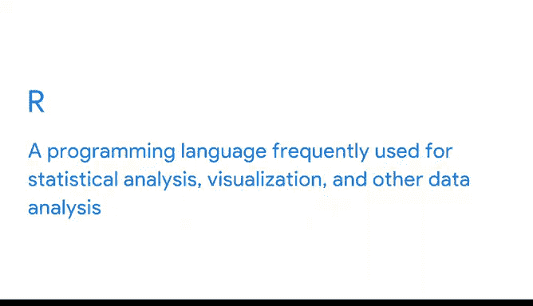

# 019：何时使用何种工具 🛠️

在本节课中，我们将探讨在数据分析过程中，如何根据具体情境选择合适的工具。我们将回顾电子表格、SQL和R等工具的特点，并学习在遇到问题时如何灵活切换工具，以提高分析效率。

---

在之前的视频中，我们介绍了电子表格、SQL等多种工具。我们也讨论了在开始项目前选择合适工具的重要性。但有时，在数据分析过程中，你可能会遇到难题。😊

这可能意味着需要重新考虑当前使用的工具是否适合当前任务。例如，如果你正在处理一个简单的电子表格，可能只有几列和5到10行数据，那么数据透视表是可视化这些数据的绝佳方式。

但如果电子表格超过一百万行，制作数据透视表时可能会开始崩溃。当你发现自己正在处理一个不断崩溃的巨大电子表格时，你可能需要切换到SQL，从数据库的不同位置提取所需数据，而不是从单个电子表格中提取。😊

你可能还记得，SQL可以处理数万亿行数据，并且现在是处理数据库程序的标准语言。SQL非常适合查询、更新和优化数据。但仅使用SQL来分析数据可能会变得复杂。

随着你作为数据分析师的不断进步，你可能会发现自己花费大量时间构建冗长、嵌套的查询，然后调试它们。这时，可能是时候考虑另一个工具了：R。

R是你稍后将使用的新工具。但现在，我会简要介绍一下它，让你开始感到兴奋。R是另一种编程语言，但它不像SQL那样是数据库语言。它是一种经常用于统计分析、可视化和其他数据分析的编程语言。

R与我们一直使用的其他工具有些不同，但它对你已经使用的工具是一个很好的补充。使用R，你将能够以各种新的方式分析和可视化数据。😊

我们稍后会更多地讨论R，但我希望这个先睹为快的介绍能给你一个令人兴奋的第一印象。作为一名数据分析师，拥有多样化的工具包很重要，但同样重要的是知道何时使用它们。😊

如果你发现自己被一个问题困住，退一步重新考虑你处理任务的方式可能是个好主意。以下是一些判断标准：

*   **数据量过大**：单个电子表格无法处理？切换到SQL。
*   **调试时间过长**：花费在调试查询上的时间比实际分析数据还多？也许你应该考虑R。

你现在也知道如何在线寻找答案。所以，如果你遇到问题并需要尝试不同的工具，快速搜索会非常有帮助。网上可能有相关资源，或者其他人可能遇到过同样的问题并发布了相关信息。如果你开始感到被问题困住，这非常有用。

你甚至可能会发现使用你已经熟悉的工具的新方法。

---

本节课中，我们一起学习了在数据分析中根据数据规模、任务复杂度和效率需求，灵活选择和使用电子表格、SQL及R等工具的方法。记住，当遇到瓶颈时，重新评估工具选择是解决问题的关键步骤。接下来，你将迎接每周的挑战。和往常一样，随时可以回顾我们过去视频中学到的任何内容。我们下个视频再见。祝你好运。😊