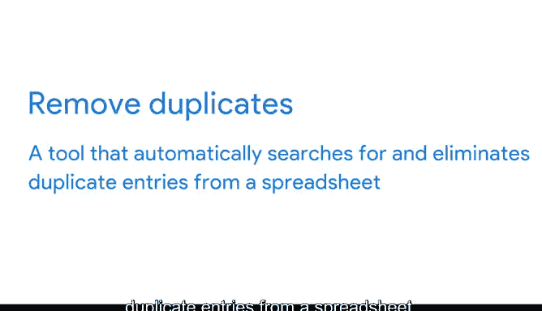

# 021：准备使用VLOOKUP

在本节课中，我们将学习如何为使用VLOOKUP函数准备数据。VLOOKUP是一种数据聚合工具，能帮助我们从多个来源收集数据，并将其合并为单一的汇总集合。

数据聚合可以为你提供关于所查看数据的各种信息。例如，在市场营销中，你可以聚合广告活动的数据，以了解其在不同时间段和特定客户群体中的表现。旅游公司使用数据聚合来了解竞争对手对特定航班、酒店房间或租车类型的定价，从而确保自身产品的定价具有竞争力。这些企业的共同点是，它们都可以使用VLOOKUP来帮助实现这些目标。

## 🔍 回顾VLOOKUP

首先，我们回顾一下VLOOKUP。VLOOKUP代表垂直查找。本质上，它是一个在列中搜索特定值以返回相应信息的函数。之前，我们使用VLOOKUP将一个单元格中的值与另一个表格中的值进行匹配。例如，我们能够将一个由数字和字母组成的产品代码（存储在一个电子表格中）与另一个表格中该产品的实际名称进行匹配。

但在进行任何查找之前，我们需要确保数据已准备妥当。正如你多次听到的，干净的数据更有可能提供准确的结果。

## 🧹 常见数据清理任务

以下是使用VLOOKUP前需要处理的常见数据清理任务。

### 处理不同的数据类型

数据集中的日期可能被格式化为数字，或者数字被表示为文本字符串而非数值。当数据格式不一致或电子表格应用程序无法识别时，VLOOKUP将不知道如何处理这些数据，并会返回错误。

之前，你学习了如何使用格式工具将数字转换为日期。现在，我们重点学习如何将文本转换为数值。

为此，你可以使用格式菜单选择数字类型。但你也可以使用`VALUE`函数。`VALUE`函数可以将表示数字的文本字符串转换为数值。

以下是一个示例。在这个电子表格中，A列的数字当前是文本字符串。我们可以通过运行一个简单的`SUM`函数来确认这一点。

**语法**是：`=SUM(open parentheses)`，然后添加你想要相加的项。在这里，是A2到A4。冒号表示我们包含这两个引用之间的所有内容。

现在，你可以添加一个闭括号并按回车键，或者为了节省时间，你可以点击并拖动想要包含在括号内的单元格。结果是0。这是因为该函数不适用于文本字符串。

但是，如果我们应用`VALUE`函数，它会自动将文本转换为数值。为此，我们输入`=VALUE(open parentheses)`。然后，我们引用想要转换其值的单元格。在这个例子中，是A2。

现在，如果我们关闭括号并按回车键，你会注意到123变成了数值。如果我们将其向下拖动到整列，456和789也会变成数值。

现在，我们可以通过运行另一个`SUM`函数来测试它。我们输入`=SUM(open parentheses)`，然后是B2冒号B4。这样，B2、B3和B4都被包含在求和中。关闭括号并按回车键。现在，它显示总和是1368。

### 处理多余空格

下一个常见错误来自电子表格中的多余空格。正如你所学的，当数据从一个来源复制到另一个来源时，有时会附带一些前导或尾随空格。这些在使用VLOOKUP时可能会导致问题。因此，我们希望在数据清理过程中使用`TRIM`函数。

`TRIM`会自动删除单元格中添加的任何额外空格。

### 处理重复项

VLOOKUP中另一个典型的错误是重复项，你可以在数据清理过程中轻松发现。如果在搜索列中存在重复行，VLOOKUP将只返回它找到的第一个匹配项。

正如你之前学到的，`移除重复项`是一个自动搜索并消除电子表格中重复条目的工具。正如你在不久前的一个视频中看到的，使用`移除重复项`是消除重复项的好方法，有助于确保在查找过程中找到正确的记录。

## 🎯 总结

本节课中，我们一起学习了为使用VLOOKUP函数准备数据的关键步骤。我们回顾了VLOOKUP的基本概念，并详细探讨了三个常见的数据清理任务：转换不一致的数据类型（特别是文本到数值）、使用`TRIM`函数清除多余空格，以及使用`移除重复项`工具处理重复数据。请始终记住，干净的数据是一切分析工作的基础，而VLOOKUP本身也可以成为一个非常有用的数据清理工具。在下一个视频中，我们将继续探索更多使用VLOOKUP的方法。