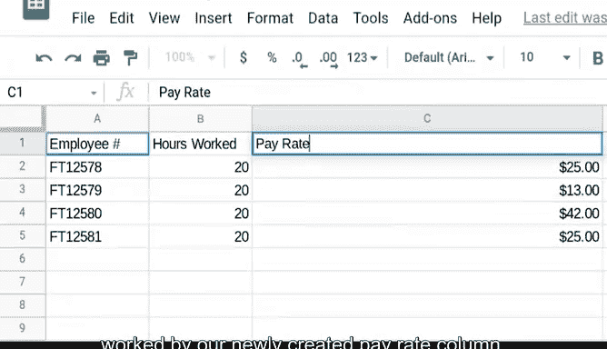

# 022：VLOOKUP实战 📊

在本节课中，我们将学习如何使用VLOOKUP函数进行实际操作。VLOOKUP是数据分析中一个非常强大的工具，它可以帮助我们从不同的数据表中查找并整合信息。通过本教程，你将掌握VLOOKUP的基本语法和实际应用场景。

---

## VLOOKUP语法回顾

上一节我们介绍了VLOOKUP在数据清洗中的重要性以及使用前的准备工作。本节中，我们来看看VLOOKUP的具体语法结构。

VLOOKUP是一个电子表格函数，用于在指定列中垂直搜索特定值，并返回对应的信息。其基本语法如下：

**公式：**
`=VLOOKUP(搜索键值, 搜索范围, 列索引, [是否近似匹配])`

例如，在公式 `=VLOOKUP(103, A2:B26, 2, FALSE)` 中：
*   `103` 是要搜索的值。
*   `A2:B26` 是待搜索的数据范围。
*   `2` 表示返回数据范围中的第二列信息。VLOOKUP不识别A、B、C这样的列名，因此使用数字来指定列。
*   `FALSE` 指示函数查找精确匹配。如果设置为 `TRUE`，函数将返回近似匹配，这可能不是我们想要的结果。

---

## VLOOKUP实战应用：合并数据表

了解了基本语法后，我们来看一个最常见的应用场景：使用VLOOKUP从一个电子表格中提取数据，填充到另一个表格中。

假设我们有两个不同的数据表，但需要结合两者的信息来回答业务问题。VLOOKUP可以通过一个匹配列将两个表格连接起来，从而整合到一个表格中。

以下是具体操作步骤：

1.  **识别数据源**：我们有两个表格。一个表格包含员工ID和他们的时薪（`员工时薪表`）。另一个表格包含相同的员工ID和每个人的工作时长（`员工工时表`）。
2.  **应用VLOOKUP**：我们的目标是在`员工工时表`中，根据员工ID查找对应的时薪，并创建一个新列。
3.  **编写公式**：在`员工工时表`的新列中，输入以下公式：
    **公式：**
    `=VLOOKUP(A2, ‘员工时薪表’!A$2:B$5, 2, FALSE)`
    *   `A2` 是`员工工时表`中的第一个员工ID。
    *   `‘员工时薪表’!A$2:B$5` 指定了在`员工时薪表`中搜索的范围。使用单引号和感叹号是引用其他工作表的正确方式。`$`符号用于锁定单元格引用，确保在向下复制公式时，搜索范围不会改变。
    *   `2` 表示我们想返回搜索范围（A列到B列）中的第二列，即时薪信息。
    *   `FALSE` 确保进行精确匹配查找。
4.  **填充公式**：将公式向下拖动填充整列。现在，`员工工时表`中就新增了一个包含每位员工时薪的列。
5.  **进行计算**：最后，我们可以使用一个简单的乘法公式来计算每个人的工资，即用“工作时长”乘以新创建的“时薪”列。

---

## 总结与练习建议

本节课中，我们一起学习了VLOOKUP函数的实战应用。我们回顾了其语法结构，并通过一个合并两个数据表的实例，演示了如何使用VLOOKUP根据一个共同键值（如员工ID）来查找和填充数据。

VLOOKUP是功能较为复杂的函数之一，持续的练习至关重要。在接下来的阅读材料中，你将学到更多关于VLOOKUP的知识，并获取一些有用的提示和资源。多加练习，你一定能熟练掌握这个强大的数据分析工具。