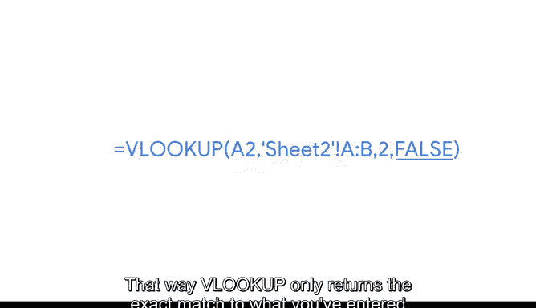

# 023：识别和修复常见VLOOKUP错误 🔍

在本节课中，我们将学习如何识别和修复电子表格中VLOOKUP函数常见的错误。VLOOKUP是数据分析师最常用的查找和引用函数之一，但它也容易引发一些问题。掌握故障排除技巧，能帮助你更高效地使用这个工具。

---

## 故障排除的核心：提出正确的问题

当人们刚开始接触数据分析时，常以为资深从业者无所不知。但事实是，我们都在不断学习和解决问题。很多时候，这都涉及故障排除。故障排除的关键在于提出正确的问题，这也是本视频的重点。

我们将学习如何运用故障排除来解决各类问题。为此，我们需要先了解VLOOKUP的一些限制，然后练习修复数据分析师最常遇到的一些问题。

以下是我喜欢问自己的一些故障排除问题：

**如何确定问题的优先级？**
试图一次性解决所有问题会让人不知所措。我发现，一次只处理一件事会更有帮助。

**用一句话描述，我面临的问题是什么？**
这有助于澄清真正的问题所在，避免被无关细节困扰。毕竟，如果在查看数据前没有明确目标，你可能会发现任何东西。最好从自己对情况的清晰理解开始，然后让数据告诉你方向是否正确。

**有哪些资源可以帮助我解决问题？**
互联网是最好的资源之一。如果你遇到一个问题，很可能已有成千上万的人遇到过完全相同的情况。因此，快速搜索会非常有帮助。同时，要记住人也是资源，不要害怕提问。这不仅是学习的绝佳方式，还能帮助你与同事建立牢固的关系。

**如何防止这个问题在未来再次发生？**
如果一个新的流程或指南能阻止相同问题再次出现，那将节省大量时间。

---

## VLOOKUP的常见限制与解决方案

上一节我们介绍了故障排除的通用思路，本节中我们来看看VLOOKUP函数本身的一些具体限制和对应的修复方法。

**VLOOKUP只返回它找到的第一个匹配项**
即使存在多个可能的匹配项，VLOOKUP也只会返回第一个。

**VLOOKUP只能返回查找范围右侧的数据**
它无法向左查找。好消息是，有一个简单的解决方案。数据分析师通常通过复制粘贴列，将想要查找的数据列移到查找值的右侧来解决这个问题。这样，查找值就在最左侧的列，而所需数据就在它的右侧。

---

## 修复常见VLOOKUP错误

以下是数据分析师最常遇到的几个VLOOKUP问题及其修复方法。

**问题一：公式下拉填充后结果出错**
假设VLOOKUP函数的前几行返回了正确结果，但当你将函数向下拖动填充整列时，问题开始出现。

这很可能是因为函数中的`table_array`（查找范围）部分没有被锁定或设为绝对引用。绝对引用是一种被锁定的引用，当公式被复制时，其行和列不会改变。

你可以通过用美元符号`$`包裹`table_array`来修复此问题。正如之前所学，美元符号控制着引用的更新方式，确保引用的相应部分不会改变。

**问题二：版本控制问题**
另一个可能导致VLOOKUP结果出错的是版本控制问题。换句话说，函数最初运行完美，但随后它所引用的电子表格中的某些内容发生了变化。例如，用户可能插入了一列，导致函数中的列号不再将VLOOKUP指向正确的位置。发生这种情况时，它会返回错误的值。

数据分析师可以采取以下措施来确保这种情况不会发生：

**锁定电子表格**
这可以阻止其他人进行更改。在Google Sheets中，选择“数据” -> “受保护的工作表和范围”。在其他电子表格应用程序中，也有实现相同功能的工具。

**选择要保护的内容**
在本例中，我们希望保护整个工作表。然后，你可以设置权限，选择显示警告或限制可编辑的人员。选择“仅限自己”，然后点击“完成”。

但请注意，有时其他人也需要在电子表格中工作。因此，将他们锁在外面可能会让你在同事中不太受欢迎。在这种情况下，你可以使用`MATCH`函数。`MATCH`函数用于定位特定查找值的位置，可以帮助你进行版本控制。我们暂时不深入讨论，但请知道这是一个备选方案。

**问题三：精确匹配与近似匹配**
我们将讨论的最后一个问题与精确匹配和近似匹配有关。使用VLOOKUP时，根据你在函数中输入`TRUE`还是`FALSE`，可能会得到不同的结果。

`TRUE`告诉VLOOKUP查找近似匹配。
`FALSE`告诉VLOOKUP查找精确匹配。

因此，如果函数看起来像这样：`VLOOKUP(lookup_value, table_array, col_index_num, TRUE)`，它是在告诉VLOOKUP查找与我们正在寻找的文本或数字最接近的匹配项。

需要重点注意的是，VLOOKUP从指定范围的顶部开始，垂直向下搜索每个单元格以找到正确的值。当它找到任何大于或等于查找值的值时，就会停止搜索。

这就是为什么数据分析师通常使用`FALSE`，像这样：`VLOOKUP(lookup_value, table_array, col_index_num, FALSE)`。这样，VLOOKUP只会返回与你输入的查找值完全匹配的结果。

---

## 总结

本节课中，我们一起学习了如何识别和修复VLOOKUP函数的常见错误。我们探讨了故障排除的核心是提出正确的问题，并具体分析了VLOOKUP只返回首个匹配项、无法向左查找、引用未锁定、版本控制问题以及匹配模式错误等常见挑战及其解决方案。

VLOOKUP是电子表格中最受欢迎的查找和引用函数之一，也是最棘手的之一。在后续课程中，你将了解更多这些常见挑战。你现在学到的一切，都将帮助你在未来作为数据分析师开始使用VLOOKUP时，遇到更少的问题。