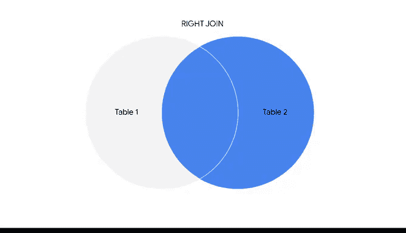
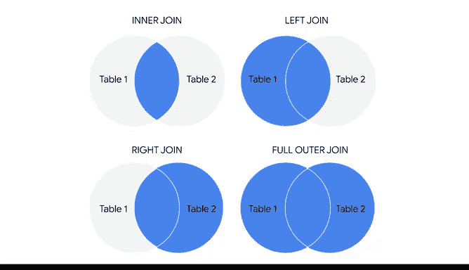

# 024：探索连接操作的工作原理 🔗


在本节课中，我们将学习SQL中的连接操作。连接是数据分析师用于合并数据库中多个相关表数据的核心工具。我们将介绍四种常见的连接类型，并通过示例理解它们的工作原理。

上一节我们介绍了在电子表格中聚合数据的工具，本节中我们来看看如何在数据库中使用SQL连接来聚合数据。

## 什么是连接？

连接是一个SQL子句，用于基于相关列将两个或更多表中的行组合起来。你可以将连接理解为SQL版本的Vlookup函数。

连接帮助你将不同表中匹配或相关的列组合起来。在学习关系型数据库时，我们称这些值为**主键**和**外键**。

*   **主键**：表中每一行都具有唯一值的列。
*   **外键**：一个表中的列，其值是另一个表中的主键。

例如，在一个关于员工的表中，`employee_id`是主键，而`office_id`则是外键。连接利用这些键来识别对应值之间的关系。

## 四种常见的连接类型

以下是数据分析师最常用的四种连接类型：内连接、左连接、右连接和全外连接。

这张图直观地展示了每种连接的作用，我们将用它来帮助理解这些函数。


### 内连接

内连接返回两个表中具有匹配值的记录。

如果将我们的表想象成维恩图中的圆圈，那么内连接将返回两个表重叠区域的记录。

**核心概念**：结果表中只会包含那些在两个表中都存在键值的记录。只有当两个表中都有匹配项时，记录才会合并。

在SQL中，输入`JOIN`通常默认为内连接。因此，许多分析师会使用`JOIN`作为简写，而不是输入完整的查询。

### 左连接

左连接返回左表中的所有记录，以及右表中匹配的记录。

如何区分左表和右表？在英语和SQL中，阅读顺序是从左到右。首先提到的表是左表，第二个提到的表是右表。你也可以将连接语句左侧的表名视为左表，右侧的表名视为右表。

在此图中，你会注意到整个左表都被着色，并且与右表有重叠区域。这表明左表及其与右表共享的记录被选中。

**核心概念**：左表中的每一行都会出现在结果中，即使它在右表中没有匹配项。

### 右连接




右连接则相反，它返回右表中的所有记录，以及左表中匹配的记录。

如果你调换表的顺序并使用左连接，可以得到相同的结果。例如：
`SELECT * FROM table_a LEFT JOIN table_b` 等同于 `SELECT * FROM table_b RIGHT JOIN table_a`。

### 全外连接

全外连接结合了右连接和左连接，返回两个表中的所有匹配记录。

这意味着它将返回两个表中的所有记录。如果一个表中的记录没有匹配项，它将为另一个表创建具有空值的记录。

## 连接操作实战示例

使用连接可以使处理多个数据源变得更加容易，并且能使表之间的关系更加清晰。

假设我们正在处理跨多个部门的员工数据。我们有一个`employees`表和一个`departments`表，它们都拥有`department_id`这样的列。我们可以使用不同的连接子句来从表中提取并聚合不同的数据。

### 场景一：获取有部门ID的员工名单及其部门名称

因为`department_id`记录在两个表中都被使用，我们可以使用内连接来返回仅包含这些员工的列表。

以下是构建此查询的步骤：

1.  使用`SELECT ... AS ...`告诉SQL我们希望的列标题。
2.  使用`FROM`指定数据来源（`employees`表）。
3.  输入`INNER JOIN`和我们使用的另一个表（`departments`）。
4.  使用`ON`指定每个表中包含匹配连接键的列。

```sql
SELECT
  employees.name AS employee_name,
  departments.name AS department_name
FROM employees
INNER JOIN departments
ON employees.department_id = departments.department_id;
```

执行后，我们就得到了拥有部门ID的员工的姓名和部门名称列表。

### 场景二：获取所有员工姓名及其部门（如有）

我们可以使用左连接或右连接来返回所有员工姓名及其部门（如果可用）。

首先尝试左连接，查询结构与上一个类似，但将`INNER JOIN`改为`LEFT JOIN`。

```sql
SELECT
  employees.name AS employee_name,
  departments.name AS department_name
FROM employees
LEFT JOIN departments
ON employees.department_id = departments.department_id;
```

执行查询后，我们得到包含员工姓名和部门的新列表。但你会注意到存在`NULL`值。这些是右表（本例中是`departments`表）没有对应值的地方。

接下来尝试右连接进行测试。这个查询几乎相同，唯一的区别是我们使用`RIGHT JOIN`子句来返回右表的所有行，无论它们在连接语句左侧的表中是否有匹配值。本例中右表是`departments`。

### 场景三：获取所有员工和所有部门信息

全外连接将获取所有员工姓名和所有部门信息。同样，这个查询的开头与我们做过的其他查询很像。

```sql
SELECT
  employees.name AS employee_name,
  departments.name AS department_name
FROM employees
FULL OUTER JOIN departments
ON employees.department_id = departments.department_id;
```

运行后，我们将获得这两个表中的所有员工姓名和部门信息。在`department.name`列和`employee.name`列中都会出现`NULL`值，因为我们连接了没有匹配值的列。



## 总结

本节课中我们一起学习了SQL连接操作的工作原理。当你需要处理多个相关表中的数据时，连接非常有用。它们为你提供了组合和查看数据的极大灵活性。

记住：
*   **内连接**：仅返回两个表都匹配的记录。
*   **左连接**：返回左表全部及右表匹配的记录。
*   **右连接**：返回右表全部及左表匹配的记录。
*   **全外连接**：返回两个表的所有记录。


如果你记不清这些连接的作用，回想一下我们的维恩图就明白了。下次我们将继续学习在SQL中聚合数据的其他知识。