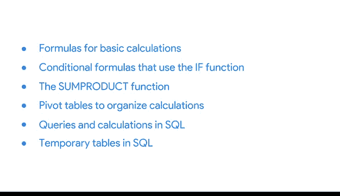

# 028：数据计算 📊

在本节课中，我们将回顾一些熟悉的概念，并运用这些概念来探索新的知识。作为一名数据分析师，你会反复使用关键的工具和流程，但随着工作的深入，你也会不断学习新事物，例如构建新型分析或掌握节省时间的快捷技巧。

上一节我们介绍了数据分析的基本流程，本节中我们来看看如何高效地进行数据计算。

## 回顾与效率提升 🔄

当我初到谷歌时，我只依赖少数几个程序和工具来获取数据并进行分析。但我很快意识到，我的工作效率并未达到预期。一旦我熟练掌握了使用SQL提取和分析数据，我的效率就得到了显著提升。随着SQL技能和对数据表操作的日益精进，我完成分析的速度也越来越快。这让我深深着迷。

在接下来的视频中，我将展示一些在分析过程中进行高效计算的方法。

## 电子表格中的基础计算 📈

我们将从重温电子表格开始，学习用于基础计算的公式。

以下是电子表格中常用的基础计算函数：
*   **SUM**: 用于对一系列数值求和。
*   **AVERAGE**: 用于计算一系列数值的平均值。
*   **COUNT**: 用于计算包含数字的单元格数量。

## 条件公式与IF函数 ⚖️

接着，我们将学习使用IF函数的条件公式，它通过计算来检查某个条件是否被满足。

IF函数的基本语法是：
`=IF(逻辑测试, 如果为真的返回值, 如果为假的返回值)`

## 多功能SUMPRODUCT函数 ✨

之后，我们将探索功能强大的SUMPRODUCT函数。它能在一步之内同时完成加法和乘法运算，因此非常实用。

SUMPRODUCT函数的基本形式是：
`=SUMPRODUCT(数组1, [数组2], ...)`

## 数据透视表的计算组织能力 🔄

接下来，我们将再次审视数据透视表。如果你跳过了相关课程，现在是第一次学习它，你将全面了解它的功能。数据透视表用途广泛，其中之一就是组织你的计算。

## SQL中的查询与计算 💾

然后，我们将转向SQL（双关语）。我们将展示在SQL中，查询和计算是如何密不可分的。

在SQL中，计算可以直接在SELECT语句中完成，例如：
`SELECT column1, column2, column1 * column2 AS calculated_column FROM table_name;`

## SQL中的临时表 💡

我们还将学习SQL中的临时表，它在分析过程中临时存储数据非常有用。

创建临时表的示例：
`CREATE TEMPORARY TABLE temp_table AS SELECT * FROM original_table WHERE condition;`

在这些视频中，我们将涵盖许多新概念。你可以随时暂停视频，思考问题或尝试自己操作步骤。你也可以根据需要反复观看视频。

## 总结 📝

本节课中我们一起学习了数据计算的核心方法。我们首先回顾了提升效率的重要性，然后依次探讨了电子表格中的基础公式、条件IF函数、SUMPRODUCT函数、用于组织计算的数据透视表，以及在SQL中结合查询进行计算和使用临时表的技巧。掌握这些工具将帮助你在数据分析工作中更加高效和精准。