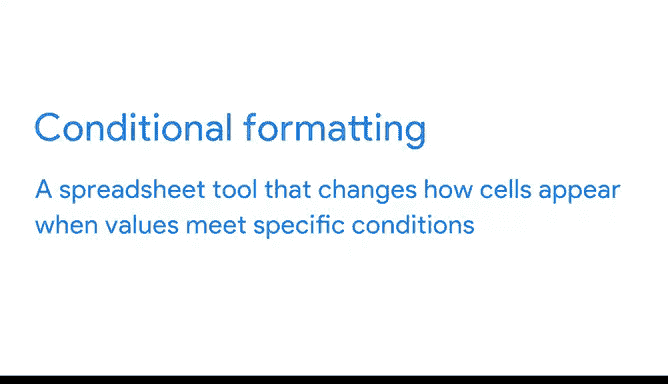

# 029：常用计算公式 📊

在本节课中，我们将学习如何在数据分析中使用电子表格公式进行基本计算。公式是数据分析师的重要工具，能帮助我们高效、准确地处理数据。我们将通过一个折扣连锁店的销售数据案例，演示如何使用公式计算年度总销售额、年度增长、增长率、月平均销售额等关键指标。

---

## 概述

在数据分析工作中，我们经常需要进行各种计算，例如求和、求平均值、计算增长率等。虽然这些计算在日常生活中也很常见，但在数据分析中，我们处理的数据量更大，计算也更复杂。使用电子表格公式可以大大提高计算效率和准确性。本节课程将介绍几种常用的计算公式，并通过实际案例演示其应用。

---

## 计算年度总销售额

首先，我们需要计算2011年至2020年每年的总销售额。数据已按月份（列）和年份（行）组织好，但尚未汇总每年的总销售额。我们可以使用 **SUM** 函数来完成这个任务。

以下是具体步骤：

1.  在数据表右侧添加一个新列，命名为“年度销售额”。
2.  在2011年对应的“年度销售额”单元格（例如N2）中输入公式：`=SUM(B2:M2)`。
    *   所有公式都以等号 `=` 开头。
    *   `SUM` 是求和函数。
    *   `B2:M2` 是单元格范围引用，代表2011年1月到12月的销售数据。
3.  按下回车键，即可得到2011年的总销售额。

**快捷操作**：我们可以使用**填充柄**（单元格右下角的小方块）快速将公式应用到其他年份。只需点击已输入公式的单元格，拖动填充柄向下覆盖“年度销售额”列的其他单元格，公式就会自动复制并计算每一年的总销售额。

---

## 计算年度销售额增长

接下来，我们计算每年相比上一年的销售额增长额。这需要我们比较连续两年的总销售额。

计算步骤如下：

1.  在“年度销售额”列旁边新增一列，命名为“销售额增长”。
2.  在2012年对应的“销售额增长”单元格（例如O3）中输入公式：`=N3 - N2`。
    *   `N3` 是2012年的总销售额。
    *   `N2` 是2011年的总销售额。
    *   减号 `-` 表示减法运算。
3.  按下回车键，即可得到2012年相比2011年的销售额增长额。
4.  同样使用填充柄将公式应用到其他年份。

**注意**：计算结果可能出现负数，这表示该年份相比上一年出现了负增长。

---

## 计算年度销售额增长率

除了增长额外，我们通常还需要了解增长的百分比，即增长率。这能更直观地反映变化幅度。

计算增长率的方法如下：

1.  在“销售额增长”列旁边新增一列，命名为“增长率%”。
2.  在2012年对应的“增长率%”单元格（例如P3）中输入公式：`=O3 / N2`。
    *   `O3` 是2012年的销售额增长额。
    *   `N2` 是2011年的总销售额（作为基数）。
    *   斜杠 `/` 是公式中表示除法的符号。
3.  按下回车键，得到一个小数形式的结果。
4.  为了更易读，我们可以将其转换为百分比格式。选中该单元格，点击工具栏上的 **百分比样式按钮（%）**。
5.  使用填充柄将公式和格式应用到该列其他单元格。

---

## 计算月平均销售额

现在，我们换个角度，分析不同月份的平均销售表现，以发现季节性趋势。我们需要计算每个月份在多年间的平均销售额。

以下是计算月平均销售额的步骤：

1.  在数据表底部新增一行，命名为“月平均销售额”。
2.  在一月份下方的“月平均销售额”单元格（例如B12）中输入公式：`=AVERAGE(B2:B11)`。
    *   `AVERAGE` 是求平均值函数。
    *   `B2:B11` 是2011年至2020年每年一月份销售额的数据范围。
3.  按下回车键，得到一月份的平均销售额。
4.  使用填充柄将公式向右拖动，一直复制到十二月份（M12）。这样我们就得到了每个月的平均销售额。

**数据洞察**：通过观察这一行数据，我们可以快速发现，夏季月份和十二月的平均销售额通常最高。

为了让这个趋势更一目了然，我们可以应用**条件格式**进行可视化。

1.  选中“月平均销售额”这一行的所有数据单元格（B12:M12）。
2.  在菜单中找到“格式” -> “条件格式”。
3.  选择“颜色刻度”，并设置一个从浅到深的绿色渐变。这样，平均值最低的月份显示为最浅的颜色（或白色），平均值最高的月份显示为最深的绿色。

通过这个简单的颜色编码，利益相关者能瞬间识别出销售表现最好和最差的月份。

---

## 查找极值：最低与最高月平均销售额

最后，我们需要明确指出月平均销售额的最高值和最低值。对于小型数据集，也许可以手动找出，但使用公式能确保准确并避免人为错误。

以下是查找极值的步骤：

*   **查找最低月平均销售额**：
    *   在一个空白单元格中输入公式：`=MIN(B12:M12)`。
    *   `MIN` 函数会返回指定数据范围中的最小值。
*   **查找最高月平均销售额**：
    *   在另一个空白单元格中输入公式：`=MAX(B12:M12)`。
    *   `MAX` 函数会返回指定数据范围中的最大值。

通过这两个公式，我们可以得出结论：对于这家门店，销售额通常在十二月达到顶峰，而在一月份处于低谷。

---

## 总结

在本节课中，我们一起学习了数据分析中几种核心的计算公式及其应用：

1.  使用 **`SUM`** 函数计算数据总和（如年度总销售额）。
2.  使用**基本算术运算符**（`-`， `/`）计算增长额和增长率。
3.  使用 **`AVERAGE`** 函数计算数据的平均值（如月平均销售额）。
4.  使用 **`MIN`** 和 **`MAX`** 函数快速查找数据集中的最小值与最大值。
5.  利用**填充柄**高效复制公式，以及使用**条件格式**将数据可视化，使分析结果更加清晰易懂。

掌握这些公式和技巧，能让你在处理实际数据分析任务时更加得心应手，高效地从数据中提取有价值的洞察。