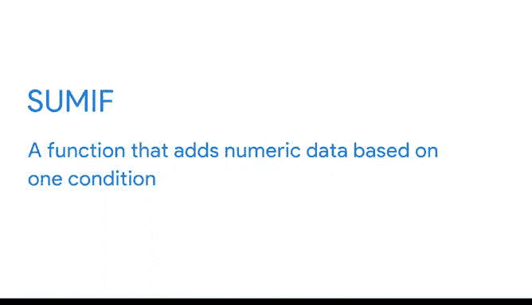
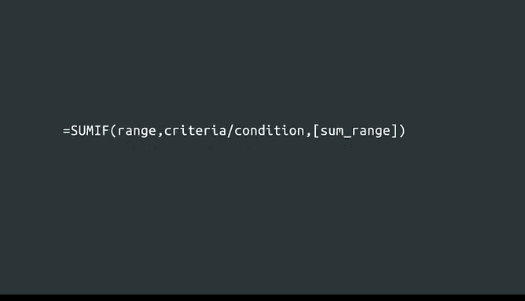
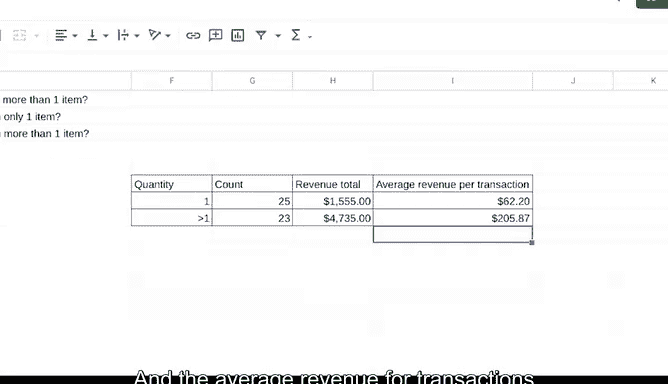

# 030：谷歌数据分析师第五课《通过数据分析回答问题》📊


## 概述

在本节课中，我们将学习如何使用 `COUNTIF` 和 `SUMIF` 函数来高效、准确地进行数据计算。这些函数能帮助数据分析师快速统计和汇总符合特定条件的数据，是处理大量数据时的得力工具。

---

## 从计数开始：`COUNTIF` 函数

上一节我们介绍了数据分析的基本流程，本节中我们来看看如何利用函数进行条件计数。

`COUNTIF` 函数用于统计满足特定条件的单元格数量。其基本语法如下：

```
=COUNTIF(范围, 条件)
```

*   **范围**：需要检查的单元格区域。
*   **条件**：定义哪些单元格将被计数的标准。

### 实践：统计单件商品交易

假设我们有一份来自在线厨具零售商的数据样本，需要回答“有多少笔交易只包含一件商品？”这个问题。

以下是操作步骤：

1.  在目标单元格（例如 `G11`）输入公式起始符：`=COUNTIF(`
2.  选择包含“商品数量”数据的列（例如 `B3:B50`），然后输入逗号。
3.  指定条件。要统计数量等于1的交易，条件应写为 `"=1"`。注意，文本条件需用引号包围。
4.  输入右括号并按下回车。

最终公式为：`=COUNTIF(B3:B50, "=1")`。执行后，函数将返回满足条件的交易笔数，例如 25。

### 统计多件商品交易

要统计商品数量大于1的交易，只需修改条件部分。公式变为：`=COUNTIF(B3:B50, ">1")`。

通过对比这两个计数，我们可以初步了解不同交易类型的分布情况。

---

## 进阶汇总：`SUMIF` 函数

了解了如何计数后，我们进一步学习如何对满足条件的数据进行求和。



`SUMIF` 函数用于对满足单个条件的单元格进行求和。其语法结构如下：

```
=SUMIF(条件检查范围, 条件, [求和范围])
```

*   **条件检查范围**：根据条件进行判断的单元格区域。
*   **条件**：定义哪些单元格对应的值将被求和的标准。
*   **求和范围**（可选）：实际需要进行求和的数值区域。如果省略，则对“条件检查范围”中满足条件的单元格本身求和。

### 实践：计算不同类型交易的总收入



现在我们需要计算“单件商品交易”和“多件商品交易”各自带来的总收入。

计算单件商品交易收入的步骤如下：

1.  在目标单元格（例如 `H11`）输入：`=SUMIF(`
2.  选择条件检查范围，即商品数量所在的列（`B3:B50`），输入逗号。
3.  指定条件 `"=1"`，输入逗号。
4.  选择求和范围，即收入金额所在的列（`C3:C50`）。
5.  输入右括号并按下回车。

最终公式为：`=SUMIF(B3:B50, "=1", C3:C50)`。结果显示，单件商品交易总收入为 $1555。

接着，我们将公式中的条件改为 `">1"`，即可计算出多件商品交易的总收入，例如 $4735。结果显示，多件商品交易贡献了更高的收入，这符合商业直觉。

---

## 完成分析：计算平均交易额

最后，我们利用已得出的计数和汇总结果，来计算平均每笔交易带来的收入。这有助于利益相关者更直观地比较不同交易类型的价值。

我们使用除法运算符 `/` 进行计算：

*   **单件商品交易平均收入** = 总收入 / 交易笔数
    *   公式示例：`=H11/G11`，结果约为 $62.20。
*   **多件商品交易平均收入** = 总收入 / 交易笔数
    *   结果约为 $205.87。

这个信息可能非常有用。例如，公司可以考虑是否为购买多件商品的交易提供折扣，以进一步鼓励客户增加购买量。

---



## 总结

本节课中我们一起学习了两个强大的电子表格函数：`COUNTIF` 和 `SUMIF`。

*   **`COUNTIF` 函数** 用于**统计**符合特定条件的数据条目数量。
*   **`SUMIF` 函数** 用于**汇总**符合特定条件的数据所对应的数值。


通过构建一个清晰的汇总表，并运用这些函数，我们能够快速回答关于数据的关键问题，例如不同交易类型的数量和收入情况。在处理大型数据集时，熟练使用这些函数能显著提升分析效率与准确性。在接下来的课程中，我们将探索更多函数，让数据分析工作更加流畅。