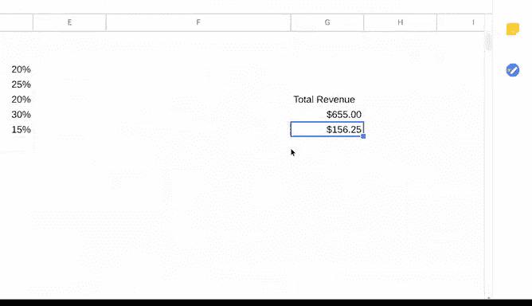

# 031：通过数据分析回答问题 - 复合函数 🧮


在本节课中，我们将学习如何使用复合函数，特别是 `SUMPRODUCT` 函数，来简化数据分析中的复杂计算。我们将通过一个具体的例子，展示如何利用这个函数高效地计算总收入和利润。

数据分析师喜欢探索新的分析方法，尤其是那些能简化工作的技巧。与其每次分析时都尝试寻找新方法，不如向他人学习，通过提问和寻求帮助来获取灵感。我们常说的“自豪地借用”意味着，你可以毫无顾虑地在分析中使用从他人或他处学到的流程，无论是同事、论坛帖子还是在线搜索。当然，使用时务必注明来源，这是一个非常重要的步骤。

`SUMPRODUCT` 函数就是这样一个分析师们可能自己发现或从其他来源学到的技巧。你可以将其视为进行更复杂计算的快捷方式。接下来，我们将展示 `SUMPRODUCT` 的工作原理，以及何时可以使用它来简化你的工作。

## 什么是 `SUMPRODUCT` 函数？ 🤔

`SUMPRODUCT` 是一个函数，它**将多个数组相乘，然后返回这些乘积的总和**。

以下是 `SUMPRODUCT` 公式的基本结构：

```excel
=SUMPRODUCT(array1, [array2], [array3], ...)
```


公式以等号 `=` 开始，后跟函数名 `SUMPRODUCT` 和一个开括号 `(`。括号内是要相乘并相加的数组，每个数组之间用逗号 `,` 分隔。

**数组**类似于电子表格中的范围，但请注意，数组是单元格中值的集合，而不是单元格本身。


## `SUMPRODUCT` 如何工作？ ⚙️

当在公式中使用时，`SUMPRODUCT` 函数会将两个或更多数组中的每个对应值相乘。

例如，数组 `B3:B7` 中的每个值可以与数组 `C3:C7` 中的对应值相乘（即 `B3*C3`, `B4*C4`，依此类推）。然后，函数会返回所有这些乘法结果的总和。

## 实战示例：计算总收入 💰

让我们通过一个厨房用品公司的数据示例来具体看看。你可能在我们的 `COUNTIF` 和 `SUMIF` 视频中见过这个例子。

我们获得了一些产品订单数据，包括订单中每种产品的销售数量（`Quantity`）和单价（`Unit Price`）。我们的任务是利用这两列数据计算出这个订单的总收入。

这正是 `SUMPRODUCT` 大显身手的地方。要计算总收入，我们需要同时进行乘法和加法运算。

如果不使用 `SUMPRODUCT`，我们需要先将每个数量乘以对应的单价（例如 `50 * $25`，`25 * $5` 等），然后再将所有收入金额相加，才能得到总收入。

幸运的是，`SUMPRODUCT` 函数可以一次性为我们完成所有这些计算。

以下是具体操作步骤：

1.  在单元格 `G5` 中添加标签“Total Revenue”。
2.  点击单元格 `G6` 来输入我们的公式。
3.  以等号 `=` 和函数名 `SUMPRODUCT` 开始公式，后跟一个开括号 `(`。记住，我们添加到公式中的数组必须始终放在括号内。
4.  选择第一个数组 `B3:B7`（数量），然后输入一个逗号 `,`。逗号用于分隔公式中的不同数组。
5.  选择第二个数组 `C3:C7`（单价），然后输入一个闭括号 `)` 来完成公式。
6.  按下回车键，即可得到总收入。

由于我们处理的是收入，可以将数字格式设置为货币。这样，我们就计算出总收入为 **$655**。

## 进阶应用：计算总利润 📈

然而，$655 并不是这些厨房用品销售的实际利润，因为我们的计算中还没有包含利润率。**利润率**是一个百分比，表示每产生一美元的销售额，能带来多少美分的利润。

在我们的数据集中，产品编号 789 的利润率为 20%，这意味着每售出一美元该产品，能获得 20 美分的总利润。

与计算收入类似，我们可以使用 `SUMPRODUCT` 函数来节省计算利润率的时间。在这个电子表格中，利润率公式与收入公式只有一个重要区别。

操作步骤如下：

1.  在单元格 `G7` 中开始输入。
2.  键入公式的第一部分，与之前相同：`=SUMPRODUCT(`。
3.  以同样的方式包含前两个数组（数量和单价）。
4.  但不要立即结束公式，而是添加另一个逗号 `,`，后跟第三个数组。
5.  这次，选择包含利润率的单元格 `D3:D7`。
6.  完成公式并闭合括号。

`SUMPRODUCT` 函数使我们免于将每个单独的收入金额乘以每个利润率百分比，然后再将每个利润金额相加的繁琐步骤。

## 总结 📝



在本节课中，我们一起学习了 `SUMPRODUCT` 这个强大的复合函数。我们了解到：

*   `SUMPRODUCT` 可以高效地执行涉及多个数组的乘法和求和运算。
*   它通过 `=SUMPRODUCT(array1, array2, ...)` 的语法结构工作。
*   我们通过计算订单总收入和总利润的实际例子，掌握了它的应用方法。

使用 `SUMPRODUCT` 进行计算不仅能节省时间，还能帮助你避免手动计算可能出现的错误。这绝对是一个值得记住并融入你分析工具箱的技巧。