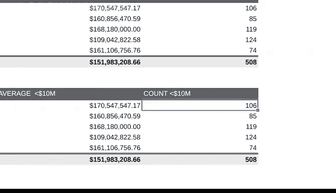

# 032：数据透视表入门 📊

在本节课中，我们将学习如何使用数据透视表（Pivot Table）来组织和计算数据，从而快速发现数据中的洞察和趋势。数据透视表是电子表格中一个强大的工具，尤其适用于汇总和分析大量数据。

## 数据透视表简介

上一节我们介绍了函数和公式，它们是完成计算的有用工具。本节中，我们来看看另一个可以实现类似功能的工具——数据透视表。

数据透视表允许你以多种方式查看数据，以发现洞察和趋势。我们之前讨论过数据透视表如何帮助清理和组织数据，包括排序和分组。此外，数据透视表也能辅助计算，例如快速计算总和与平均值。

## 实战演练：分析电影收入数据

现在，让我们通过一个电影数据集的例子，看看数据透视表如何与计算协同工作。在这个场景中，你的经理要求你通过收入计算来寻找一些趋势，以帮助构思新的电影创意。

这个电子表格包含了几年前的电影数据。虽然数据本身可能已过时，但我们分析数据的步骤在当下依然完全适用。

### 第一步：计算每年的总收入

首先，我们需要找出每年的总收入。使用数据透视表是组织这类信息的好方法。

以下是创建数据透视表以显示每年总收入的步骤：

1.  **选择数据范围**：数据位于单元格 `A1` 到 `N509`。
2.  **创建新工作表**：为数据透视表添加一个新工作表，这有助于将计算集中在一处，并与原始数据分开。我们将此工作表重命名为“Revenue”。
3.  **构建数据透视表**：
    *   将“Release Date”（上映日期）字段拖到“行”区域。
    *   将“Box Office Revenue”（票房收入）字段拖到“值”区域。
4.  **按年份分组**：右键点击“Release Date”列中的任意单元格，选择“创建数据透视表日期组”，然后按“年”分组。

完成这些步骤后，数据透视表会自动使用**求和函数**（`SUM`）计算每年的总收入。无需手动更改设置。

### 第二步：计算每部电影的平均收入

仅看总收入可能不够，因为每年上映的电影数量不同。计算每部电影的平均收入可能更有用。

我们可以在同一个数据透视表中添加这个计算：

1.  再次将“Box Office Revenue”字段拖到“值”区域。
2.  点击这个新值字段，将“值字段设置”中的汇总方式从“求和”改为“平均值”。

**平均值函数**（`AVERAGE`）会为我们提供数据集中每年电影的平均收入。

### 第三步：深入分析数据

观察结果，我们发现2015年的平均收入远低于其他年份。作为一名优秀的分析师，发现异常后应进一步探索原因。

为了解原因，我们首先需要知道数据集中每年包含多少部电影：

1.  第三次将“Box Office Revenue”字段拖到“值”区域。
2.  将这个值字段的汇总方式改为“计数”。

**计数函数**（`COUNT`）显示，2015年的电影数量最多，但其总收入却是第二低。这可能意味着2015年有很多电影收入不高，从而拉低了平均收入。

为了验证这个假设，我们可以进行更深入的分析，例如：
*   使用筛选器找出2015年收入低于1000万美元的电影数量。
*   创建计算字段来确定这些电影占当年电影总数的百分比。

我们将在下一讲中继续这个探索过程。

## 总结

本节课中，我们一起学习了数据透视表的基础应用。我们了解到数据透视表不仅能组织和汇总数据，还能快速执行求和、平均值、计数等计算。通过分析电影收入数据的实例，我们掌握了创建数据透视表、按年份分组数据以及使用不同汇总函数的方法。最重要的是，我们认识到在分析中主动发现并探索数据异常是优秀数据分析师的关键特质。