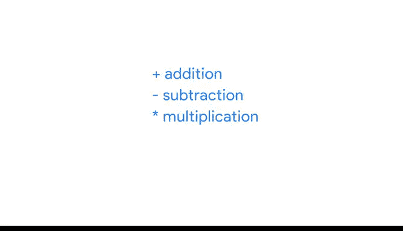
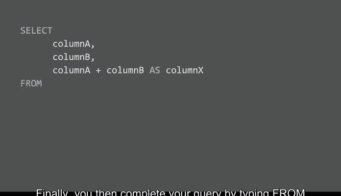
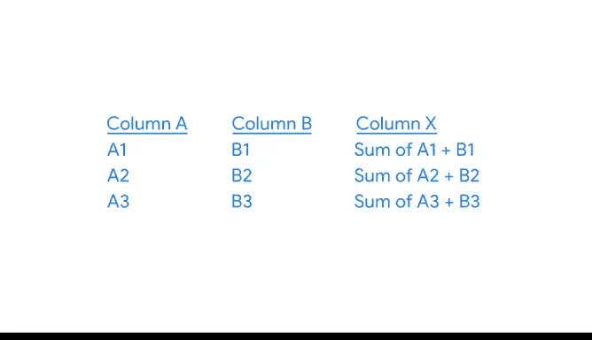
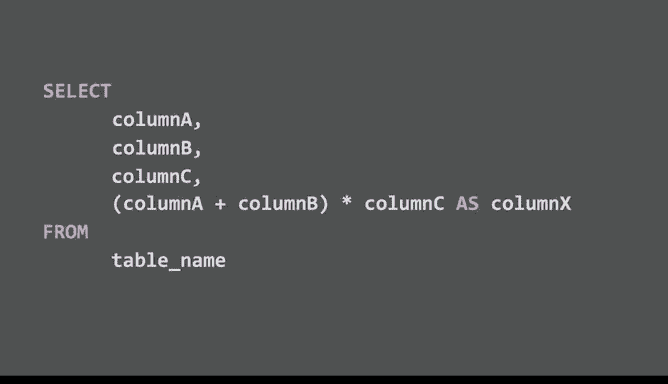
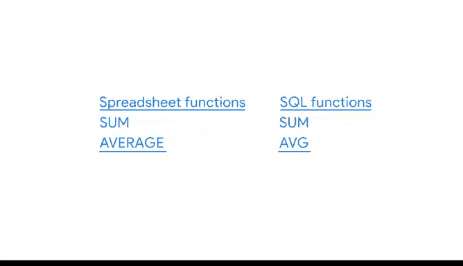

# 034：查询与计算 📊


在本节课中，我们将学习如何在SQL中执行计算，并将其与电子表格中的计算方式进行对比。我们将探讨基本的算术运算符、查询语法以及函数的使用，帮助初学者理解SQL计算的核心概念。

---

## 概述

数据分析师在日常工作中可以通过多种方式完成任务，计算也不例外。之前我们已经了解到，在电子表格中可以通过多种方法完成相同的计算。同样，在SQL中也能实现这些计算。本节将概述SQL计算与电子表格计算的异同，并介绍SQL中的基本算术运算符和查询语法。

---

## 算术运算符对比



在电子表格和SQL中，算术运算符用于执行基本的数学运算。运算符是公式中用于命名操作或计算类型的符号。

以下是电子表格公式中的四种基本算术运算符：
- **加法**：使用加号 `+`
- **减法**：使用减号或连字符 `-`
- **乘法**：使用星号 `*`
- **除法**：使用正斜杠 `/`

在SQL中，这些运算符以相同的方式计算数据。它们嵌入在从数据库提取数据的查询中，就像电子表格公式一样。

---

## SQL查询语法

查询的语法是其结构，应包含要提取到新表中的所有数据细节及其位置。以下是一个可能的查询语法示例：

```sql
SELECT column1, column2, column1 + column2 AS total
FROM table_name;
```



运行此查询将返回一个表，显示要相加的两列及其值的总和。

如果需要进行减法、乘法或除法运算，只需使用相应的运算符替换加号即可。



---

## 使用多个运算符

如果需要在计算中使用多个算术运算符，可以使用括号控制计算顺序。例如：

```sql
SELECT columnA, columnB, columnC, (columnA + columnB) * columnC AS result
FROM table_name;
```



此查询将返回一个新列，显示列A和列B的总和乘以列C的值。

---

## 模运算符

如果只需要除法计算的余数，可以使用模运算符。在SQL中，模运算符用百分号 `%` 表示。在电子表格中，可以使用 `MOD` 函数完成相同的计算。

---

## 函数的使用

在电子表格和SQL中，很多时候可以使用函数代替运算符完成计算。例如：
- **求和函数**：在电子表格和SQL中均可使用 `SUM` 函数完成加法运算。
- **平均值函数**：电子表格中的 `AVERAGE` 函数与SQL中的 `AVG` 函数功能相同，均返回一组数字的平均值。

在SQL中，这些函数被视为聚合函数，因为它们对一个或多个值执行计算并返回单个值。稍后我们将学习如何与 `GROUP BY` 命令结合使用。

---

## 总结



本节课我们一起学习了SQL计算的基础知识，包括算术运算符、查询语法以及函数的使用。掌握如何编写计算查询是第一步，接下来我们将继续深入学习SQL中的更多计算技巧。