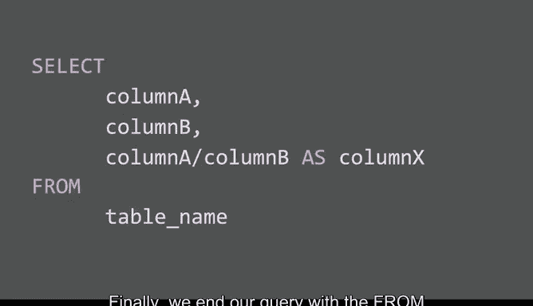
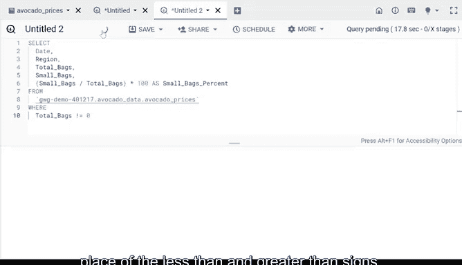

# 035：在SQL查询中嵌入计算 🧮


在本节课中，我们将学习如何在SQL查询中直接嵌入计算。这是一种非常高效的方法，可以让我们在提取数据的同时完成计算，从而更快地完成更多工作。

上一节我们介绍了SQL的基本查询结构，本节中我们来看看如何将计算嵌入到查询中。

## 基本查询语法回顾



一个包含计算的基本查询语法如下：

```sql
SELECT column_name,
       calculation_details AS new_column_name
FROM table_name;
```

*   **SELECT**： 用于指定要使用的列。
*   **计算细节**： 包含运算符（例如除号 `/`）的计算表达式。
*   **AS**： 用于为包含计算值的新列命名。
*   **FROM**： 指定数据来源的表。

## 实践：嵌入计算验证数据

现在，让我们通过一个关于牛油果销售数据的例子，将学习提升到新的水平。

我们将使用以下语法嵌入更复杂的计算：

```sql
SELECT column1,
       column2,
       (columnA + columnB + columnC) AS calculated_column
FROM dataset.table;
```

我们的目标是：找出每个日期、每个地点售出的牛油果袋子的总数。数据中已有一个显示总数的列，但我们需要验证这个总数是否确实是**小号袋**、**大号袋**和**加大号袋**三列数值的加和。

以下是构建查询的步骤：

1.  使用 `SELECT` 命令选择所需的列：`date`, `region`, `small_bags`, `large_bags`, `xl_bags`, `total_bags`。
2.  添加计算：将三个袋子数量列相加，即 `small_bags + large_bags + xl_bags`。
3.  使用 `AS` 命令将计算结果命名为新列，例如 `total_bags_calc`，以便与原始的总数列进行比较。
4.  使用 `FROM` 命令指定数据源表。

运行查询后，通过比较 `total_bags` 列和我们计算出的 `total_bags_calc` 列，可以验证两列数值相同，从而确认数据的准确性。

## 进阶：计算百分比并处理错误

验证数据后，我们可以利用这些值进行更深入的分析。例如，计算**小号袋占总袋数的百分比**。这个信息可以帮助利益相关方决定如何包装牛油果或对哪种尺寸的袋子进行促销。

我们构建一个新的查询：

```sql
SELECT date,
       region,
       total_bags,
       small_bags,
       (small_bags / total_bags) * 100 AS small_bags_percent
FROM dataset.table;
```

*   **计算逻辑**： `(小号袋数量 / 总袋数) * 100`。乘以100是为了将小数转换为更易理解的百分比形式。
*   **括号**： 确保除法运算优先进行。

然而，运行此查询可能会遇到错误：**“不能除以0”**。这是因为数据集中某些行的 `total_bags` 值为0。

为了解决这个问题，我们需要使用 `WHERE` 子句为计算添加条件。

以下是修复查询的方法：

```sql
SELECT date,
       region,
       total_bags,
       small_bags,
       (small_bags / total_bags) * 100 AS small_bags_percent
FROM dataset.table
WHERE total_bags <> 0;
```

*   `WHERE total_bags <> 0`： 这个条件确保只选择 `total_bags` 不等于0的行进行计算。符号 `<>` 表示“不等于”。
*   你也可以使用 `!=` 来达到同样的效果，即 `WHERE total_bags != 0`。

> 注意：这只是避免除以零错误的一种方法。SQL还提供了像 `SAFE_DIVIDE` 这样的函数，也能安全地处理除法运算。

运行修正后的查询，我们就能成功得到小号袋百分比的结果。



## 总结

本节课中我们一起学习了在SQL查询中嵌入计算的方法。我们首先回顾了基本语法，然后通过验证数据总和、计算百分比两个实例进行了实践。在计算百分比时，我们还遇到了“除以零”的错误，并学会了使用 `WHERE` 子句来排除无效数据。


这里展示的计算方法只是一个开始。在SQL中，你几乎可以在分析过程中完成任何所需的计算。将计算嵌入查询有助于你保持分析过程的有条理，并快速获得结果。