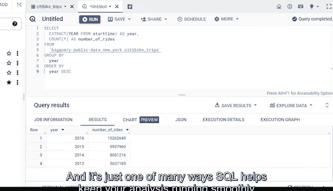

# 036：与其他语句结合的计算 📊

在本节课中，我们将学习如何在SQL查询中结合使用`GROUP BY`和`ORDER BY`语句与聚合函数，以对数据进行分组、计算和排序。这是数据分析中整理和汇总数据的关键技能。

---

## 概述

作为数据分析师，您会遇到各种形式和规模的计算需求。之前我们已经介绍了SQL中的一些基础计算方法。虽然基础计算很有用，但有时我们需要先对数据进行分组，然后再进行计算。`GROUP BY`和`ORDER BY`命令可以帮助我们实现这一点。这些命令通常与`SUM`或`COUNT`等聚合函数配对使用。本节将展示如何使用这些命令和函数来计算和汇总表中行组的数据。

---

## 探索 `GROUP BY` 命令

`GROUP BY`是一个命令，它将表中具有相同值的行分组到汇总行中。`GROUP BY`命令在基本的`SELECT FROM`或`SELECT FROM WHERE`查询中与`SELECT`语句一起使用，并且位于查询的末尾。

让我们尝试使用`GROUP BY`。我们将使用一个包含自行车共享系统数据的数据库。我们的目标是找出每年人们使用这些自行车的骑行次数。

该数据包含多个列，但对于此任务，我们只需要`start_time`列。由于此数据集未按日期组织，且`start_time`列未按年份组织，我们需要在代码中包含步骤来整理它。我们还需要每年骑行次数的总数，因此需要在查询中包含一个计算。根据我们需要回答的问题，这可能是我们分析中的第一步。

以下是构建查询的步骤：

1.  使用`SELECT`命令开始查询。
2.  在查询中添加`EXTRACT`命令。`EXTRACT`命令允许我们提取给定日期的某一部分来使用。
3.  从`start_time`列中提取年份。为此，我们添加一个左括号，后跟`YEAR`，这会让服务器知道我们需要日期的哪一部分。
4.  然后添加`FROM`命令和`start_time`，以便从该列的所有开始时间中获取年份。
5.  关闭括号，然后使用`AS`和单词`year`来命名我们正在创建的列。
6.  在查询的下一行，使用聚合函数`COUNT`，后跟一个星号和括号。这将计算`start_time`列中的自行车骑行次数。
7.  使用星号确保数据中的所有开始时间都被计数。
8.  然后使用下划线代替空格，将我们的列命名为`number_of_rides`。
9.  在下一行添加`FROM`和我们正在提取数据的数据库。在本例中，是`bigquery-public-data.new_york_citibike.citibike_trips`。
10. 最后，添加我们的`GROUP BY`命令。我们将使用它按年份对数据进行分组。输入`GROUP BY`，后跟`year`。

我们可以进一步使用`ORDER BY`命令来组织结果。在`GROUP BY`之后添加此命令可以对结果进行排序。我们将添加`year`以按年份对数据进行排序。需要注意的是，默认情况下，`ORDER BY`按升序对数据进行排序。

现在我们可以运行查询来获取结果。年份从2013年开始排序，到2016年结束。如果我们想将其更改为降序，可以在查询末尾添加关键字`DESC`并再次运行。

---

## 总结

无论使用哪种顺序，`GROUP BY`和`ORDER BY`命令都非常有助于我们完成和组织分析计算。这是在聚合数据时包含计算的一种方式，也是SQL帮助您的分析顺利进行和推进的众多方法之一。关于SQL中的计算，还有更多内容。接下来，我们将学习更多关于数据验证的知识。