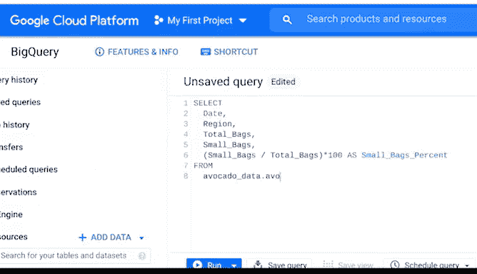
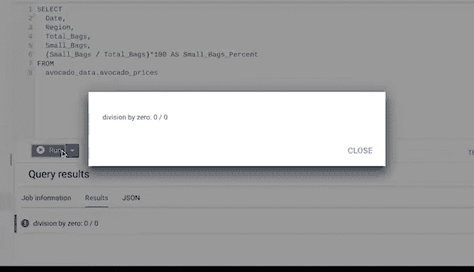
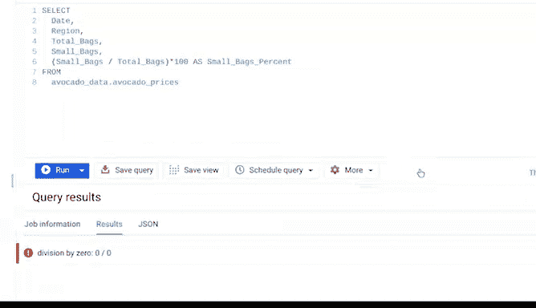

# 037：反复检查与验证 📊


在本节课中，我们将学习数据分析中一个至关重要的环节：**数据验证**。我们将探讨如何通过反复检查来确保数据的质量、准确性和一致性，从而为可靠的分析打下坚实基础。

---

## 数据验证：不仅仅是电子表格功能

上一节我们介绍了数据验证，这是一种电子表格功能，通过下拉列表控制单元格的输入内容。使用数据验证可以保护工作表的结构化数据和公式。

但数据验证功能只是更广泛的数据验证过程的一部分。这个过程涉及反复检查数据的质量，确保其**完整、准确、安全且一致**。虽然数据验证过程是数据清洗的一种形式，但你应该在整个分析过程中都使用它。

如果你觉得这些概念很熟悉，那很好。拥有高质量的数据至关重要。在我看来，这个过程也很有趣，因为它能将你的业务知识与技术技能结合起来。这有助于你理解数据、检查其清洁度，并确保与业务目标保持一致。简而言之，这是确保你的数据有意义所必须做的事情。

请记住，你的业务知识会随着时间和经验而积累。这里有一个专业建议：尽可能多地提问会让这个过程变得容易得多。

---

## 实践案例：家具零售商数据分析

假设我们正在为一家家具零售商分析数据。我们需要检查“购买价格”列中的值是否始终等于“售出数量”乘以“产品单价”。

为此，我们添加一个新列并使用乘法公式来重新计算购买价格：
```excel
= 售出数量 * 产品单价
```

比较总计后，我们发现至少有一个值与原始“购买价格”列中的值不匹配。我们需要找到答案才能继续分析。

通过研究和提问，我们发现当顾客购买五件或以上特定商品时，可享受30%的折扣。如果我们没有进行这项检查，可能会完全忽略这一点。

作为分析师，计算是你工作的重要组成部分。因此，每当进行计算时，检查计算是否正确至关重要。

---

## 常识性检查与业务理解

有时，你会进行一些常识性的数据验证检查。例如，假设你正在分析一家只在工作日营业的企业的店内促销效果。

你需要检查数据中是否没有周六和周日的销售数据。如果你的数据显示了周末的销售，这可能不是数据本身的问题，甚至可能根本不是问题。背后可能有合理的原因，比如你的企业在周末举办了特别活动，因此产生了周末销售。

如果你的目标仅仅是分析工作日，你可能仍然希望在分析中排除周末销售。但进行数据验证可以避免分析中的计算错误和其他失误。

---

## 在不同分析工具中应用数据验证

无论使用何种分析工具，都应始终进行数据验证。在之前的视频中，我们使用SQL分析了一些关于牛油果的数据。其中一个查询是检查“总袋数”是否为小、大和超大袋数的总和。

通过运行以下查询，我们能够确定“总袋数”列是准确的，这使我们得以继续分析：
```sql
SELECT 
    total_bags,
    small_bags + large_bags + xlarge_bags AS calculated_total
FROM avocado_data
WHERE total_bags != (small_bags + large_bags + xlarge_bags);
```

但是，当我们试图计算小袋数占总袋数的百分比时，遇到了一个小问题：我们收到了一个关于“除以零”的错误信息。



我们通过调整查询来修复这个错误。如果我们把这个有错误的查询链接到提交给利益相关者的演示文稿中，他们看到的将是“除以零”的错误，而不是我们想要的数字。



通过将这类检查作为数据验证过程的一部分，你可以避免分析中的错误，完成业务目标，让每个人都满意。相信我，当你做到这一点时，感觉会非常好。



---

## 总结

本节课中，我们一起学习了**数据验证**的核心概念和实际应用。我们了解到：

1.  **数据验证是一个持续的过程**，旨在确保数据的完整性、准确性、安全性和一致性。
2.  **结合业务知识进行验证**至关重要，它能帮助你理解数据背后的逻辑，发现异常。
3.  **在任何分析工具中（如电子表格、SQL）都应实施验证**，包括常识性检查和计算验证。
4.  **主动检查和提问**可以避免严重的分析错误，确保最终结果可靠，满足业务目标。

掌握数据验证技能，是成为一名优秀数据分析师的基石。恭喜你完成了本节内容的学习！🎉