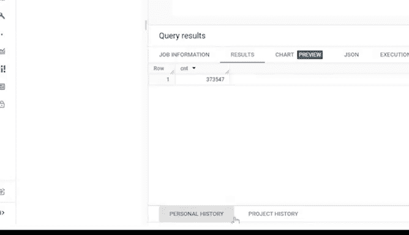

# 038：临时表 📝


在本节课中，我们将要学习SQL中的“临时表”。临时表是数据分析师在处理数据时的一种便捷工具，它类似于我们日常使用的便利贴，用于临时存储和处理数据，使用完毕后会自动清理。通过本教程，你将了解临时表的概念、用途以及如何在SQL中创建和使用它们。

---

## 什么是临时表？🤔

上一节我们介绍了临时表的基本概念，本节中我们来看看它的具体定义。

临时表是一种在数据库服务器上临时创建和存在的数据库表。它通常被称为“temp tables”。临时表用于在特定时间段内存储从标准数据表中提取的数据子集。当你的SQL数据库会话结束时，这些临时表会自动被删除。

由于临时表不会被永久存储，因此它们非常适合在短时间内完成分析任务，例如进行计算时使用。

---

## 临时表的用途 🛠️

了解了临时表的基本概念后，我们来看看它的具体应用场景。

临时表在多种数据分析场景中都非常有用。以下是几个常见的用途：

*   **简化复杂查询**：当你需要同时处理多个表，并且有一个查询需要连接7到8个表时，你可以先将行数最少的两个或三个表连接起来，并将结果存储在临时表中。然后，再将这个临时表与其他较大的表进行连接。
*   **整合多数据库查询结果**：如果你需要在多个不同的数据库上运行查询，可以在每个单独的数据库中运行这些初始查询，然后使用临时表来收集所有查询的结果。最终的报告查询将在临时表上运行。
*   **高效处理数据子集**：当一个表中包含大量记录，而你需要反复使用其中的一小部分记录来完成某些计算或其他分析时，临时表非常有用。与其反复过滤数据以返回子集，不如将数据过滤一次并存储在临时表中，然后针对创建的临时表运行查询。

---

## 实战演练：创建临时表 🚴

现在，我们通过一个具体的例子来学习如何创建和使用临时表。

假设你需要分析之前提到的共享单车系统的数据。你只需要分析骑行时间超过60分钟的数据，但你需要回答关于这些数据的多个问题。使用临时表可以让你在不重复过滤数据的情况下，多次查询这些数据。

在SQL中，创建临时表的方法取决于你使用的关系数据库管理系统。在本例中，我们将使用BigQuery，并应用`WITH`子句。`WITH`子句是一种可以多次查询的临时表类型，它近似于临时表的功能，即使它不会在数据库中永久添加一个表。

以下是创建临时表的步骤：

1.  使用`WITH`命令开始查询。
2.  为临时表命名，例如 `trips_over_1_hr`。
3.  输入`AS`命令和一个开括号`(`。
4.  在新的一行，使用`SELECT FROM WHERE`结构编写子查询。
    *   `SELECT *`：选择表中的所有列。
    *   `FROM`：指定数据来源，例如 `bigquery-public-data.new_york_citibike.citibike_trips`。
    *   `WHERE`：添加条件，例如 `tripduration >= 3600`（3600秒即60分钟）。
5.  在新的一行添加闭括号`)`来结束子查询。

**代码示例：**
```sql
WITH trips_over_1_hr AS (
  SELECT *
  FROM `bigquery-public-data.new_york_citibike.citibike_trips`
  WHERE tripduration >= 3600
)
```

这样，我们的临时表就设置好了。现在，我们可以运行只返回骑行时间60分钟或更长的结果的查询。

---

## 使用临时表进行查询 🔍

临时表创建完成后，我们就可以基于它进行查询了。

由于我们已经在临时表的上下文中工作，因此不需要开启新的查询。我们可以在添加代码之前，用描述性文字标注查询的目的。

**代码示例：**
```sql
## 统计有多少次骑行超过60分钟
SELECT
  COUNT(*) AS ct
FROM
  trips_over_1_hr
```

运行此查询后，结果将显示数据集中骑行时间达到或超过60分钟的总行程数。只要我们需要分析60分钟及以上的骑行数据，就可以反复对此临时表运行查询。

---

## 临时表的优势与总结 ✨

通过前面的学习，我们了解了临时表的创建和使用。现在，我们来总结一下它的优势。



使用临时表可以使你的工作更高效。命名和使用临时表可以帮助你以更流畅的方式处理大量数据，避免因重复编写相同的查询代码而感到困惑。

此外，使用临时表还有另一个好处：它可以帮助你的团队成员。临时表通常会使你的代码不那么复杂，更易于阅读和理解，这将是团队所欣赏的。

---

**本节课总结：**

在本节课中，我们一起学习了SQL中临时表的概念和用途。我们了解到临时表是临时存储数据子集的工具，在会话结束后会自动删除。通过实战演练，我们掌握了如何使用`WITH`子句在BigQuery中创建临时表，并基于它进行高效查询。临时表不仅能简化复杂的数据操作，提高个人工作效率，还能使代码更清晰，便于团队协作。