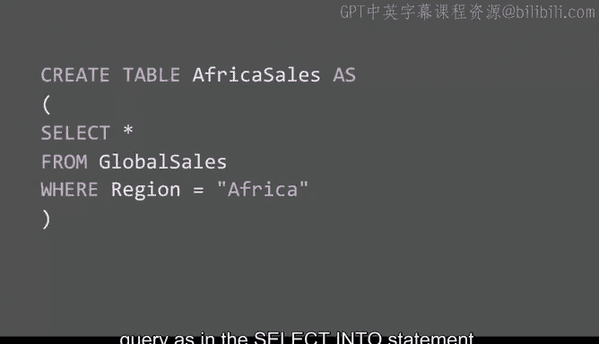
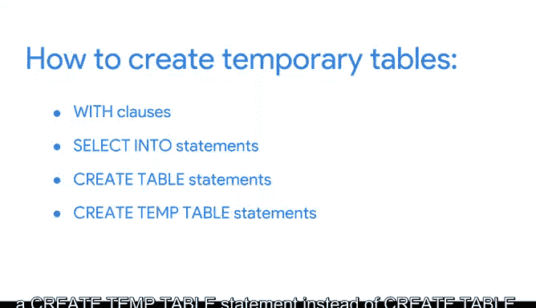

# 039：临时表的多种创建方式 🗂️


在本节课中，我们将学习如何通过不同的SQL语句创建临时表。临时表是数据分析中的一项重要工具，它能帮助您保持代码的条理性并提升分析效率。我们将介绍`SELECT INTO`和`CREATE TABLE`这两种创建临时表的方法，并讨论它们各自的优缺点。

上一节我们介绍了使用`WITH`子句创建临时表，本节中我们来看看其他创建临时表的方式。

## 使用 SELECT INTO 语句创建临时表

`SELECT INTO`语句可以将数据从一个表复制到一个新表中，但**不会**将这个新表永久添加到数据库中。当您需要基于特定条件（例如使用`WHERE`子句的查询）创建表的副本时，这种方法非常有用。

需要注意的是，我们目前演示使用的BigQuery数据库暂不支持`SELECT INTO`命令。以下是该语句在其他关系型数据库管理系统（RDBMS）中的通用语法示例：

```sql
SELECT *
INTO Africa_Sales
FROM Global_Sales
WHERE Region = 'Africa';
```

这段代码会从`Global_Sales`表中筛选出`Region`为`Africa`的数据，并创建一个名为`Africa_Sales`的新临时表。

当您希望保持数据库的整洁，并且不需要与他人共享该表时，使用`SELECT INTO`是一个很好的实践。

## 使用 CREATE TABLE 语句创建临时表


如果许多人都需要使用同一个表，那么`CREATE TABLE`语句可能是更好的选择。与`SELECT INTO`不同，**这个语句会将创建的表正式添加到数据库中**。

以下是使用`CREATE TABLE`语句实现同样功能的示例：



```sql
CREATE TABLE Africa_Sales AS
SELECT *
FROM Global_Sales
WHERE Region = 'Africa';
```

在大多数RDBMS中，您还可以为使用`CREATE TABLE`创建的表添加元数据描述，这有助于任何使用该表的人更好地理解其中的数据。

此外，`CREATE TABLE`语句对于创建结构更复杂的表尤其有用。例如，如果某段代码难以复现，那么以这种方式创建临时表意味着您之后可以安全地访问这些数据。

## 如何选择创建方式

选择使用`WITH`子句、`SELECT INTO`还是`CREATE TABLE`来创建临时表，通常取决于您的具体需求和偏好。

以下是选择时需要考虑的几个因素：
*   **共享需求**：如果表需要被团队多人使用，考虑`CREATE TABLE`。
*   **数据库整洁性**：如果只是临时性分析，不希望留下永久表，考虑`SELECT INTO`或`WITH`子句。
*   **代码复杂度**：对于复杂查询的结果集，考虑使用`CREATE TABLE`或`WITH`子句将其物化，便于后续调用。
*   **平台兼容性**：不同的数据库系统（RDBMS）语法可能略有不同，例如某些系统可能使用`CREATE TEMP TABLE`。



您可能会发现，在不同的RDBMS中工作时，所需的语法会有所差异。一个好消息是，通过快速的网络搜索，通常很容易找到特定数据库所需的准确语法。

## 临时表的潜在考量

无论以何种方式或在何处创建临时表，它们本身的缺点并不多。但需要注意，有时构建临时表可能会打断您的工作流程。这同样取决于您的分析目标和偏好。

您可以反复运行同一段代码，而不是创建临时表。但这通常会使您的查询语句可读性变差，并且更容易因拼写错误而出错。

## 总结


本节课中我们一起学习了创建临时表的两种主要方法：`SELECT INTO`和`CREATE TABLE`。我们了解了`SELECT INTO`适用于创建私有的、临时的数据副本，而`CREATE TABLE`则更适合创建需要共享或结构更复杂的永久性表。随着您在数据分析领域的不断探索，您会发现临时表是众多可用工具中的一种，并且用得越多，您就越能游刃有余地驾驭数据分析的世界。