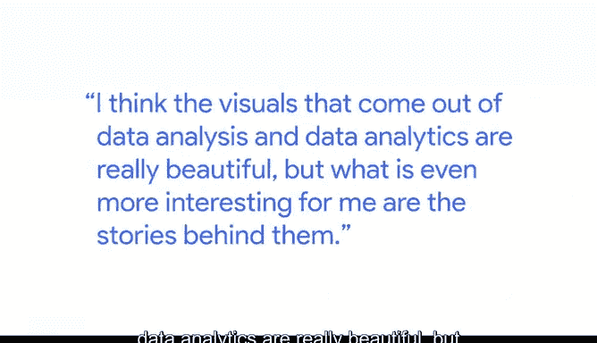

# 002：数据可视化的力量

在本节课中，我们将跟随谷歌数据分析总监凯文的分享，深入理解数据可视化的核心价值与力量。我们将探讨数据分析如何通过图表和可视化讲述故事，以及如何从不同领域汲取灵感，创造出既美观又富有洞察力的可视化作品。

---

数据分析是**收集、分析数据，并利用图表和可视化来讲述故事**的过程，目的是帮助企业做出更明智的决策。

我一直热爱数字，也一直享受数学和微积分这类事物。因此，数据对我来说非常容易上手。我之前在一家咨询公司工作，处理大量数字，我确实很享受这份工作。

但直到我在一家广告公司工作时，我才看到了数字的创造性表达，以及数据如何驱动这种创造力。这一切对我来说才真正豁然开朗。我意识到，在营销和广告环境中进行数据分析正是我想做的事情。

我发现，当我们将这两者结合在一起时，我获得了极大的乐趣。我认为，从数据分析和数据分析中产生的视觉作品非常美丽。

---

但对我来说，更有趣的是它们背后的故事。

如果你看一大段文字或一大串数字，故事就在其中，但它们确实需要被发掘出来。因此，提取这些信息需要特定的技能。

我发现这种技能，这种分析过程，非常令人兴奋和有趣。但它最终会以一个美丽的可视化作品作为终点，这让我感到非常满足。

如今，有许多伟大的数据可视化思想家。你到处都能看到这些视觉作品，你可以从观察当今的新闻媒体、看他们呈现的可视化以及他们如何用这种方式讲故事中获得灵感。

可视化已经变得如此重要，以至于无处不在，你可以从中获得巨大的灵感。但我也从不太可能的来源汲取灵感，比如摄影、艺术等，观察构图是如何创造的，色彩是如何运用的。我认为这非常重要。

我努力将这些元素和影响融入到我创建的可视化作品中。

我知道这门课程强度很大，我们向你灌输了很多内容。你的大脑可能已经超负荷了，你可能感到筋疲力尽，但请坚持下去。一切都会开始拼凑起来，并变得有意义。

我认为你能想到的最重要的事情，就是这些技能到底有多重要。这是开展业务的新方式，**涉及数据，运用我们正在讨论的分析工具和技术来做决策**。

所以，在这门课程结束时，有一个巨大的回报在等待着你。我是凯文，谷歌的分析总监。

---

## 🎯 课程总结

本节课中，我们一起学习了数据可视化的核心力量。我们了解到，数据分析不仅仅是处理数字，更是通过**图表和视觉化**来讲述故事、驱动创意和辅助决策的过程。凯文分享了他的个人经历，强调了从广告创意、新闻媒体乃至艺术摄影中汲取灵感的重要性，以创造出既美观又富有洞察力的可视化作品。最后，他鼓励大家坚持学习，因为掌握这些数据分析与可视化技能，是当今商业世界做出明智决策的关键。