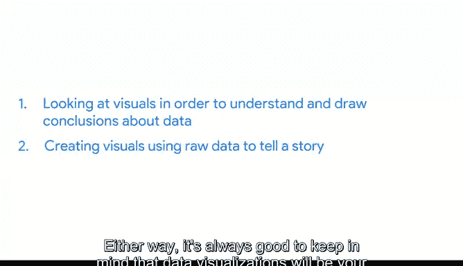
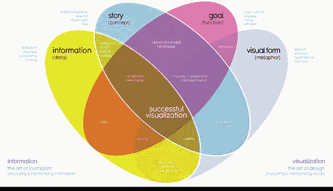
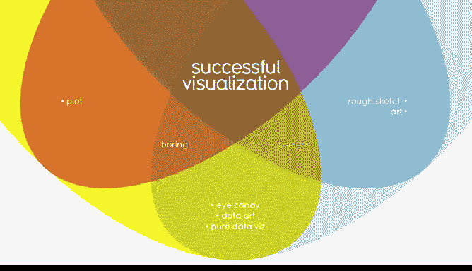
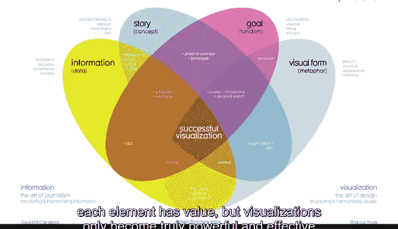

# 003：数据可视化为何重要 📊

在本节课中，我们将要学习数据可视化的核心价值、构成要素以及如何创建有效的可视化图表。数据可视化不仅是呈现数据的工具，更是沟通见解、讲述故事的关键手段。

---

欢迎回来，未来的数据分析师。作为一名成长中的分析师，你将接触到大量数据。

人们学习和吸收数据的方式多种多样。

其中最有效的方式之一是通过可视化。

**数据可视化是数据的图形化表示和呈现**。实际上，它只是将信息放入图像中，以便他人更容易理解。

如果你曾看过任何类型的地图，无论是纸质的还是在线的，那么你就能确切地知道视觉图像有多么有用。数据可视化在当下无疑正当时。

我们被以各种方式展示信息的图像所包围。

但数据可视化的历史远比互联网更久远。

数据可视化始于很久以前的地图，地图是地理数据的视觉表示。

这张已知世界的地图来自1502年。随着新大陆被绘制，地图制作者不断改进他们的可视化。关于这些地点的新数据被收集，新的数据可视化方法也被创造出来。

科学家和数学家们在18世纪和19世纪开始真正接受将数据视觉化排列的想法。

这张条形图来自1821年，它看起来与我们今天看到的条形图没有太大不同。

但自从20世纪90年代数据分析的数字时代开始以来，随着我们不断学习如何更有效地通过视觉进行沟通，可视化的范围和影响力也随着它们所图形化表示的数据一起增长。

我们洞察的质量也在持续提高。今天，我们可以通过数据量化人类行为。

并且我们已经学会使用计算机来收集、分析和可视化这些数据。作为当今世界的一名分析师，你可能会在两个方面分配处理数据可视化的时间：查看可视化图表以理解和得出关于数据的结论，或者从原始数据创建可视化图表来讲述故事。

无论哪种方式，始终牢记数据可视化将是您成功的关键，这一点总是有益的。

这一点尤其正确，一旦你准备好向观众展示数据分析结果时。

让人们理解你的观点和思维过程可能感觉具有挑战性。

但一个制作精良的数据可视化有能力改变人们的想法。

此外，它可以帮助那些没有与你相同技术背景或经验的人形成自己的观点。

因此，这里有一个创建可视化的快速规则：你的观众应该在看到它的前五秒内确切地知道他们正在看什么。

基本上，这意味着视觉图表应该清晰且易于理解。而在那之后的五秒内，你的观众应该理解你的可视化图表所要表达的结论，即使他们不完全熟悉你所做的研究。

他们可能不同意你的结论。这没关系。

你总是可以利用他们的反馈来调整你的可视化，并返回数据做进一步分析。

---

现在，让我们来谈谈为了创建一个可理解、有效且最重要的、有说服力的可视化图表，我们必须做些什么。让我们从头开始。

数据可视化是一种将大量信息融入小空间的有用工具。

要做到这一点，你首先需要构建和组织你的思路。

思考你的目标以及你在整理数据后得出的结论。

然后思考你在数据中注意到的模式、让你感到惊讶的事情，当然，还有所有这些如何融入你的分析中。

识别你发现的关键要素有助于为你应如何组织你的演示奠定基础。

看看这个由知名数据记者David McCandless制作的数据可视化图表。

这个图表包含了四个关键要素：信息或数据、故事、目标和视觉形式。它被安排在一个四部分的维恩图中，这告诉我们成功的可视化需要所有这四个要素。

到目前为止，你已经学到了很多关于可视化中使用的数据的知识。这很重要，因为它是你可视化的关键构建块。

故事或概念为数据增添了意义并使其变得有趣。我们稍后会更多地讨论数据叙事的重要性。但现在，只需记住故事和数据的结合为你试图展示的内容提供了一个大纲。

目标或功能使数据既有用又可用。

而视觉形式则创造了美感和结构。

仅使用两个要素，你可以创建一个视觉草稿。如果你处于早期阶段，这可能行得通，但不会给你一个完整的可视化，因为你会缺少其他关键要素。

即使使用三个要素也能让你更接近目标，但你还没有完全完成。例如，如果你结合了信息、目标和视觉形式，但没有任何故事，你的视觉图表可能看起来不错，但不会有趣。

每个要素本身都有价值，但只有当你以有意义的方式将这四个要素结合起来时，可视化才会变得真正强大和有效。

当你把这些要素放在一起思考时，你可以为你的观众创造有意义的东西。

在谷歌，我确保开发的可化图表能讲述包含所有这四个要素的数据故事。我可以告诉你，每个要素都是可视化成功的关键。

这就是为什么作为分析师，在我们继续前进的过程中，密切关注每个要素对你来说如此重要。

其他人可能不知道或不理解你得出结论所采取的确切步骤。

但这不应该阻止他们理解你的推理。

基本上，一个有效的数据可视化应该引导观众得出与你相同的结论，但要快得多。

因为我们所处的时代，我们不断地被展示不同的方式来查看和吸收信息。

这意味着你已经看到了许多在设计自己的可视化时可以借鉴的视觉图表。

你有能力讲述能够改变观点和思维模式的有说服力的故事。这很酷。

但你在创作这些故事时，也有责任关注他人的视角。因此，始终牢记这一点很重要。

接下来，我们将开始在数据和图像之间建立联系，为你的视觉杰作打下坚实的基础。

我迫不及待要开始了。

---

本节课中，我们一起学习了数据可视化的重要性及其四个核心构成要素：**数据**、**故事**、**目标**和**视觉形式**。一个成功的可视化需要将这四者有机结合，才能清晰、快速地向观众传达见解，并有效影响他们的理解与决策。