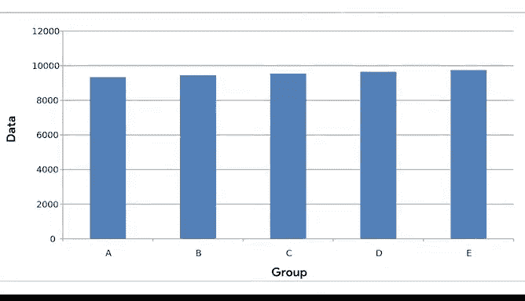

# 004：通过数据可视化分享数据 📊


## 04_01_03 图像与数据的关联

在本节课中，我们将要学习数据可视化中图像与数据之间的关联。我们将探讨几种常见的图表类型，理解它们如何有效地传达信息，并了解如何避免创建可能误导观众的图表。

---

之前我们讨论了数据可视化对分析师和利益相关者的重要性。本节中，我们来看看如何在可视化图表中建立数据与图像之间的具体联系。

通过视觉方式传达数据，对于使用数据做出决策的人来说至关重要，这有助于他们更好地理解数据与图像之间的联系。

以下是几种常见的数据可视化示例，以及它们如何有效地传达数据。你可能会在日常生活中遇到许多这样的图表，我们将在此进行更深入的探讨。

### 条形图 📊

一个很好的起点是条形图。条形图利用**尺寸对比**来比较两个或多个数值。

条形图底部的水平线称为 **X 轴**。在垂直条形图中，X 轴通常用于表示**类别**、**时间段**或其他变量。

条形图左侧的垂直线称为 **Y 轴**。Y 轴通常具有表示变量值的**刻度**。

在这个例子中，将一天中的时间与某人在整个工作日中的动力水平进行比较。

```python
# 示例：条形图比较一天中不同时间的动力水平
# X轴：时间（如 9am, 12pm, 3pm, 6pm）
# Y轴：动力水平（数值刻度）
```

条形图是阐明趋势的好方法。从这个图表可以清楚地看出，这个人的动力在一天开始时较低，并在工作日结束时变得越来越高。这种类型的可视化使得识别模式变得非常容易。

### 折线图 📈

另一个例子是折线图。折线图是一种可以帮助你的观众理解数据**变化或波动**的可视化类型。

它们通常用于跟踪**一段时间内的变化**，但也可以与其他因素结合使用。

在这张折线图中，我们使用两条不同颜色的线来比较猫和狗在一段时间内的受欢迎程度。我们可以立即看出狗比猫更受欢迎。我们稍后也会讨论如何使用颜色和图案使可视化对观众更友好。

即使线条上下波动，也存在一个总体上升的趋势，并且代表狗的线条始终高于代表猫的线条。

### 饼图 🥧

现在让我们看看另一种你可能认得的可视化图表：饼图。

饼图显示某事物的**各个部分如何构成整体**。这个饼图显示了构成某人一天的所有活动。一半的时间用于工作，这通过蓝色部分占据的空间大小来体现。

通过快速浏览，你可以轻松看出在这个饼图中，哪些活动占用了当天的大部分时间，哪些活动占用的时间较少。

### 地图 🗺️

之前，我们学习了地图如何帮助按地理区域组织数据。地图的优点是它们可以承载大量**基于位置的信息**，并且易于观众解读。

这个例子显示了关于欧洲人民幸福感的调查数据。边界线定义清晰，添加的颜色使得区分不同国家变得更加容易。理解这里所代表的数据（我们稍后会再次提到）可以非常迅速。

---

因此，数据可视化是建立图像与其所代表信息之间联系的绝佳工具。但它有时也可能具有误导性。

### 避免误导性可视化 ⚠️

可视化可能被操纵的一种方式是通过**缩放和比例**。

以饼图为例。饼图显示类别之间的**比例和百分比**。圆的每个部分（或每一块“饼”）都应反映其占整体的百分比，总和等于 **100%**。

如果你想可视化你的销售分析，以显示公司销售额中来自在线交易的百分比，你可以使用饼图。每一块的大小就是它所代表的销售额占总销售额的百分比。因此，如果你的在线销售额占 **60%**，那么这一块就应该是整个饼的 **60%**。

现在，这里有一个具有误导性的饼图。它本应显示关于披萨配料的意见，但每一块或每个部分都代表了不止一个选项，并且它们加起来远远超过了 **100%**。图片下方列出了许多甚至没有包含在可视化数据中的配料，并且所有部分的大小都相同，尽管它们本应显示不同的数值。如果一个可视化图表看起来令人困惑，那么它很可能就是令人困惑的。

让我们探索另一个例子，这次是条形图，其中图形组件的尺寸起到了关键作用。

在这个被**截断的条形图**中，Y 轴上的值并非从 **0** 开始。数据点从 **9100** 开始，并以 **100** 为间隔。这使得数据（假设是不同网站链接的每日点击量）看起来差异很大。

在这种视图下，网站 E 似乎明显比网站 D 获得更多点击，而网站 D 又比网站 C 获得更多点击，依此类推。

虽然图表本身清晰，元素易于理解，但数据的呈现方式具有误导性。让我们尝试通过更改图表的 Y 轴，使其从 **0** 开始，来修复这个问题。

现在，网站每日点击量之间的差异看起来就不那么剧烈了。通过让 Y 轴从 **0** 开始，我们改变了视觉比例，使其更加准确和诚实。

一些平台总是将 Y 轴起点设为 **0**。但其他程序（如电子表格）可能不会固定 Y 轴。因此，在创建可视化图表时，牢记这一点非常重要。

通过遵循数据分析的惯例，你将能够避免误导性的可视化。你总是希望你的可视化图表清晰易懂，但绝不能以牺牲传达真实数据为代价。



---

### 总结

本节课中，我们一起学习了几种有效的数据驱动可视化图表，如**条形图**、**折线图**和**饼图**，以及何时使用它们。除此之外，我们还讨论了在可视化中应避免的一些问题，以防止图表产生误导。

接下来，我们将探讨如何让这些可视化图表触达你的目标受众。