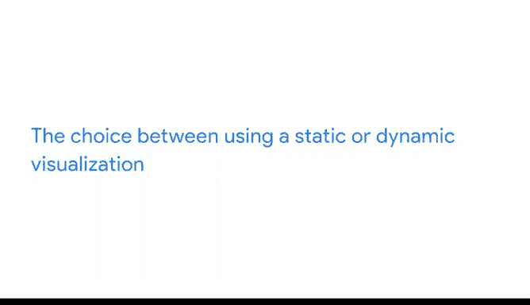

# 006：动态可视化


在本节课中，我们将学习数据可视化中的一个重要选择：静态可视化与动态可视化。我们将探讨两者的特点、适用场景以及如何根据需求做出合适的选择。

---

## 静态可视化与动态可视化

上一节我们介绍了创建可视化时需要考虑的多种选择。本节中，我们来看看另一个关键决策：选择静态可视化还是动态可视化。

静态可视化不会随时间改变，除非被手动编辑。当你需要完全控制数据和数据故事时，静态可视化非常有用。任何打印在纸上的可视化都自动是静态的。在电子表格中创建的图表通常也是静态的。例如，电子表格的所有者可能需要更改数据才能使可视化更新。

动态可视化是交互式的或会随时间变化。这些图形的交互性意味着用户可以控制他们看到的内容。如果利益相关者希望调整他们能查看的内容，这会很有帮助。

以下是两者的核心区别：

*   **静态可视化**：数据固定，视图固定，适合精确控制叙事。
*   **动态可视化**：数据或视图可交互变化，适合探索性分析和实时展示。

---

## 🎮 动态可视化实例：Tableau中的交互式仪表板

现在，让我们通过一个在Tableau中创建的可视化实例来具体了解动态可视化。Tableau是一个商业智能和分析平台，帮助人们查看、理解数据并据此做出决策。Tableau中的可视化默认是交互式的。

我们将进入一个关于“幸福指数”的仪表板，查看2015年至2017年的分数变化。

我们可以在第12张幻灯片中查看“年度幸福指数变化”。左侧显示了国家层面幸福指数的变化，国家按增幅最大到降幅最大排序。右侧是一张显示总体幸福指数的地图。颜色刻度从蓝色（幸福指数最高的国家）过渡到红色（幸福指数最低的国家）。

在地图下方，您会看到一个“选择查看年份”的滑块，人们可以选择在地图上显示哪一年的幸福指数得分。它当前设置为2016年。但如果有人想知道2015年或2017年的分数，他们可以调整滑块。然后，他们可以记下颜色编码和分数标签如何逐年变化。

```plaintext
交互元素示例：[年份滑块] — 用户拖动滑块，地图数据与颜色随之更新。
```

---

## ⚡ 自动更新的动态可视化

其他动态可视化可以自动上传新数据。例如，一些条形图会持续按分钟或秒更新数据。其他数据可视化也可以按天、周或月进行同样的更新。因此，如果需要，你可以实时显示趋势。

拥有交互式可视化对你和分享的受众都可能有用。但需要记住，你赋予用户的控制权越多，你对数据所要讲述的故事的控制就越少。在学习创建自己的可视化时，请记住这一点。你需要在交互性和控制权之间找到适当的平衡。

---

## 🤔 如何选择：静态还是动态？

需要考虑的另一点是在使用静态可视化还是动态可视化之间做出选择。这通常取决于你正在可视化的数据、你面向的受众以及你进行演示的方式。

*   **选择静态可视化**：当数据稳定、故事线需要强引导或交付形式为印刷品/静态报告时。
*   **选择动态可视化**：当数据持续更新、需要受众自主探索或进行实时演示时。

---

## 📝 课程总结



本节课中，我们一起学习了数据可视化的两种主要形式：静态可视化和动态可视化。我们了解了静态可视化的固定性和控制优势，以及动态可视化的交互性和实时更新能力。通过Tableau的实例，我们看到了动态可视化如何让用户探索数据。最后，我们讨论了如何根据数据特性、受众和演示场景来选择合适的可视化类型。

---

既然我们已经决定了要创建哪种类型的数据可视化，就可以开始思考设计方面了，而这正是我们下次课要开始讨论的内容。下次见。