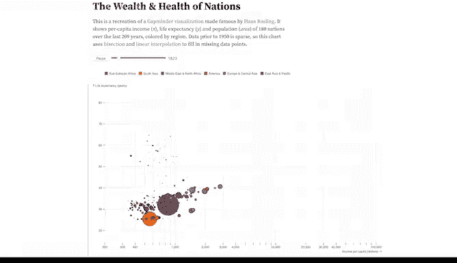
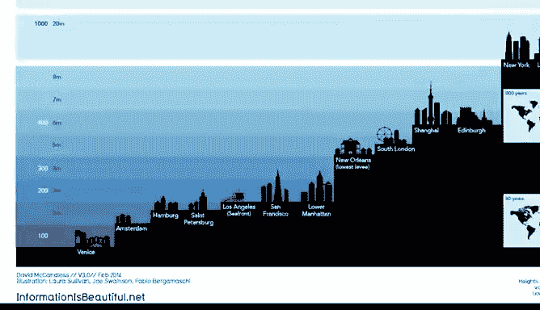
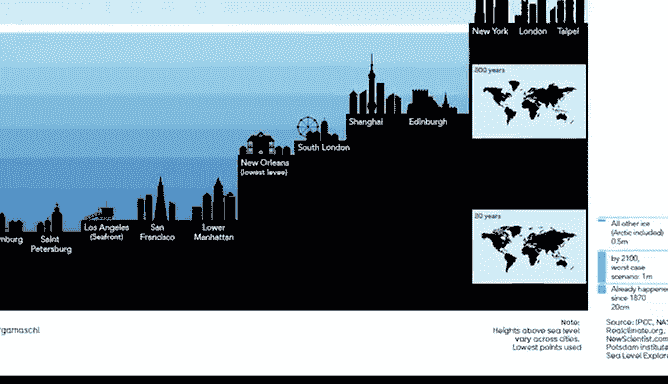

# 007：通过数据可视化分享数据 📊

## 第七讲：艺术元素在数据可视化中的应用 🎨

在本节课中，我们将探讨艺术元素如何应用于数据可视化。虽然数据分析与艺术看似无关，但两者在创作中都运用了相似的基础元素。我们将介绍线条、形状、色彩、空间和动感这五个核心艺术元素，并说明它们如何提升数据图表的视觉效果与表现力。

上一节我们介绍了数据可视化的基础概念，本节中我们来看看如何运用艺术元素来增强图表的表达。

### 线条 📏

线条在可视化中可以是曲线或直线、粗或细、垂直、水平或对角线。它们为数据赋予视觉形态，并帮助构建图表的整体结构。

以下是线条在数据可视化中应用的几个例子：

*   **组合图**展示了两种不同类型的线条，共同为数据提供图形化表示。
*   **折线图**也使用线条，但采用的是曲线而非直线。

### 形状 🔶

形状以其多样性著称。在可视化中，形状应始终保持二维，因为三维对象会使图表复杂化并可能让观众感到困惑。

形状是增加视觉对比度的绝佳方式，特别是尺寸对比，能让你的数据故事更引人注目。

以下是关于形状应用的要点：

*   **饼图**使用的圆形，能让人们以熟悉的格式快速理解数据。
*   具有**对称性**的形状通常更易于理解，观众解读对称的数据图表时认知负担更小。
*   地图上**不对称**的国家形状，依然能被瞬间识别。
*   需要注意的是，你分享的**数据内容**通常会决定你在可视化中希望使用的形状类型。

### 色彩 🌈

接下来是色彩。在艺术家和分析师眼中，色彩的内涵远比表面看起来复杂。色彩可以通过**色相**、**饱和度**和**明度**来描述。

*   **色相**指颜色的基本名称，如红、绿、蓝等。
*   **饱和度**指颜色的鲜艳或灰暗程度。
*   **明度**指颜色在可视化中的明暗程度。更科学地说，明度表示反射光线的多少。

在色彩理论中：
*   添加黑色形成的深色值称为**暗色**，例如 `shades of green`。
*   添加白色形成的浅色值称为**亮色**，例如 `tints of blue`。

在一幅地图中，使用了不同明度的灰色。这些颜色的明度帮助我们理解地图中的人口数据。**变化色彩的明度**是引导观众关注特定区域的有效方法。

### 空间 ⬜

空间指的是物体之间、周围及内部的区域。数据可视化中应始终存在空间，但不宜过多或过少。

例如，在条形图中，条形之间的间距应小于条形本身的宽度。这会将观众的注意力吸引到条形及其代表的数据上，而非空白区域。

### 动感 🎬

最后是动感。动感用于在可视化中创造流动感或动态效果。

一个著名的例子是名为“国家财富与健康”的数据可视化作品。该作品展示了国家财务健康与国民身体健康之间的相关性，并随时间推移追踪这些元素，从而展现两者如何相互影响。

动感元素将数据从19世纪一直拉近到近期。**交互性**允许展示更大体量的数据，并能从同一可视化中揭示多个故事。

但请记住，动感应谨慎使用。吸引注意力与分散观众注意力之间只有一线之隔。静态图像让你能完全控制你想讲述的故事。而当你开始融入动感和交互性时，故事的控制权就转移到了操控交互的一方，无论是你自己还是将控制权交给了观众。

我们将在课程后续部分讨论这种微妙的平衡。

### 综合应用实例

当你将许多艺术元素融合在一个可视化中时，例如这个关于海平面上升的图表，它可以既美观又发人深省。这证明了在数据分析中，创造性表达确实占有一席之地。

---

### 总结

本节课中，我们一起学习了如何将线条、形状、色彩、空间和动感这五大艺术元素应用于数据可视化。理解并恰当运用这些元素，可以使你的图表更具视觉吸引力、更清晰有效，从而更好地传达数据背后的故事。

接下来，我们将继续探索为你的数据可视化增添有意义创造性表达的其他方法。