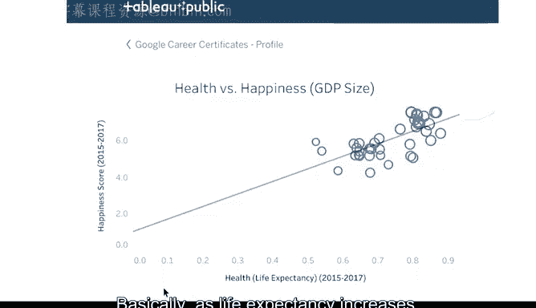
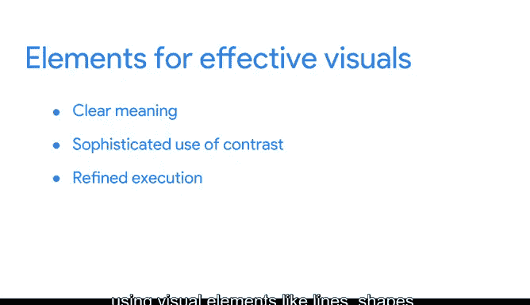

# 008：数据可视化的影响力

在本节课中，我们将学习如何通过数据可视化有效地传达分析结果，并理解不同图表类型如何服务于特定的数据呈现需求。我们将探讨如何根据受众和场景选择最合适的可视化方式，并了解优秀数据可视化作品的核心要素。

---

欢迎回来。我们开始吧。到目前为止，我们已经对数据可视化有了清晰的认识。

我们探讨了从设计原则到可视化中可以使用的各种图表类型的一切内容。

为你的数据发现选择合适的可视化方式，通常可以归结为一个问题：哪种方式能让用户最容易理解你想表达的观点？

无论你的分析多么复杂，你的受众只会关心呈现在他们面前的内容以及他们理解的难易程度。

当你完成分析时，你必须决定哪种可视化方式能满足你以及你的受众在每项任务中的需求。

例如，如果你想展示访问网站的不同年龄组用户的比较，那么为每个年龄组绘制一条线、再加一条总用户线的折线图会奏效。

但假设你想突出显示各年龄组之间的差异，以便更直接地进行比较。为此，你可以使用像这样的正负条形图。

我们之前提到过这一点。现在，让我们在分析后得到的数据与你希望在不同情况下使用的可视化方式之间建立更多联系。

我们将从一些图表开始。你之前已经接触过其中一些，稍后我们会通过更多示例详细介绍更多图表类型。

你还会发现，最适合你目的的图表可能取决于你的行业、公司以及受众中利益相关者的需求。

---

## 📈 比较随时间变化的数据

上一节我们介绍了数据可视化的基本目标，本节中我们来看看如何展示数据随时间的变化。

对于比较随时间变化的数据，我们展示了折线图如何有效，就像这个例子一样。条形图、堆叠条形图以及面积图，也是可视化数据随时间变化的有效方式。

顺便提一下，图表种类繁多。我们将尽可能多地为你提供关于各种图表的信息。但你自己进行研究或在可视化中练习使用它们也会很有帮助。

---

## 📊 比较不同对象

以下是用于比较不同对象（例如我们关于移动设备与计算机使用情况的例子）的图表类型：

*   **有序条形图**和**分组条形图**：用于比较不同类别的数值。
*   **有序柱状图**：与条形图类似，但柱子是垂直的。

---

## 🧩 展示整体与部分的关系

这被称为**数据构成**，通过将可视化的各个部分组合在一起并作为一个整体显示来实现。

以下是用于展示整体与部分关系的图表类型：

*   **堆叠条形图**：显示每个类别中不同组成部分的贡献。
*   **环形图**：类似于饼图，但中间是空的。
*   **堆叠面积图**：显示不同组成部分随时间变化的贡献。
*   **饼图**：显示各部分占整体的比例。
*   **树状图**：使用嵌套矩形显示层次结构数据各部分的大小。

---

## 🔗 展示数据间的关系

为了展示数据之间的关系，你可能需要使用散点图、气泡图、柱线组合图和热力图。

让我们重温一下“幸福数据”的可视化例子。这些散点图中的每一个都显示了一个国家的幸福指数与促成该指数的某个因素之间的关系。

例如，健康与幸福的散点图显示了该国居民预期寿命与其幸福程度之间的强相关性。基本上，随着预期寿命的增加，他们的幸福指数也会上升。

---

## 🧠 理解受众的视觉处理

说到幸福，一个成功的数据可视化会带来满意的受众。因此，理解你的受众如何观看你的数据可视化非常重要，因为他们应该始终是你考虑的首要因素。

这一切都始于大脑。在处理信息时，我们的大脑会尝试寻找模式并依赖视觉上下文。作为数据分析师，我们可以利用对人类视觉系统的理解来制作更好的视觉作品。

当我们创建可视化时，我们可以采用一种有助于受众处理信息并记住他们所看到内容的方式。

视觉新闻工作者Dona Wong提出，像我们一直在讨论的数据可视化这样的有效视觉作品，具有三个基本要素：

1.  **清晰的含义**：好的可视化能清晰地传达其预期的见解。
2.  **对比的巧妙运用**：这有助于利用我们大脑自然寻找的视觉上下文，将最重要的数据与其他数据区分开来。
3.  **精致的执行**：具有精致执行的可视化作品包括对细节的深度关注，使用线条、形状、颜色、明暗、空间和运动等视觉元素。换句话说，就是我们之前讨论过的艺术元素。

---

## 🎯 以受众为中心

大多数企业的首要规则是让客户满意。数据分析也不例外。

虽然你的客户可能是经理和其他利益相关者，但在创建数据可视化时，你应该始终首先考虑他们。

回想一下我们之前提到的“五秒规则”。如果你让你的数据可视化易于观看和快速理解，那么你就完成了你的工作。然后你就会感到满意，就像你的客户一样。

---

## 📝 总结

本节课中，我们一起学习了如何根据不同的数据呈现目标（如展示趋势、比较、构成或关系）选择合适的图表类型。我们探讨了优秀数据可视化的三个核心要素：**清晰的含义**、**巧妙的对比**和**精致的执行**。最重要的是，我们认识到始终以受众为中心，确保可视化易于快速理解，是数据可视化成功的关键。接下来，我们将讨论设计思维与数据可视化。