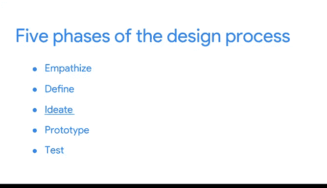
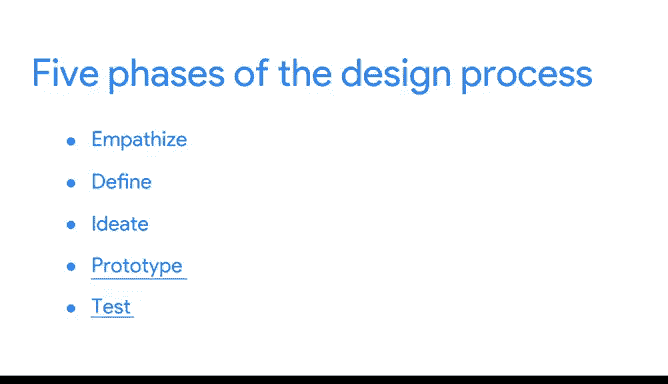
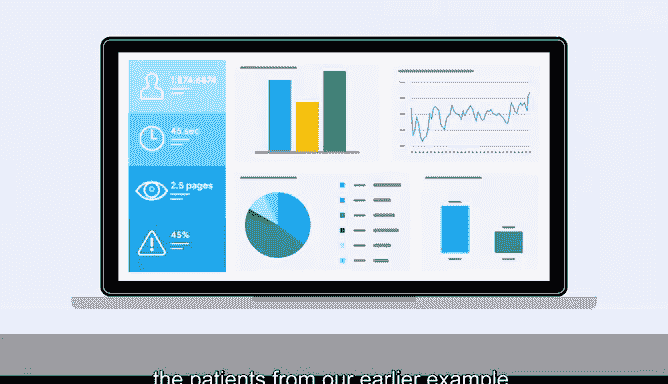

# 009：设计思维与可视化 🎨

在本节课中，我们将要学习如何将“设计思维”这一以用户为中心的问题解决方法，应用到数据可视化的创建过程中。我们将探讨设计思维的五个阶段，并学习如何通过关注受众的需求来制作更有效、更具影响力的图表。

---

在之前的课程中，我们深入探讨了数据可视化的各个方面，并强调了在决定图表、颜色、空间和标签等所有元素时，应以受众为核心。本节中，我们来看看如何通过一种系统性的方法——设计思维，来确保我们的可视化作品始终以用户为中心。

设计思维是一种以用户为中心、用于解决复杂问题的过程。将设计思维融入工作，意味着你需要尝试找出那些可能并不显而易见的、关于可视化的替代策略。你必须挑战自己的固有思维，探索解决问题的不同方法和解决方案。

一个著名的例子是爱彼迎（Airbnb）。这家度假租赁在线市场公司曾发现其收入未达预期。尽管他们收集和分析的数据很有价值，但他们决定从客户的角度审视自己的产品。他们意识到，房源照片的质量不佳。于是，他们聘请摄影师，上门为纽约的房源拍摄了专业照片。一周内，这些拥有专业照片的房源预订量增加了2到3倍，公司收入几乎翻倍。这得益于他们采用了以设计思维为基础的、用户至上的心态。

如果设计思维能帮助爱彼迎这样的公司，它同样能帮助数据分析师。数据可视化是应用这种以用户为中心心态的绝佳阶段。如果在规划和创建数据可视化时运用设计思维，你的决策将基于观看者的需求。这样，你的受众就能被你呈现数据的方式所吸引并受到启发。

虽然设计思维过程有多种形式，但它们都包含一些阶段或步骤。以下是创建数据可视化时可以使用的五个阶段：

**1. 共情**
**2. 定义**
**3. 构思**
**4. 原型**
**5. 测试**

秉承设计思维的精神，这些阶段不必遵循固定的顺序。相反，可以将它们视为一系列能帮助你产出以用户为中心的可视化设计的行动概述。

---

### 第一阶段：共情 🤝

在共情阶段，你需要思考数据可视化目标受众（无论是利益相关者、团队成员还是公众）的情感和需求。在此阶段，应避免可能阻碍人们与你的可视化进行交互的领域。

例如，假设你正在为一家制药公司分析患者对某种新疗法的反应数据。在准备将数据可视化时，你需要考虑受众，其中包括药剂师、医生和其他医疗专业人员等利益相关者。也许你考虑使用自己喜欢的配色方案，但意识到这些颜色可能对某些人构成挑战：颜色可能过于鲜艳或夸张，不适合数据的严肃性；或者颜色对比度不足，不利于有色觉缺陷的人士识别。通过调整颜色，你就是在与受众的需求共情。如果你的团队中有视力受损的成员，你还需要考虑如何用语言描述数据。

### 第二阶段：定义 ✍️

定义阶段帮助你明确受众的需求、他们的问题以及你的见解。这与共情阶段相辅相成，你将利用在共情阶段学到的东西，来精确阐明受众需要从你的可视化中获得什么。

你可以利用这个阶段思考在可视化中展示哪些数据。例如，如果你的数据也将呈现给参与公司研究的患者，那么虽然你需要达成分析目标，但有些数据可能会让这些人感到不适。你可以思考如何呈现这些数据，使其更易于接受。或者，如果你要向不同的受众群体展示，可以通过征求该群体成员或曾与该群体合作过的同事的意见，来调整你的可视化以满足每个群体的需求。

### 第三阶段：构思 💡

在构思阶段，你开始生成数据可视化的想法。你将利用从共情和定义阶段获得的所有发现，来头脑风暴潜在的数据解决方案。

这可能涉及用不同的颜色组合创建可视化的草稿，或者尝试不同的形状。

尽可能多地创建示例将有助于你完善想法。此阶段的关键是，在提出想法和策略时，要始终牢记你的受众。你需要思考如何定位你的可视化，以满足受众的需求和期望。

### 第四与第五阶段：原型与测试 🧪

在最后的原型和测试阶段，你将开始将你的图表、仪表板或其他可视化作品组合起来。

如果你在所有阶段都始终将受众放在心上，那么你的数据可视化将是信息丰富且易于理解的。你可能需要创建多个可视化版本，以选择最能满足你目标的那一个。你可以在向利益相关者展示之前，先向团队成员展示你的可视化作品进行测试。如果你为同一数据或不同受众（如我们之前例子中的医疗专业人员和患者）创建了多个版本，你可以分享所有的选项。

一如既往，请倾听你收到的任何反馈。无论是你自己的还是他人的批评，都是设计思维过程的关键。它们通过将新想法整合到最终产品中，帮助你保持对受众的关注。

“跳出框框思考”这句话经常被使用，但它绝对适用于这里。这里的“框框”，指的是你自己处理数据及其可视化的惯常方式。如果你拥抱设计思维，你将能为任何受众创造出超级有效的数据可视化作品。

---

本节课中，我们一起学习了设计思维的五个阶段（共情、定义、构思、原型、测试），并了解了如何将其应用于数据可视化，以确保我们的作品始终以用户需求为核心。通过像爱彼迎那样的案例，我们看到了以用户为中心的设计思维所能带来的巨大价值。

接下来，我们将继续探讨在数据可视化中需要考虑的更多因素。